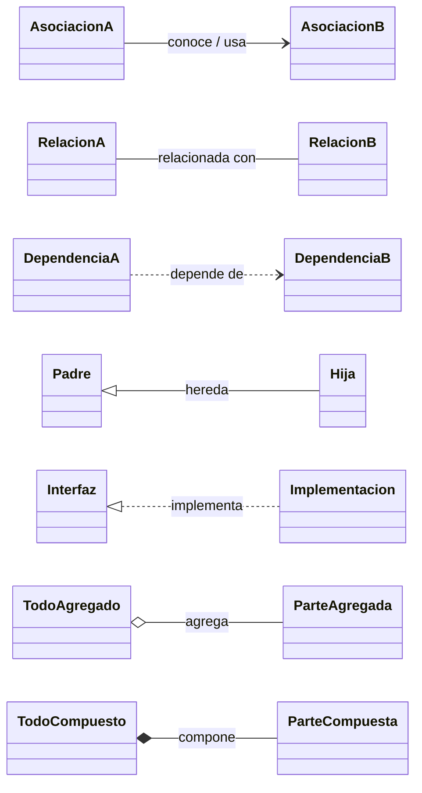
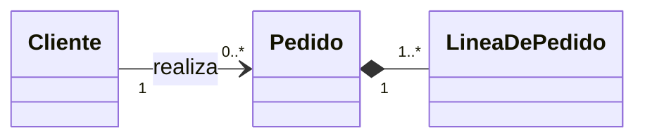
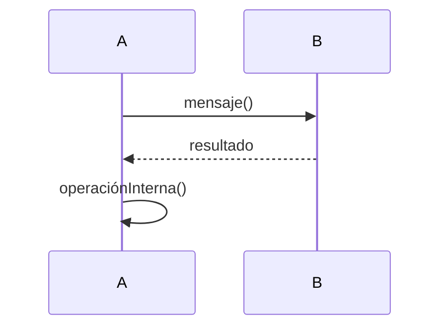
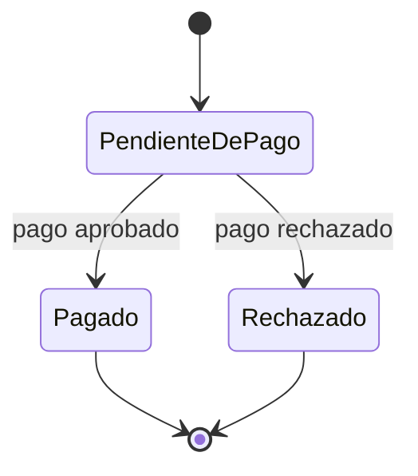
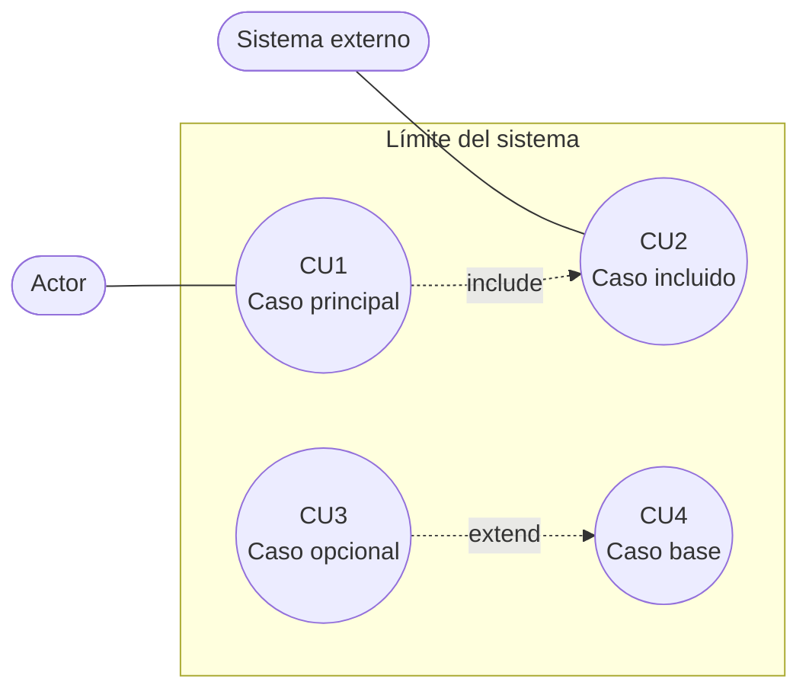
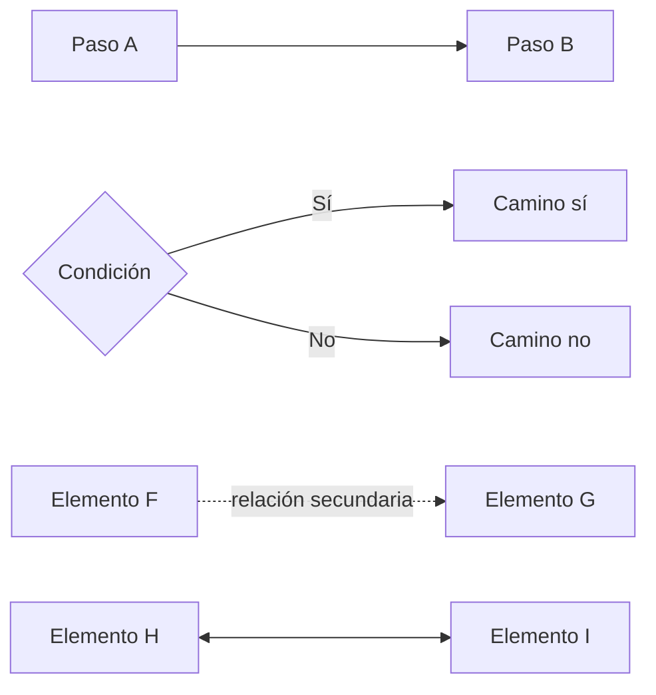
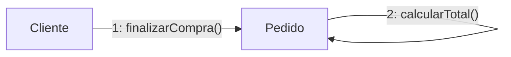
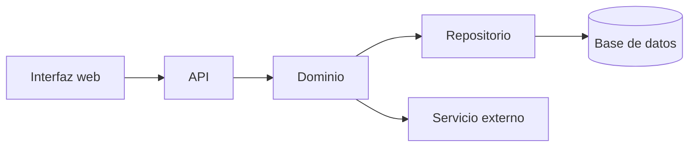
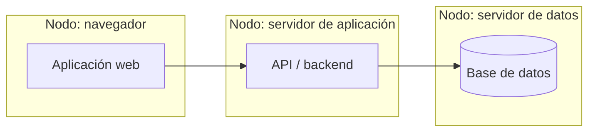
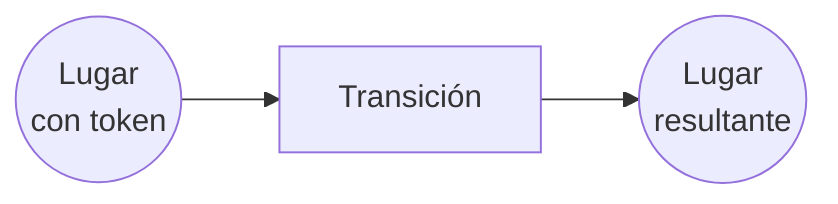

# Guía de diagramas

Esta página sirve como **leyenda común** para leer los diagramas del sitio. La mayoría están escritos en **Mermaid**, que permite dibujar diagramas desde texto. Algunos diagramas representan notación **UML** formal; otros son esquemas visuales usados para explicar una idea.

{: .note }
> Regla rápida: si el diagrama es de **clases**, **secuencia** o **estados**, se lee como UML. Si es un **flowchart**, **graph** o mapa conceptual, se lee como ayuda visual: las flechas indican flujo, relación o dependencia, pero no necesariamente una relación UML formal.

## Cómo leer un diagrama

1. Mirar primero el **tipo de diagrama**: clases, secuencia, estados, actividad, componentes, despliegue o flujo conceptual.
2. Identificar los **elementos principales**: clases, actores, objetos, estados, componentes, nodos o pasos.
3. Leer las **relaciones**: flechas, líneas, diamantes, herencia, mensajes o transiciones.
4. Revisar las **etiquetas**: nombres de mensajes, condiciones, multiplicidades, roles o reglas de negocio.
5. Interpretar el diagrama según su objetivo: estructura estática, comportamiento, flujo de proceso, ciclo de vida o arquitectura.

## UML vs Mermaid

| Concepto | Qué significa |
|---|---|
| **UML** | Lenguaje estándar de modelado. Define tipos de diagramas y significado de relaciones como herencia, asociación, composición, mensajes y estados. |
| **Mermaid** | Herramienta textual para dibujar diagramas. Puede expresar UML, pero también permite esquemas más libres como mapas conceptuales o flujos explicativos. |
| **Diagrama formal** | Usa símbolos con significado preciso. Ejemplo: composición en un diagrama de clases. |
| **Diagrama explicativo** | Usa cajas y flechas para ordenar ideas. Ejemplo: un flujo de requisitos a diseño. |

## Diagramas de clases

Un diagrama de clases muestra la **estructura estática** del software: clases, atributos, operaciones y relaciones. Es central para diseño orientado a objetos, Larman, GRASP y patrones GoF.

### Clases

```text
class Pedido {
  +numero
  +calcularTotal()
}
```

| Parte | Significado |
|---|---|
| `Pedido` | Nombre de la clase. |
| `+numero` | Atributo público. |
| `+calcularTotal()` | Operación o método público. |
| `<<interface>>` | Interfaz: contrato que otras clases implementan. |
| `<<abstract>>` | Clase abstracta: no se instancia directamente. |

### Visibilidad

| Símbolo | Significado |
|---:|---|
| `+` | Público: visible desde fuera de la clase. |
| `-` | Privado: visible solo dentro de la clase. |
| `#` | Protegido: visible para la clase y sus subclases. |
| `~` | Paquete: visible dentro del mismo paquete o módulo. |

En los apuntes se usa principalmente `+` para no sobrecargar los diagramas. Eso no implica que todos los atributos deban ser públicos en código; en diseño OO real, los atributos suelen estar encapsulados.

### Relaciones

| Notación | Nombre | Cómo leerla |
|---|---|---|
| `A --> B` | Asociación navegable | A conoce, usa o mantiene una referencia a B. |
| `A -- B` | Asociación simple | A y B están relacionados, sin enfatizar dirección. |
| `A ..> B` | Dependencia | A depende puntualmente de B, por ejemplo como parámetro, servicio externo o uso temporal. |
| `A <|-- B` | Generalización / herencia | B hereda de A. La flecha apunta a la clase más general. |
| `A <|.. B` | Realización | B implementa la interfaz A. |
| `A o-- B` | Agregación | A agrupa B, pero B puede existir independientemente. |
| `A *-- B` | Composición | A está compuesto por B; B depende fuertemente del ciclo de vida de A. |

Vista visual:



### Multiplicidad

La multiplicidad indica **cuántas instancias** pueden participar en una relación.

| Multiplicidad | Significado |
|---:|---|
| `1` | Exactamente una instancia. |
| `0..1` | Cero o una instancia. |
| `*` | Muchas instancias, equivalente a `0..*`. |
| `0..*` | Cero o muchas instancias. |
| `1..*` | Una o muchas instancias. |

Ejemplo:



Notación textual equivalente:

```text
Cliente "1" --> "0..*" Pedido : realiza
Pedido "1" *-- "1..*" LineaDePedido
```

Se lee así: un `Cliente` puede realizar muchos `Pedido`; cada `Pedido` está compuesto por una o más `LineaDePedido`.

## Diagramas de secuencia

Un diagrama de secuencia muestra **cómo colaboran objetos o componentes en el tiempo** para cumplir un escenario. Se lee de arriba hacia abajo.

| Elemento | Significado |
|---|---|
| Participante | Actor, objeto, componente o servicio que interviene. |
| Línea de vida | Línea vertical bajo un participante; representa su existencia durante el escenario. |
| Mensaje | Llamada, pedido o evento enviado de un participante a otro. |
| Retorno | Respuesta del participante llamado. |
| Bloque `alt` | Alternativas condicionales. |
| Bloque `loop` | Repetición. |
| Bloque `opt` | Paso opcional. |

| Notación | Cómo leerla |
|---|---|
| `A->>B: mensaje()` | A envía un mensaje o invoca una operación en B. |
| `B-->>A: resultado` | B devuelve una respuesta a A. |
| `A->>A: operación()` | A se envía un mensaje a sí mismo; suele representar lógica interna. |

Vista visual:



En diseño OO, estos diagramas ayudan a revisar **responsabilidades**: si un objeto recibe demasiados mensajes o coordina todo, puede haber baja cohesión o acoplamiento excesivo.

## Diagramas de estados

Un diagrama de estados muestra el **ciclo de vida de un objeto** relevante: sus estados posibles y los eventos que provocan cambios.

| Notación | Significado |
|---|---|
| `[*]` inicial | Punto inicial del ciclo de vida. |
| `[*]` final | Punto final del ciclo de vida. |
| `Pendiente` | Estado estable del objeto. |
| `A --> B : evento` | Transición desde A hacia B cuando ocurre el evento. |
| `evento [condición] / acción` | Evento, guarda y acción asociada a la transición. |

Ejemplo:



Notación textual equivalente:

```text
PendienteDePago --> Pagado : pago aprobado
PendienteDePago --> Rechazado : pago rechazado
```

Se lee así: desde `PendienteDePago`, el objeto pasa a `Pagado` si se aprueba el pago, o a `Rechazado` si se rechaza.

## Diagramas de casos de uso

Un diagrama de casos de uso muestra **qué objetivos funcionales** ofrece el sistema y qué actores participan. En el sitio se representan con Mermaid como `flowchart`, porque Mermaid no tiene un diagrama UML de casos de uso tan directo como otras herramientas.

| Elemento | Significado |
|---|---|
| Actor | Persona, rol, organización o sistema externo que interactúa con el sistema. |
| Caso de uso | Objetivo observable para un actor, por ejemplo "Registrar préstamo". |
| Límite del sistema | Caja que agrupa los casos de uso propios del sistema. |
| Asociación actor-caso | El actor participa en ese caso de uso. |
| `include` | Un caso de uso siempre reutiliza otro como parte obligatoria. |
| `extend` | Un caso de uso agrega comportamiento opcional o condicional a otro. |

| Notación usada | Cómo leerla |
|---|---|
| `Actor --- CasoUso` | El actor participa en el caso de uso. |
| `CU1 -. include .-> CU2` | CU1 incluye obligatoriamente a CU2. |
| `CU3 -. extend .-> CU4` | CU3 extiende a CU4 bajo una condición. |

Vista visual:



## Diagramas de actividad y flujos

Los diagramas de actividad o flujos muestran **pasos, decisiones y caminos alternativos**. En el sitio suelen estar hechos con `flowchart`.

| Forma | Significado habitual |
|---|---|
| Rectángulo | Actividad, tarea o paso. |
| Rombo | Decisión o condición. |
| Círculo / borde redondeado | Inicio o fin. |
| Subgraph | Agrupación lógica: sistema, módulo, actor, capa o contexto. |

| Notación | Cómo leerla |
|---|---|
| `A --> B` | Después de A sigue B. |
| `A -- Sí --> B` | Si la condición da "Sí", sigue B. |
| `A -- No --> C` | Si la condición da "No", sigue C. |
| `A -. texto .-> B` | Relación secundaria, alternativa, feedback o dependencia conceptual. |
| `A <--> B` | Relación bidireccional o interacción mutua. |

Vista visual:



En estos diagramas, la flecha no siempre expresa una relación UML: muchas veces solo indica orden, dependencia o lectura.

## Diagramas de colaboración

Un diagrama de colaboración, también llamado **comunicación**, muestra los mismos mensajes que un diagrama de secuencia, pero enfatiza la **red de objetos que colaboran**.

| Elemento | Significado |
|---|---|
| Objeto o componente | Participante de la colaboración. |
| Línea entre participantes | Existe comunicación o enlace entre ellos. |
| Número de mensaje | Orden temporal del mensaje. |
| Etiqueta del mensaje | Operación o responsabilidad invocada. |

Ejemplo:



Notación textual equivalente:

```text
Cliente -->|"1: finalizarCompra()"| Pedido
Pedido -->|"2: calcularTotal()"| Pedido
```

Se lee por el número del mensaje, no solo por la posición visual.

## Diagramas de componentes

Un diagrama de componentes muestra **piezas grandes de software** y sus dependencias: interfaz web, API, dominio, repositorios, servicios externos, base de datos.

| Elemento | Significado |
|---|---|
| Componente | Módulo, subsistema, servicio, capa o paquete desplegable. |
| Flecha | Dependencia o comunicación entre componentes. |
| Servicio externo | Sistema que no pertenece al módulo diseñado, pero se consume. |

Vista visual:



En Mermaid suelen representarse como `flowchart`, por lo que las flechas indican dependencia práctica, no todos los detalles formales de UML.

## Diagramas de despliegue

Un diagrama de despliegue muestra **dónde corre el software**: navegador, servidor web, servidor de aplicación, base de datos, servicios externos o infraestructura.

| Elemento | Significado |
|---|---|
| Nodo | Dispositivo físico, servidor, contenedor, proceso o entorno de ejecución. |
| Componente dentro del nodo | Software que corre allí. |
| Flecha entre nodos | Comunicación de red, llamada HTTP, acceso a base de datos o integración. |

Vista visual:



Sirve para razonar sobre topología, seguridad, latencia, disponibilidad y responsabilidades operativas.

## Redes de Petri

En la unidad de tiempo real aparecen redes de Petri como modelo de concurrencia y sincronización.

| Elemento | Significado |
|---|---|
| Lugar | Estado, condición o recurso. |
| Transición | Evento o acción que puede ocurrir. |
| Arco | Conecta lugares y transiciones. |
| Token | Marca el estado actual del sistema o la disponibilidad de un recurso. |

Vista visual simplificada:



Una transición puede dispararse cuando sus lugares de entrada tienen los tokens necesarios. Al dispararse, consume tokens de entrada y produce tokens de salida.

## Errores comunes de lectura

| Error | Corrección |
|---|---|
| Leer todo `flowchart` como UML formal. | Un `flowchart` puede ser solo una explicación visual. |
| Confundir agregación y composición. | En composición, la parte depende fuertemente del todo; en agregación, puede existir aparte. |
| Leer la herencia al revés. | En `A <|-- B`, B hereda de A; la flecha apunta a la clase padre. |
| Ignorar multiplicidades. | `1`, `0..*` y `1..*` cambian el significado del diseño. |
| Confundir secuencia con estructura. | Secuencia muestra un escenario; clases muestran estructura estable. |
| Tomar todos los atributos `+` como recomendación de código. | En diagramas didácticos se simplifica; el código debería preservar encapsulamiento. |

## Para el parcial

- **Clases:** leer responsabilidades, asociaciones, multiplicidades, herencia, dependencias, agregación y composición.
- **Secuencia/comunicación:** leer quién envía mensajes a quién y si la asignación de responsabilidades tiene sentido.
- **Estados:** leer el ciclo de vida del objeto y las reglas que disparan transiciones.
- **Casos de uso:** leer actores, objetivos, límites del sistema, `include` y `extend`.
- **Actividad/flujo:** leer orden, decisiones y caminos alternativos.
- **Componentes/despliegue:** leer dependencias, capas, servicios externos y distribución física o lógica.

La pregunta útil no es solo "qué flecha es esta", sino **qué decisión de diseño comunica**: quién conoce a quién, quién crea qué, quién delega, qué objeto cambia de estado y qué dependencia queda introducida.
