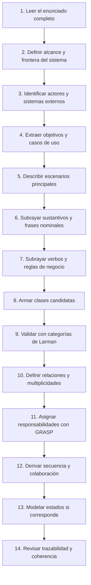
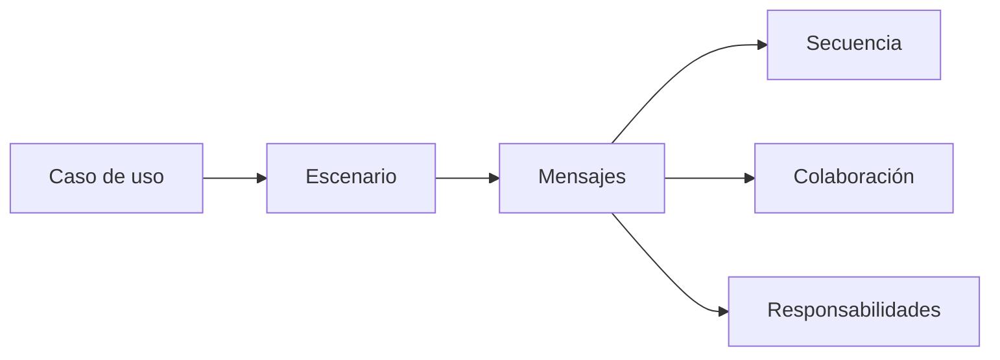

# Guía de resolución

Esta guía propone un método de trabajo para resolver los casos prácticos de la cátedra. Está pensada para pasar de un **enunciado narrativo** a una solución defendible con casos de uso, clases candidatas, responsabilidades y diagramas UML.

No es una receta automática. El análisis de sustantivos y verbos ayuda a empezar, pero el resultado se corrige con criterio de diseño: **Larman**, **GRASP**, bajo acoplamiento, alta cohesión, frontera clara del sistema y trazabilidad con el enunciado.

{: .note }
> Para resolver bien, no alcanza con dibujar. Hay que poder explicar por qué cada actor, caso de uso, clase, relación y mensaje aparece en la solución.

## Secuencia recomendada

## 1. Leer antes de modelar

La primera lectura no busca dibujar. Busca entender:

- qué organización o dominio describe el caso;
- qué problema se quiere resolver;
- qué parte del negocio queda dentro del sistema;
- qué actores interactúan con el sistema;
- qué reglas no se pueden ignorar;
- qué datos, documentos, transacciones o eventos aparecen.

Un error común es empezar por el diagrama de clases. Eso suele producir modelos inflados, con clases sin responsabilidad clara.

## 2. Definir la frontera del sistema

Antes de listar casos de uso, hay que decidir qué está **dentro** y qué está **fuera** del sistema a diseñar.

| Pregunta | Sirve para decidir |
|---|---|
| ¿Qué módulo o sistema pide el enunciado? | Alcance de la solución. |
| ¿Qué usuario inicia acciones? | Actores principales. |
| ¿Qué sistemas se consultan o notifican? | Actores secundarios o sistemas externos. |
| ¿Qué cosas pertenecen al negocio pero no al software? | Contexto, no clases de diseño necesariamente. |

Ejemplo: si el enunciado dice que el sistema consulta Veraz, VISA o AFIP, esos elementos suelen modelarse como **sistemas externos**, no como clases de dominio internas.

## 3. Identificar actores

Un actor es un rol externo que interactúa con el sistema para lograr un objetivo o colaborar con él.

| Tipo | Cómo reconocerlo | Ejemplo |
|---|---|---|
| Actor principal | Inicia un caso de uso para lograr un objetivo. | Cliente, Ejecutivo de Cuenta. |
| Actor secundario | El sistema lo usa para completar una tarea. | Pasarela de Pago, AFIP, Veraz. |
| Actor de soporte | Recibe notificaciones o provee servicios técnicos. | Servicio de correo. |

No todo sustantivo humano es actor. Una persona puede aparecer solo como dato del dominio. La pregunta clave es: **¿interactúa con el sistema?**

## 4. Extraer casos de uso

Un caso de uso representa un **objetivo observable** para un actor, no una pantalla ni un método.

Buenas señales:

- empieza con verbo en infinitivo;
- tiene valor para un actor;
- cruza la frontera del sistema;
- puede describirse con precondiciones, flujo y postcondiciones;
- no es un paso demasiado pequeño.

| Mejor | Evitar |
|---|---|
| Registrar préstamo | Presionar botón Guardar |
| Realizar compra online | Completar campo domicilio |
| Evaluar confiabilidad de pago | Calcular variable puntaje |
| Refinanciar préstamo | Modificar input interés |

### Include y extend

Usar `include` cuando un caso de uso **siempre necesita** otro comportamiento para completarse. Usar `extend` cuando aparece comportamiento **opcional o condicionado**.

| Relación | Pregunta de control | Ejemplo |
|---|---|---|
| `include` | ¿Siempre ocurre como parte obligatoria? | Realizar compra incluye autorizar pago. |
| `extend` | ¿Solo ocurre bajo una condición? | Refinanciar extiende evaluar mora si hay tres meses de atraso. |

## 5. Describir escenarios

Antes de diseñar clases, conviene escribir al menos el escenario principal del caso de uso más importante.

Formato mínimo:

| Parte | Qué poner |
|---|---|
| Actor principal | Quién inicia el objetivo. |
| Precondiciones | Qué debe ser verdadero antes de empezar. |
| Flujo principal | Pasos numerados actor-sistema. |
| Flujos alternativos | Excepciones o decisiones relevantes. |
| Postcondiciones | Qué queda registrado o modificado al finalizar. |

Los diagramas de secuencia y colaboración deberían salir de estos escenarios. Si no hay escenario, los mensajes suelen quedar inventados.

## 6. Subrayar sustantivos y frases nominales

Este paso sirve para encontrar **conceptos del dominio** y **clases candidatas**.

Ejemplos:

- cliente;
- pedido;
- carrito;
- producto;
- préstamo;
- cuota;
- seguro;
- factura;
- informe crediticio;
- ejecutivo de cuenta.

No todo sustantivo debe convertirse en clase.

| Sustantivo encontrado | Posible decisión |
|---|---|
| Cliente | Clase o actor, según interacción. |
| Documento | Atributo si es solo un dato; clase si tiene entidad propia. |
| Estado | Atributo o estado de un diagrama de estados. |
| Monto | Atributo. |
| Pago | Clase/transacción si tiene reglas y ciclo propio. |
| Sistema externo | Actor secundario o servicio externo. |
| Zona | Clase si tiene reglas propias; atributo si solo es un valor simple. |

## 7. Subrayar verbos y reglas

Los verbos muestran **acciones**, **responsabilidades**, **casos de uso** o **mensajes**.

Ejemplos:

- registrar;
- asignar;
- consultar;
- evaluar;
- calcular;
- autorizar;
- emitir;
- enviar;
- refinanciar.

| Verbo encontrado | Puede terminar como |
|---|---|
| Registrar | Caso de uso o método de aplicación. |
| Calcular | Responsabilidad de una clase experta. |
| Consultar | Mensaje a repositorio, servicio o sistema externo. |
| Evaluar | Regla de negocio o servicio de dominio. |
| Emitir | Responsabilidad de un componente o servicio. |

Las reglas de negocio también deben subrayarse: montos mínimos, plazos, condiciones de aprobación, estados, restricciones legales y variantes por tipo.

## 8. Armar clases candidatas

Una clase candidata se conserva si tiene identidad, información relevante o responsabilidades propias.

| Conservar como clase si... | Descartar o degradar si... |
|---|---|
| Tiene datos propios y comportamiento. | Es solo un dato simple. |
| Participa en reglas de negocio. | Es un sinónimo de otra clase. |
| Se relaciona con otros conceptos. | Es una acción, no un concepto. |
| Tiene ciclo de vida. | Es un valor enumerado. |
| Representa una transacción o documento importante. | Es un detalle de interfaz. |

El objetivo no es tener muchas clases, sino tener las clases necesarias para explicar el dominio y asignar responsabilidades.

## 9. Validar con categorías de Larman

La lista de categorías de Larman ayuda a encontrar clases que el análisis lingüístico puede omitir.

| Categoría | Pregunta | Ejemplos |
|---|---|---|
| Objetos físicos o tangibles | ¿Hay cosas materiales relevantes? | Producto, bien prendado. |
| Especificaciones o descripciones | ¿Hay catálogos, tipos o descripciones? | Rubro, tipo de préstamo. |
| Lugares | ¿La ubicación afecta reglas? | Sucursal, zona. |
| Transacciones | ¿Hay operaciones de negocio registrables? | Pedido, pago, préstamo, refinanciación. |
| Líneas de transacción | ¿Hay detalle de una transacción? | Línea de pedido, cuota. |
| Roles de personas | ¿Hay roles con responsabilidades distintas? | Cliente, ejecutivo. |
| Organizaciones | ¿Importa la entidad organizacional? | Banco, farmacia. |
| Eventos | ¿Hay hechos relevantes en el tiempo? | Pago aprobado, vencimiento. |
| Documentos o registros | ¿Hay comprobantes, informes o declaraciones? | Factura, informe crediticio. |
| Sistemas externos | ¿Se consulta o invoca otro sistema? | AFIP, Veraz, VISA. |

{: .warning }
> La tabla de categorías no reemplaza al criterio. Sirve para revisar omisiones, especialmente sistemas externos, documentos, transacciones y líneas de transacción.

## 10. Definir relaciones y multiplicidades

Después de elegir clases, se definen relaciones. No antes.

| Relación | Cuándo usarla |
|---|---|
| Asociación | Una clase conoce o se vincula con otra. |
| Agregación | Un todo agrupa partes que pueden existir separadas. |
| Composición | La parte depende fuertemente del todo. |
| Herencia | Hay especialización real con comportamiento común. |
| Dependencia | Una clase usa otra de forma puntual o indirecta. |

Las multiplicidades deben responder preguntas concretas:

- ¿un cliente puede tener muchos pedidos?
- ¿un pedido tiene una o muchas líneas?
- ¿una cuota pertenece a un solo préstamo?
- ¿un ejecutivo atiende varios clientes?
- ¿un pago puede estar asociado a más de un pedido?

Si no se puede defender una multiplicidad desde el enunciado o una regla razonable, conviene explicitar el supuesto.

## 11. Asignar responsabilidades con GRASP

Este es el paso central de diseño. No alcanza con identificar clases: hay que decidir **quién conoce qué** y **quién hace qué**.

| Problema | Criterio GRASP |
|---|---|
| ¿Quién calcula un dato? | Experto en Información: quien tiene la información necesaria. |
| ¿Quién recibe el evento del sistema? | Controlador: un objeto de aplicación, módulo o caso de uso. |
| ¿Quién crea un objeto? | Creator: quien lo contiene, lo usa intensamente o tiene datos para inicializarlo. |
| ¿Cómo evitar clases enormes? | Alta Cohesión: responsabilidades relacionadas y manejables. |
| ¿Cómo evitar dependencia innecesaria? | Bajo Acoplamiento: conocer lo mínimo necesario. |
| ¿Cómo manejar variantes? | Polimorfismo o Variaciones Protegidas. |
| ¿Dónde ubicar lógica que no pertenece al dominio? | Fabricación Pura o servicio de aplicación. |

Ejemplo de criterio: si `Pedido` conoce sus líneas, entonces `Pedido` puede calcular el total. Si la UI recibe un clic, no debería contener la lógica de negocio; debería delegar en un controlador o servicio de aplicación.

## 12. Derivar secuencia y colaboración

Los diagramas de secuencia y colaboración no se inventan aparte: salen de un escenario.

En secuencia se revisa:

- quién recibe el primer evento;
- si el controlador delega o concentra lógica;
- si cada mensaje tiene sentido con las responsabilidades;
- si aparecen sistemas externos donde corresponde;
- si los retornos y alternativas importantes están representados.

En colaboración se revisa lo mismo, pero con énfasis en los enlaces y la numeración de mensajes.

## 13. Modelar estados cuando corresponde

No todo objeto necesita diagrama de estados. Conviene hacerlo cuando hay un objeto con ciclo de vida claro.

Buenos candidatos:

- pedido;
- pago;
- préstamo;
- cuota;
- solicitud;
- ticket;
- inscripción.

Preguntas de control:

- ¿qué estados relevantes puede tener?
- ¿qué evento cambia cada estado?
- ¿hay estados finales?
- ¿hay transiciones condicionadas por reglas?

## 14. Revisar trazabilidad

La revisión final debe comprobar que cada artefacto se corresponde con el enunciado.

| Revisión | Pregunta |
|---|---|
| Enunciado -> casos de uso | ¿Cada funcionalidad pedida aparece como objetivo? |
| Casos de uso -> clases | ¿Las clases permiten realizar esos escenarios? |
| Clases -> secuencia | ¿Los mensajes respetan responsabilidades reales? |
| Secuencia -> clases | ¿Todo objeto usado existe en el modelo? |
| Reglas -> diseño | ¿Las reglas importantes están representadas? |
| Sistemas externos -> diagramas | ¿Aparecen donde se los consulta o invoca? |

## Qué entregar

| Producto | Qué debe quedar claro |
|---|---|
| Lista de actores | Quién interactúa y con qué rol. |
| Casos de uso | Objetivos funcionales, no pantallas ni métodos. |
| Diagrama de casos de uso | Frontera del sistema, actores, `include` y `extend` justificados. |
| Diagrama de actividad | Flujo principal, decisiones y reglas. |
| Clases candidatas por frases conceptuales | Sustantivos/frases nominales con decisión explícita. |
| Clases candidatas por categorías de Larman | Verificación cruzada del dominio. |
| Diagrama de clases | Clases, relaciones, multiplicidades y especializaciones. |
| Diagrama de secuencia | Escenario significativo con mensajes ordenados. |
| Diagrama de colaboración | Mismo escenario, enfatizando enlaces y numeración. |
| Diagrama de estados | Ciclo de vida de un objeto representativo. |
| Componentes/despliegue | Estructura lógica y distribución técnica cuando se pida. |

## Criterio de corrección

Una resolución sólida tiene estas señales:

- define bien la frontera del sistema;
- no confunde actor, clase y sistema externo;
- cubre todas las funcionalidades pedidas;
- justifica `include` y `extend`;
- combina análisis de sustantivos con categorías de Larman;
- evita convertir atributos simples en clases;
- asigna responsabilidades con GRASP;
- mantiene bajo acoplamiento y alta cohesión;
- usa multiplicidades defendibles;
- hace que clases, secuencia, colaboración y estados cuenten la misma solución.

## Errores frecuentes

| Error | Cómo corregirlo |
|---|---|
| Empezar por clases sin casos de uso. | Primero actores, objetivos y escenarios. |
| Tomar todo sustantivo como clase. | Filtrar atributos, sinónimos, valores y detalles de interfaz. |
| Olvidar sistemas externos. | Revisar consultas, autorizaciones, notificaciones e integraciones. |
| Poner lógica de negocio en la UI. | Usar controlador y delegar en objetos expertos. |
| Usar herencia solo porque hay nombres parecidos. | Heredar solo si hay especialización real y comportamiento común. |
| Hacer secuencia sin escenario. | Elegir un caso de uso significativo y derivar mensajes. |
| No explicar multiplicidades. | Justificarlas con el enunciado o declarar supuesto. |
| Modelar estados de cualquier clase. | Elegir objetos con ciclo de vida real. |

## Aplicación rápida

Para resolver un caso en examen o práctica:

1. marcá la frontera del sistema;
2. listá actores principales, secundarios y sistemas externos;
3. convertí objetivos en casos de uso;
4. escribí el flujo principal del caso más importante;
5. sacá sustantivos para clases candidatas;
6. sacá verbos para responsabilidades y mensajes;
7. revisá con categorías de Larman;
8. dibujá clases con relaciones y multiplicidades;
9. asigná responsabilidades con GRASP;
10. derivá secuencia y colaboración desde un escenario;
11. hacé estado solo si hay ciclo de vida relevante;
12. revisá cobertura contra el enunciado.

## Para el parcial

La cadena mínima que conviene memorizar es:

**frontera -> actores -> casos de uso -> escenarios -> sustantivos -> verbos -> clases candidatas -> categorías de Larman -> relaciones -> responsabilidades GRASP -> secuencia/colaboración -> estados -> revisión**

La pregunta final siempre es la misma: **¿puedo defender cada decisión con el enunciado, con Larman o con un criterio de diseño?**
