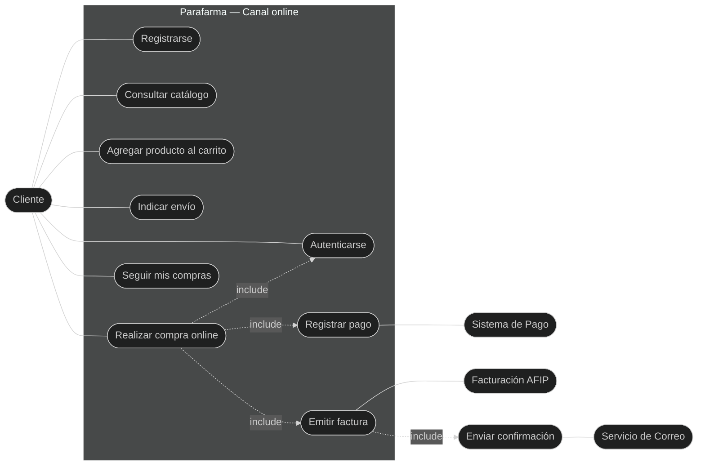
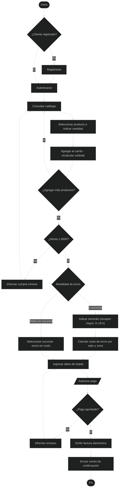
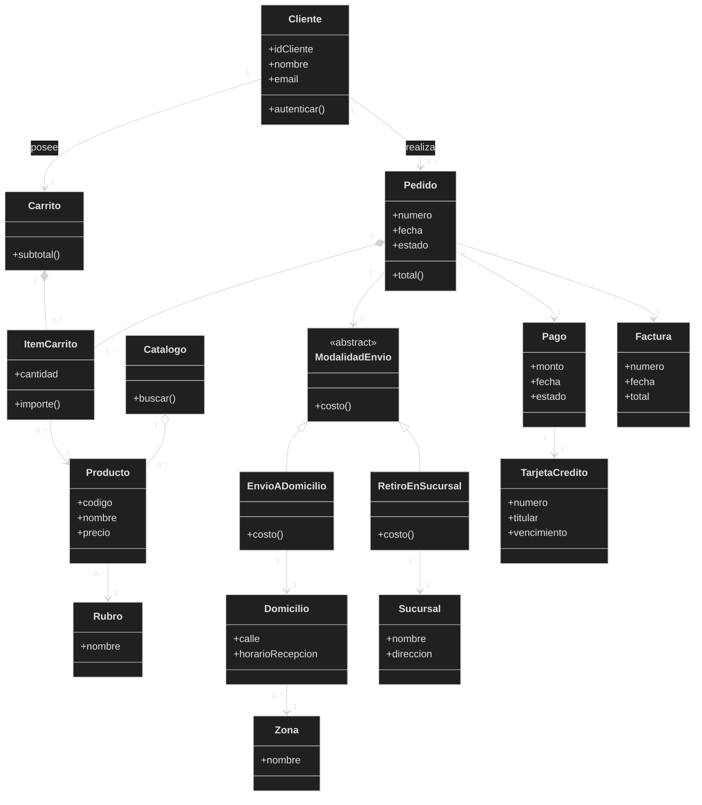
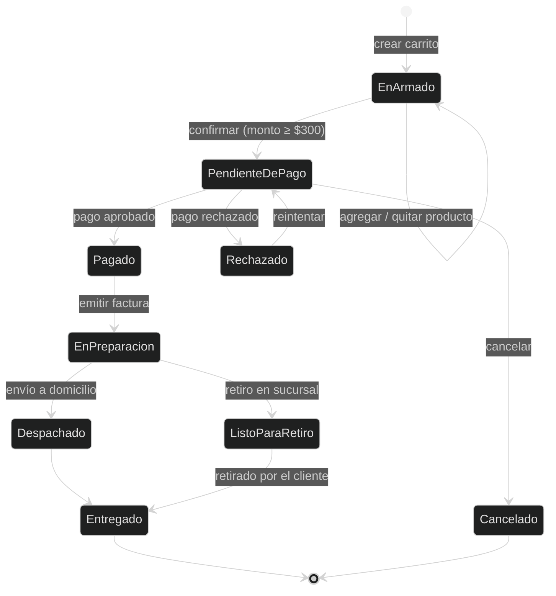
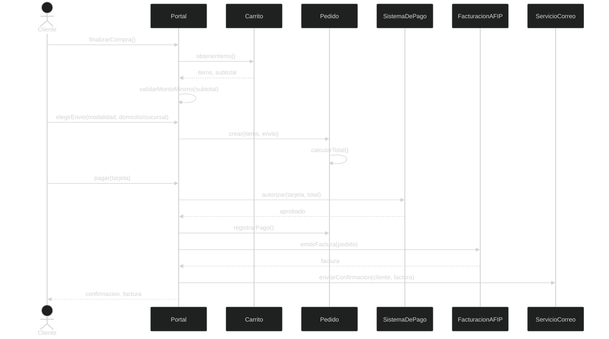
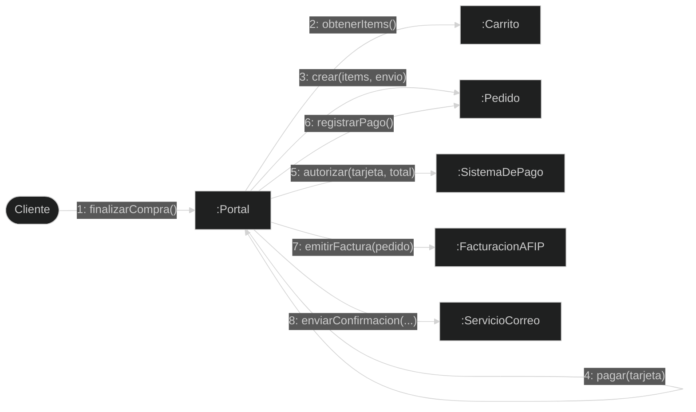

# Práctica 1 — Caso "Farmacia" (Parafarma)

Resolución del **Ejercicio 1** de la guía de la cátedra. Es un caso integral de **análisis y diseño orientado a objetos** (casos de uso → clases candidatas según Larman → diagramas UML). El alcance del modelado se centra en el **canal de venta online** (e-commerce), que es la parte detallada del enunciado.

{: .enunciado }
> **Parafarma** es una cadena de farmacias de Buenos Aires con dos canales de venta: mostrador tradicional y **compras online** (cosmética, salud y nutrición, higiene; por este canal **no** se venden medicamentos). Para comprar online, la persona debe **registrarse como cliente**. Arma su pedido **seleccionando productos del catálogo** e indicando **cantidades**; luego indica el **domicilio de entrega**. Hay dos **modalidades de envío**: (1) a un **domicilio** donde lo reciba una persona mayor de edad de 9 a 18 h —el **costo varía según el valor de la compra y la zona**— o (2) **retiro en una sucursal** sin costo. La **compra mínima es de $300**. Finalmente el cliente paga **únicamente con tarjeta de crédito**; verificado el pago, recibe un **correo de confirmación con la factura electrónica** (Res. Gral. AFIP N.º 2975).

---

## 1. Casos de uso (descripción)

### Actores

| Actor | Tipo | Rol |
|---|---|---|
| **Cliente** | Principal | Se registra, arma el pedido, elige envío y paga. |
| **Sistema de Pago** (pasarela de tarjeta) | Secundario / externo | Autoriza y verifica el pago con tarjeta de crédito. |
| **Sistema de Facturación (AFIP)** | Secundario / externo | Emite la factura electrónica (Res. 2975). |
| **Servicio de Correo** | Secundario / externo | Envía el correo de confirmación. |

### Lista de casos de uso (canal online)

- **CU1 – Registrarse como cliente**
- **CU2 – Autenticarse** (iniciar sesión)
- **CU3 – Consultar catálogo**
- **CU4 – Agregar producto al carrito** (seleccionar producto + cantidad)
- **CU5 – Gestionar carrito** (modificar cantidades / quitar)
- **CU6 – Indicar envío** (domicilio o retiro en sucursal)
- **CU7 – Realizar compra online** (*checkout*) — «include» CU2, CU8, CU9
- **CU8 – Registrar pago con tarjeta**
- **CU9 – Emitir factura electrónica**
- **CU10 – Seguir mis compras** (historial)

### CU7 — Realizar compra online (formato expandido)

{: .resolucion }
> **Actor principal:** Cliente · **Personal involucrado:** Sistema de Pago, Facturación AFIP, Servicio de Correo.
>
> **Precondiciones:** el cliente está **registrado y autenticado**; el catálogo está disponible; el carrito tiene al menos un producto.
>
> **Postcondiciones (éxito):** la compra queda **registrada y pagada**; se **emite y envía la factura electrónica**; el pedido pasa a preparación.
>
> **Flujo principal:**
> 1. El cliente selecciona productos del catálogo e indica cantidades (CU4).
> 2. El sistema agrega cada producto al carrito y recalcula el subtotal.
> 3. El cliente solicita **finalizar la compra**.
> 4. El sistema **valida que el monto ≥ $300** (compra mínima).
> 5. El cliente elige la **modalidad de envío** (CU6).
>     - **5a. A domicilio:** indica el domicilio; el sistema **calcula el costo de envío** según el valor de la compra y la zona.
>     - **5b. Retiro en sucursal:** selecciona la sucursal; el costo de envío es **$0**.
> 6. El cliente ingresa los **datos de la tarjeta de crédito**.
> 7. El sistema solicita la **autorización** al Sistema de Pago (CU8).
> 8. El Sistema de Pago **aprueba** el pago.
> 9. El sistema **emite la factura electrónica** vía AFIP (CU9) y registra la compra.
> 10. El sistema **envía el correo de confirmación** con la factura y muestra la confirmación.
>
> **Flujos alternativos:**
> - **4a. Monto < $300:** el sistema informa el mínimo y no permite avanzar.
> - **7a. Cliente no autenticado:** se invoca CU2 (Autenticarse) o CU1 (Registrarse).
> - **8a. Pago rechazado:** el sistema informa, el pedido queda *pendiente de pago* y se vuelve al paso 6.

### CU1 — Registrarse como cliente (breve)

{: .resolucion }
> **Precondición:** la persona no está registrada. **Flujo:** ingresa los datos que permiten su identificación → el sistema valida que no exista y los registra → habilita el ingreso en visitas futuras y el seguimiento de compras. **Postcondición:** existe una cuenta de cliente.

---

## 2. Diagrama de casos de uso

---

## 3. Diagrama de actividad

Flujo de la compra online, desde el ingreso hasta la confirmación.

---

## 4. Lista de clases candidatas — frases conceptuales (análisis de sustantivos)

Método de Larman por **identificación lingüística**: se extraen los **sustantivos / frases nominales** del enunciado y de los casos de uso, y se descartan los que en realidad son **atributos**, **roles**, **reglas** o **sinónimos**.

| Frase nominal del enunciado | Decisión | Clase candidata |
|---|---|---|
| persona / cliente | Clase | **Cliente** |
| producto | Clase | **Producto** |
| rubro (cosmética, salud, higiene…) | Clase | **Rubro** |
| catálogo | Clase | **Catálogo** |
| carrito de compras | Clase | **Carrito** |
| producto **+** cantidad en el carrito | Clase (línea) | **ItemCarrito** |
| compra / pedido | Clase | **Pedido** |
| modalidad de envío | Clase (con subtipos) | **ModalidadEnvío** |
| domicilio de entrega | Clase | **Domicilio** |
| sucursal | Clase | **Sucursal** |
| zona de entrega | Clase | **Zona** |
| datos para el pago | Clase | **Pago** |
| tarjeta de crédito | Clase | **TarjetaCrédito** |
| factura | Clase | **Factura** |
| cantidad de unidades | ❌ atributo de *ItemCarrito* | — |
| costo del envío | ❌ atributo de *ModalidadEnvío* | — |
| compra mínima ($300) | ❌ regla de negocio | — |
| persona mayor de edad / horario 9–18 | ❌ restricción / atributo | — |
| localidad | ❌ atributo de *Sucursal/Domicilio* | — |
| canal de venta | ❌ concepto, fuera de alcance | — |
| correo de confirmación | ❌ evento / mensaje (no es entidad) | — |

**Clases candidatas resultantes:** Cliente, Producto, Rubro, Catálogo, Carrito, ItemCarrito, Pedido, ModalidadEnvío, Domicilio, Sucursal, Zona, Pago, TarjetaCrédito, Factura.

---

## 5. Lista de clases candidatas — categorías de Larman (Tabla 10.1)

Las mismas clases, ahora ubicadas según la **lista de categorías conceptuales** de Larman (verificación cruzada: ayuda a encontrar clases que el análisis de sustantivos pudo omitir, como los **sistemas externos**).

| Categoría conceptual (Larman) | Clases candidatas en el caso |
|---|---|
| Objetos tangibles o físicos | **Producto** |
| Especificaciones / descripciones | **Rubro**, DescripciónDeProducto |
| Lugares | **Sucursal**, **Domicilio**, **Zona** |
| Transacciones | **Pedido**, **Pago** |
| Líneas de la transacción | **ItemCarrito** (LíneaDePedido) |
| Roles de la gente | **Cliente** |
| Contenedores de otras cosas | **Carrito**, **Catálogo** |
| Cosas en un contenedor | Producto (en catálogo), ItemCarrito (en carrito) |
| Otros sistemas externos | **SistemaDePago**, **SistemaFacturaciónAFIP**, ServicioCorreo |
| Organizaciones | Parafarma (la cadena) |
| Catálogos | **Catálogo**, ListaDePrecios |
| Registros financieros / legales | **Factura** |
| Instrumentos y servicios financieros | **TarjetaCrédito** |
| Reglas y políticas | PolíticaDeEnvío, CompraMínima |

---

## 6. Diagrama de clases básico

Modelo del dominio con las clases candidatas, sus asociaciones y multiplicidades. `ModalidadEnvío` se especializa en las dos opciones del enunciado.

---

## 7. Diagrama de estado

Ciclo de vida del objeto **Pedido**, desde que se arma el carrito hasta la entrega.

---

## 8. Diagrama de secuencia

Escenario significativo: **finalizar la compra y pagar** (flujo principal del CU7).

---

## 9. Diagrama de comunicaciones

Mismo escenario que el diagrama de secuencia, pero resaltando los **enlaces entre objetos** y la **numeración** de los mensajes (Mermaid no tiene un tipo nativo de colaboración; se representa con un grafo de objetos y mensajes numerados).

{: .note }
> **Para el parcial.** El diagrama de **secuencia** y el de **comunicaciones** describen el **mismo escenario** con distinto énfasis: el de secuencia resalta el **orden temporal** (líneas de vida verticales); el de comunicaciones, la **estructura de enlaces** entre objetos (mensajes numerados). Las clases candidatas salen de combinar el **análisis de sustantivos** con la **lista de categorías** de Larman: la segunda es clave para no olvidar los **sistemas externos** (pago, AFIP), que rara vez aparecen como sustantivo del dominio.
