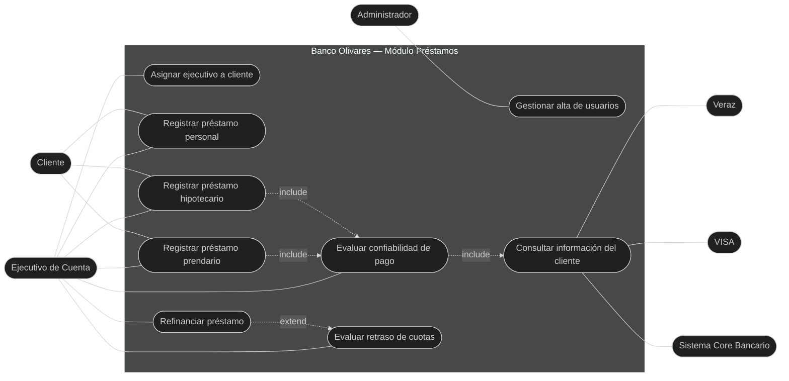
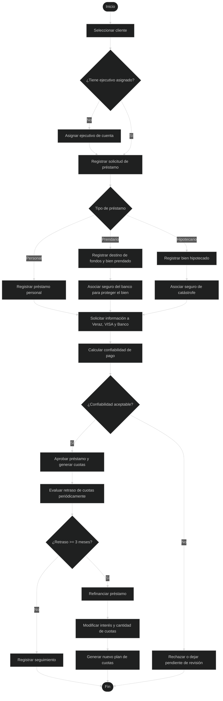
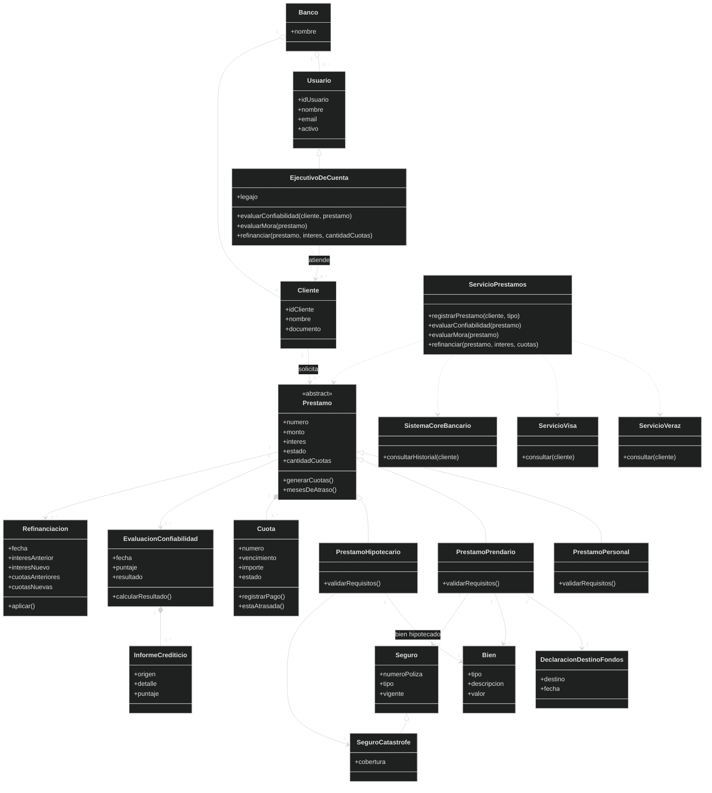
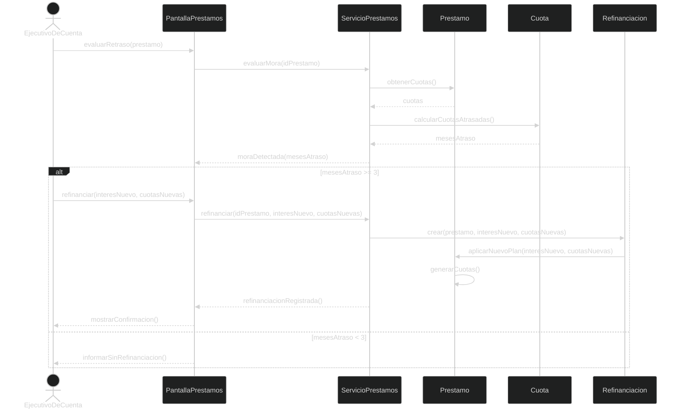
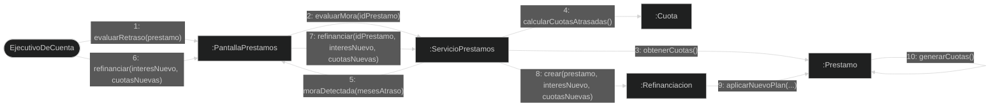
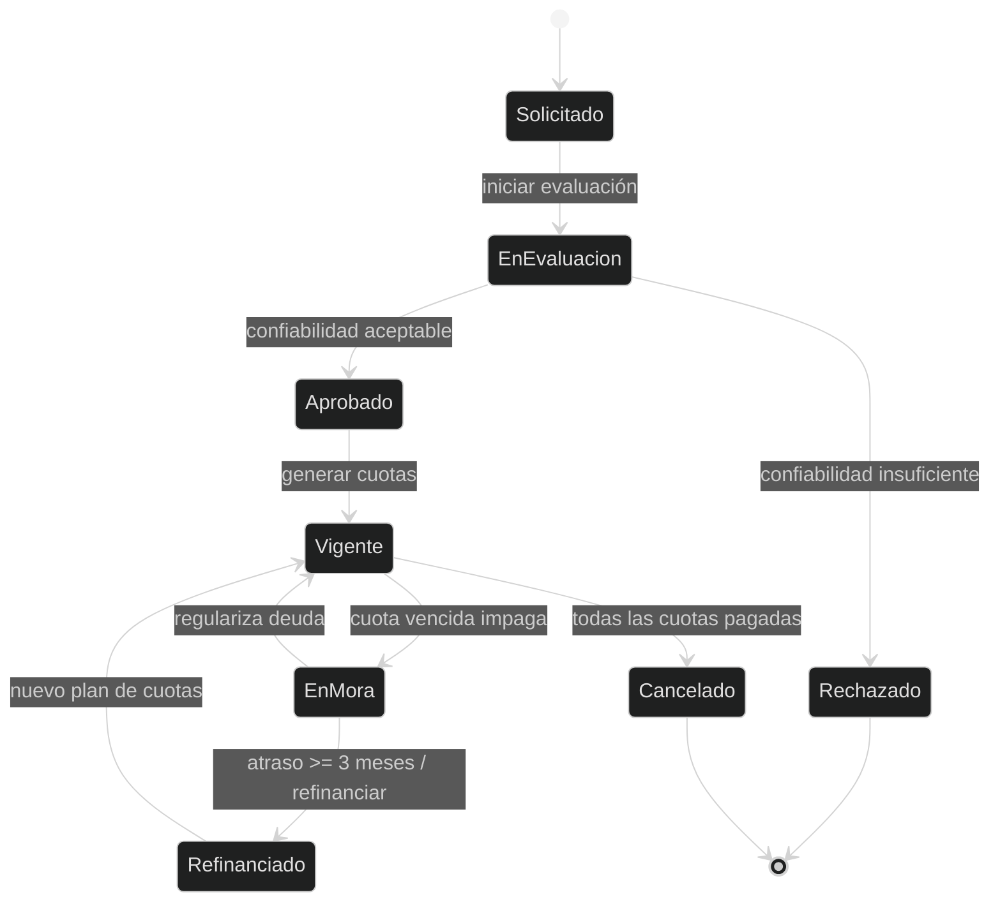
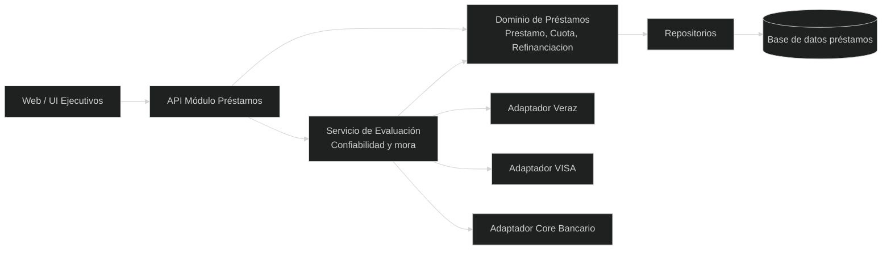
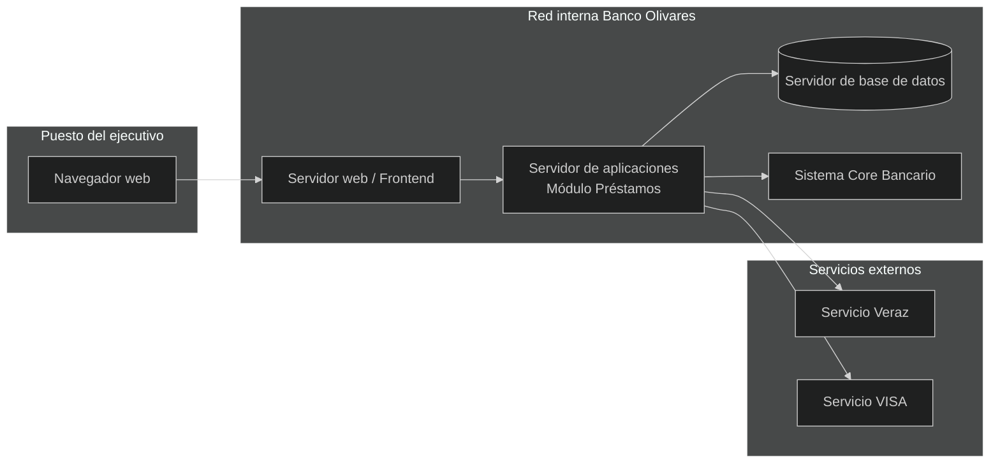

# Práctica 2 — Caso "Banco Olivares"

Resolución propuesta del **Ejercicio 2** de la guía de la cátedra. El caso se centra en el rediseño del módulo de **Préstamos**, con foco en responsabilidades, especialización de tipos de préstamo, evaluación de confiabilidad, seguimiento de cuotas y refinanciación.

{: .enunciado }
> El banco Olivares desea hacer un nuevo desarrollo del módulo Prestamos, ya que no se encuentra el código fuente de dicho subsistema.
>
> De la fase de análisis se definió la siguiente funcionalidad
>
> • El sistema debe gestionar el alta de los usuarios,
>
> • El sistema debe gestionar la asignación de ejecutivos a determinados clientes,
>
> • El sistema debe gestionar los diferentes prestamos que tiene el Banco:
>
> o personales (sin ser necesario tener una declaración sobre el destino de los fondos)
>
> o préstamos prendarios para Autos, motos, herramientas, etc., (se debe tener una declaración sobre el destino de los fondos, más asociarle un seguro del banco para proteger el bien)
>
> o Prestamos Hipotecarios (declaración sobre el bien hipotecado , con el seguro de catástrofe del banco)
>
> • El sistema debe gestionar la evaluación de confiabilidad de pago del préstamo del cliente, el mismo lo realiza un ejecutivo de cuenta, solicitando información del Veraz, de VISA y del propio Banco
>
> • El sistema debe permitir al Ejecutivo de Cuenta evaluar el retraso de las cuotas predefinidas para el cobro del préstamo, Ante el retraso de tres meses en el pago, el ejecutivo de cuenta puede refinanciar el préstamo, modificando el interés y cantidad de cuotas
>
> Al inicio del proyecto se obtuvo el siguiente modelo preliminar, donde se definió algunas clases.
>
> Se solicita realizar:
>
> 1- Diagrama de CU  
> 2- Diagrama de Actividad Lista de clases candidatas (según frases conceptuales de Larman)  
> 3- Lista de clases candidatas (según frases listas de categoría de Larman)  
> 4- Diagrama de Clases de Diseño  
> 5- Diagrama de Secuencia para un escenario significativo.  
> 6- Diagrama de Colaboración para un escenario significativo.  
> 7- Diagrama de Estado de un objeto representativo.  
> 8- Diagrama de Componentes.  
> 9- Diagrama de Despliegue.

{: .note }
> El PDF menciona un **modelo preliminar**, pero en la guía provista no aparece visible junto al caso. La resolución parte del enunciado funcional y explicita las clases necesarias para cubrirlo.

---

## 1. Diagrama de casos de uso

### Actores

| Actor | Tipo | Rol |
|---|---|---|
| **Administrador** | Principal | Da de alta usuarios y mantiene datos base del módulo. |
| **Ejecutivo de Cuenta** | Principal | Asigna clientes, evalúa confiabilidad, revisa mora y refinancia préstamos. |
| **Cliente** | Secundario | Es titular de préstamos y cuotas. |
| **Veraz** | Secundario / externo | Informa antecedentes crediticios. |
| **VISA** | Secundario / externo | Informa comportamiento de pago con tarjeta. |
| **Sistema Core Bancario** | Secundario / externo | Aporta información interna del banco sobre el cliente. |

### Lista de casos de uso

- **CU1 – Gestionar alta de usuarios**
- **CU2 – Asignar ejecutivo a cliente**
- **CU3 – Registrar préstamo personal**
- **CU4 – Registrar préstamo prendario**
- **CU5 – Registrar préstamo hipotecario**
- **CU6 – Evaluar confiabilidad de pago**
- **CU7 – Consultar información externa e interna del cliente**
- **CU8 – Evaluar retraso de cuotas**
- **CU9 – Refinanciar préstamo**

{: .note }
> `CU9` se modela como **extend** de `CU8`: la refinanciación solo aparece si el retraso alcanza la regla de negocio indicada por el enunciado, es decir, tres meses de atraso.

---

## 2. Diagrama de actividad

Flujo principal para evaluar un préstamo y, luego, controlar mora y refinanciar cuando corresponde.

---

## 3. Lista de clases candidatas — frases conceptuales

Método de Larman por identificación de sustantivos y frases nominales. Se descartan atributos simples, acciones y reglas que conviene ubicar como responsabilidades.

| Frase nominal del enunciado | Decisión | Clase candidata |
|---|---|---|
| banco Olivares / Banco | Contexto u organización | **Banco** |
| módulo Préstamos / subsistema | Contexto de software | — |
| usuarios | Clase | **Usuario** |
| ejecutivos / ejecutivo de cuenta | Clase especializada / rol | **EjecutivoDeCuenta** |
| clientes | Clase | **Cliente** |
| préstamos | Clase base | **Prestamo** |
| préstamos personales | Subclase | **PrestamoPersonal** |
| préstamos prendarios | Subclase | **PrestamoPrendario** |
| préstamos hipotecarios | Subclase | **PrestamoHipotecario** |
| declaración sobre el destino de los fondos | Clase / documento del préstamo | **DeclaracionDestinoFondos** |
| Autos, motos, herramientas / bien | Clase | **Bien** |
| seguro del banco | Clase | **Seguro** |
| seguro de catástrofe | Subtipo o atributo de seguro | **SeguroCatastrofe** |
| evaluación de confiabilidad de pago | Clase de evaluación | **EvaluacionConfiabilidad** |
| Veraz | Sistema externo | **ServicioVeraz** |
| VISA | Sistema externo | **ServicioVisa** |
| propio Banco | Sistema interno externo al módulo | **SistemaCoreBancario** |
| cuotas predefinidas | Clase | **Cuota** |
| retraso de cuotas | Estado/cálculo sobre cuotas | — |
| refinanciar / refinanciación | Clase transaccional | **Refinanciacion** |
| interés | Atributo de préstamo/refinanciación | — |
| cantidad de cuotas | Atributo o valor calculado | — |

**Clases candidatas resultantes:** Banco, Usuario, EjecutivoDeCuenta, Cliente, Prestamo, PrestamoPersonal, PrestamoPrendario, PrestamoHipotecario, DeclaracionDestinoFondos, Bien, Seguro, SeguroCatastrofe, EvaluacionConfiabilidad, ServicioVeraz, ServicioVisa, SistemaCoreBancario, Cuota, Refinanciacion.

---

## 4. Lista de clases candidatas — categorías de Larman

| Categoría conceptual (Larman) | Clases candidatas en el caso |
|---|---|
| Roles de la gente | **Usuario**, **EjecutivoDeCuenta**, **Cliente** |
| Organizaciones | **Banco** |
| Transacciones | **Prestamo**, **Refinanciacion**, **EvaluacionConfiabilidad** |
| Líneas de la transacción | **Cuota** |
| Objetos tangibles o físicos | **Bien** |
| Especificaciones / descripciones | TipoPrestamo, TipoBien, TipoSeguro |
| Instrumentos financieros | **Prestamo**, **Cuota**, **Seguro** |
| Registros/documentos | **DeclaracionDestinoFondos**, InformeCrediticio |
| Otros sistemas externos | **ServicioVeraz**, **ServicioVisa**, **SistemaCoreBancario** |
| Reglas y políticas | PolíticaConfiabilidad, PolíticaMora, PolíticaRefinanciación |

{: .note }
> Las políticas se pueden modelar como clases de diseño si se necesita cambiar reglas sin modificar `Prestamo` o `EjecutivoDeCuenta`. Para un diagrama básico, alcanza con mostrarlas como responsabilidades del servicio de aplicación.

---

## 5. Diagrama de clases de diseño

Modelo orientado a responsabilidades. `Prestamo` concentra el comportamiento común; los subtipos incorporan las restricciones particulares del enunciado.

---

## 6. Diagrama de secuencia

Escenario significativo: **evaluar mora y refinanciar un préstamo** cuando el cliente acumula tres meses de atraso.

---

## 7. Diagrama de colaboración

Mismo escenario que el diagrama de secuencia, representado como enlaces entre objetos con mensajes numerados.

---

## 8. Diagrama de estado

Ciclo de vida del objeto **Prestamo**.

---

## 9. Diagrama de componentes

Vista lógica del módulo de préstamos y sus dependencias.

---

## 10. Diagrama de despliegue

Vista física sugerida para operar el módulo.

{: .note }
> **Para el parcial.** La clave del caso es no poner toda la lógica en una única clase `Prestamo`. Los subtipos resuelven requisitos distintos: el personal no exige declaración, el prendario exige destino de fondos, bien y seguro, y el hipotecario exige bien hipotecado y seguro de catástrofe. La refinanciación conviene modelarla como una transacción propia porque conserva el cambio de interés y cantidad de cuotas.
