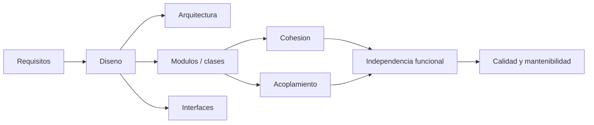

## Idea central

El **diseño de software** transforma requisitos en una solución construible. Si los requisitos dicen **qué** debe hacer el sistema, el diseño decide **cómo** se organiza internamente para hacerlo.

Desde Larman, diseñar es **asignar responsabilidades**: qué objeto conoce, qué objeto hace y cómo colaboran. Desde Pressman, el diseño es donde se introduce calidad antes de codificar.

## Mapa mental



## Conceptos clave

| Concepto | Para recordar |
|---|---|
| **Diseño de sistemas** | Decide la solución completa: hardware, software, personas, procesos, redes. |
| **Diseño de software** | Diseña internamente la parte de software: arquitectura, módulos, clases, datos, interfaces. |
| **Abstracción** | Subir el nivel: quedarse con lo esencial y ocultar detalles. |
| **Refinamiento** | Bajar el nivel: descomponer paso a paso hasta llegar a detalles implementables. |
| **Modularidad** | Dividir el sistema en partes comprensibles. Ni pocos módulos gigantes ni demasiados módulos triviales. |
| **Cohesión** | Qué tan relacionadas están las responsabilidades internas de un módulo. Se busca **alta**. |
| **Acoplamiento** | Qué tanto depende un módulo de otros. Se busca **bajo**. |
| **Independencia funcional** | Alta cohesión + bajo acoplamiento. Es señal de buen diseño modular. |
| **Ocultamiento de información** | Encapsular decisiones de diseño detrás de interfaces estables. |
| **Refactoring** | Mejorar estructura interna sin cambiar comportamiento observable. |
| **Reutilización** | Reusar código, componentes, frameworks, sistemas o conocimiento de diseño como patrones. |

## Cohesión y acoplamiento

La frase más importante de la unidad:

```text
Independencia funcional = alta cohesion + bajo acoplamiento
```

Orden de cohesión, de peor a mejor:

1. Coincidental.
2. Lógica.
3. Temporal.
4. Procedimental.
5. Comunicacional.
6. Secuencial.
7. Funcional.

Orden de acoplamiento, de peor a mejor:

1. De contenido.
2. Común.
3. De control.
4. De sello.
5. De datos.

## Diseño OO

En diseño orientado a objetos, una clase no debería ser solo una estructura de datos con getters/setters. Un buen objeto combina:

- **identidad**;
- **estado**;
- **comportamiento**;
- **responsabilidades claras**.

GRASP aparece como criterio para decidir responsabilidades: asignar a quien tiene la información, mantener bajo acoplamiento y alta cohesión.

## Buen diseño

Un buen diseño:

- implementa requisitos explícitos e implícitos;
- es entendible para programadores, testers y mantenedores;
- muestra datos, arquitectura, interfaces y componentes;
- es modular;
- reduce dependencias innecesarias;
- permite probar, cambiar y reutilizar partes.

## Para repasar rápido

- ¿Qué diferencia hay entre diseño de sistemas y diseño de software?
- ¿Por qué abstracción y refinamiento son complementarios?
- ¿Qué significa que un módulo tenga cohesión funcional?
- ¿Por qué el acoplamiento de contenido es el peor?
- ¿Qué relación hay entre ocultamiento de información y bajo acoplamiento?
- ¿Por qué refactoring no cambia el comportamiento externo?
- ¿Cómo se conecta esta unidad con GRASP?
