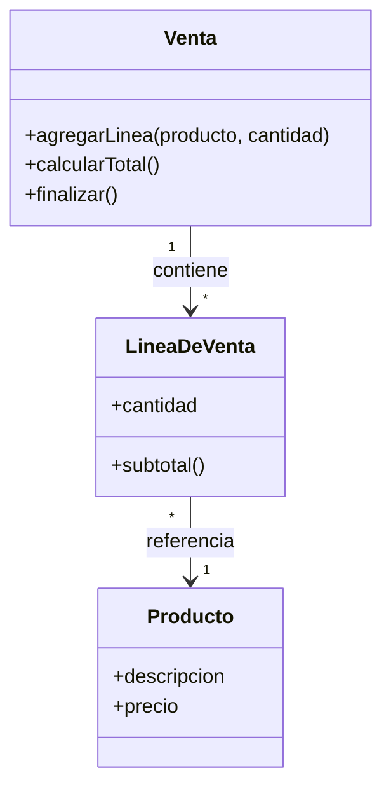
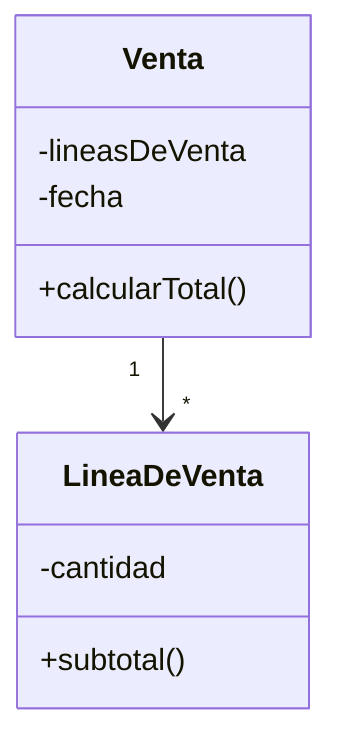
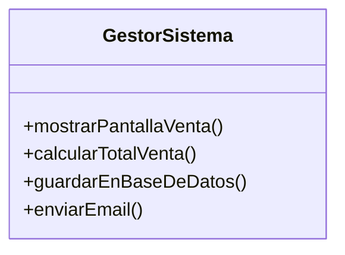
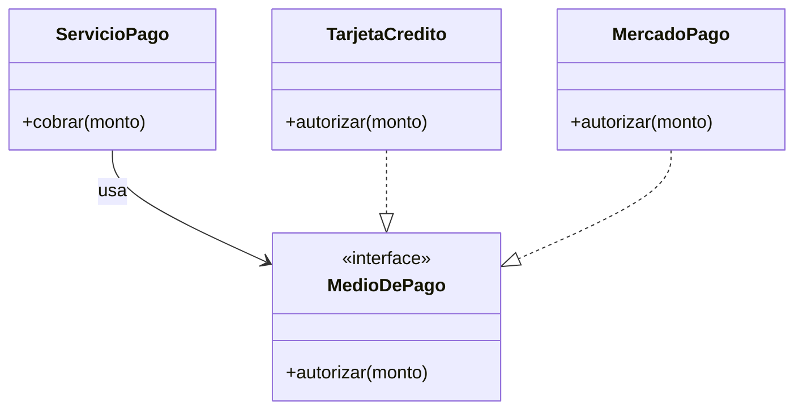
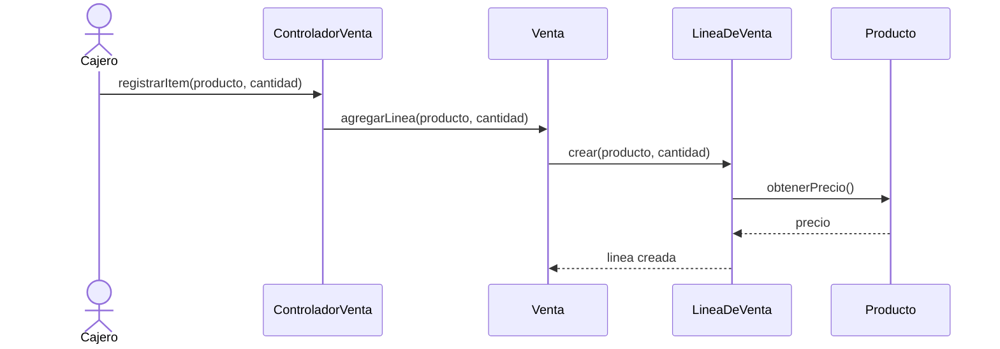
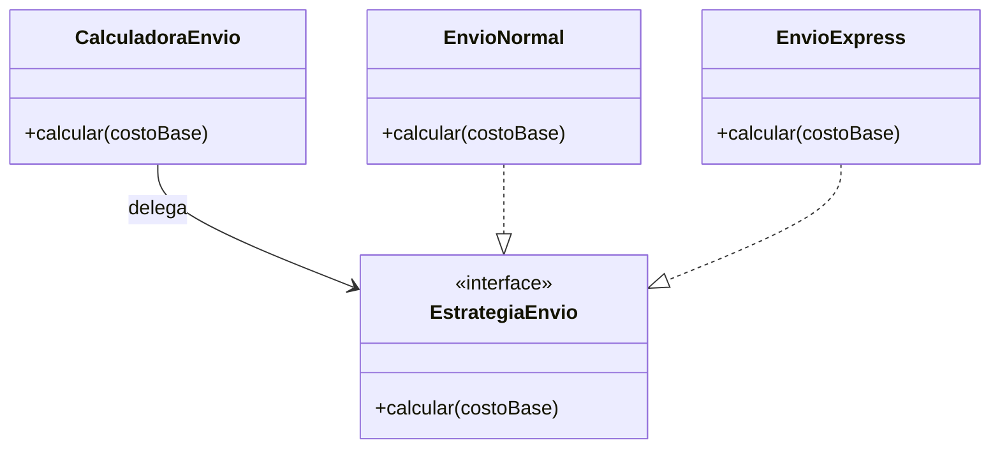

## Introducción

El **diseño de software** (*software design*) es la actividad de ingeniería que traduce los **requisitos** del cliente en una representación interna del sistema que sirve de plano (*blueprint*) para la construcción. Es el momento en el que se decide *cómo* se va a resolver el problema que los requisitos describen como *qué* hay que resolver. Si los requisitos responden "qué debe hacer el sistema", el diseño responde "cómo lo va a hacer".

Desde el enfoque de la cátedra, el diseño se entiende principalmente como una actividad de **asignación de responsabilidades** y organización de colaboraciones entre objetos. Larman lo expresa en términos prácticos: diseñar es decidir qué objetos participan en la solución, qué conoce cada uno, qué hace cada uno y cómo se comunican. Pressman complementa esta idea al ubicar el diseño como la actividad técnica donde se toman muchas de las decisiones que determinan la calidad del producto final.

{: .note }
> El diseño es el "puente" entre el espacio del problema (requisitos, lo que el cliente necesita) y el espacio de la solución (código, lo que se construye). Es la primera de las tres actividades técnicas que producen el sistema: **diseño → construcción/codificación → prueba**.

Esta unidad presenta los **conceptos fundamentales del diseño** que son independientes del método o paradigma concreto (estructurado, orientado a objetos, etc.): son las ideas que todo buen diseño aplica, formuladas a lo largo de la historia de la ingeniería de software por autores como **Wirth** (refinamiento), **Parnas** (ocultamiento de información), **Constantine y Yourdon** (cohesión y acoplamiento), entre otros.

En la cátedra, estos conceptos se estudian principalmente desde el diseño orientado a objetos:

- **Larman**, *UML y patrones*, aporta el enfoque de **asignación de responsabilidades**: diseñar implica decidir qué objetos colaboran, qué sabe cada uno y qué hace cada uno.
- **GoF**, *Design Patterns*, aporta la idea de **reutilizar soluciones de diseño** ya probadas para problemas recurrentes, no solo reutilizar código.
- **Sommerville** y **Pressman & Maxim** se usan como apoyo para validar definiciones generales de proceso, calidad, modularidad y principios clásicos.

---

## El diseño dentro del proceso de software

### Dónde encaja el diseño

Cualquiera sea el modelo de proceso (cascada, incremental, ágil, espiral), las actividades fundamentales de la ingeniería de software son:

1. **Especificación** (ingeniería de requisitos): se define *qué* debe hacer el sistema.
2. **Diseño e implementación**: se transforma la especificación en un sistema ejecutable.
3. **Validación**: se verifica que el sistema cumple lo que el cliente quería.
4. **Evolución**: se modifica el sistema ante cambios de necesidades.

El diseño se ubica en la actividad (2), justo después de la especificación de requisitos y antes (o entrelazado con) la codificación.

{: .note }
> **Entrada del diseño:** el modelo de requisitos (modelo de análisis), que describe la información, las funciones y el comportamiento del sistema.
>
> **Salida del diseño:** el modelo de diseño, un conjunto de representaciones (datos, arquitectura, interfaces, componentes) que sirve de plano para construir el software.

### Entrada y salida: del modelo de requisitos al modelo de diseño

Como apoyo general, Pressman describe el diseño como una transformación del **modelo de requisitos** en un **modelo de diseño** a través de cuatro elementos:

| Modelo de requisitos (entrada) | Elemento del diseño (salida) |
| --- | --- |
| Modelo basado en clases / modelo de datos | **Diseño de datos / clases** (estructuras de datos, esquemas) |
| Modelo de flujo / modelo basado en clases | **Diseño arquitectónico** (organización en subsistemas y componentes) |
| Modelo basado en escenarios (casos de uso) | **Diseño de interfaces** (cómo interactúan componentes, sistemas y usuarios) |
| Modelo de comportamiento, flujo, clases | **Diseño de componentes** (lógica interna de cada módulo) |

El modelo de diseño se construye en **distintos niveles de abstracción**: comienza con representaciones de alto nivel (cercanas al problema) y se refina progresivamente hacia representaciones de bajo nivel (cercanas al código).

### El diseño como asignación de responsabilidades (Larman)

En diseño orientado a objetos, la transición desde requisitos hacia código no consiste solamente en "dibujar clases". Según Larman, una parte central del diseño es **asignar responsabilidades** a objetos y clases.

Una **responsabilidad** es una obligación de un objeto. Puede ser de dos tipos:

| Tipo | Significa que el objeto debe... | Ejemplo |
| --- | --- | --- |
| **Conocer** (*knowing*) | Saber información propia o relacionada | Una `Venta` conoce sus `LineasDeVenta` y su total. |
| **Hacer** (*doing*) | Realizar una acción o coordinar una colaboración | Una `Venta` calcula su total; un `ControladorVenta` coordina el caso de uso. |

{: .note }
> Para Larman, un buen diseño OO no se mide por tener muchas clases, sino por asignar bien las responsabilidades. Los patrones **GRASP** ayudan a decidir *quién debe hacer qué* para obtener bajo acoplamiento, alta cohesión y objetos comprensibles.

Esta mirada conecta directamente con los conceptos de la unidad: si una clase recibe demasiadas responsabilidades pierde cohesión; si necesita conocer demasiados detalles de otras clases aumenta el acoplamiento; si oculta bien sus datos y ofrece una interfaz clara mejora la modularidad.

**Ejemplo de responsabilidades en UML:**



En este ejemplo, `Venta` no debería pedirle a otro objeto que calcule su total si ella conoce sus líneas. Esa asignación sigue el criterio de **Experto en Información** de Larman: asignar la responsabilidad al objeto que tiene la información necesaria para cumplirla.

### Modelo conceptual vs. modelo de diseño

En Larman es importante distinguir dos modelos que suelen confundirse:

| Modelo | Describe | Pregunta que responde |
| --- | --- | --- |
| **Modelo conceptual / de dominio** | Conceptos relevantes del problema y sus relaciones | "¿Qué cosas existen en el dominio?" |
| **Modelo de diseño** | Clases de software, métodos, visibilidad y colaboraciones | "¿Qué objetos de software resuelven el caso de uso?" |

{: .note }
> El modelo conceptual no es código. Una clase de dominio como `Venta` puede inspirar una clase de software `Venta`, pero el diseño agrega responsabilidades, métodos, interfaces y colaboraciones.

### Diseño preliminar (arquitectónico) vs. diseño detallado

Tradicionalmente se distinguen dos grandes fases dentro del diseño de software:

- **Diseño preliminar o arquitectónico** (*high-level / preliminary / architectural design*): define la **estructura global** del sistema. Identifica los **subsistemas y componentes** principales, sus responsabilidades y las relaciones entre ellos. Responde "¿de qué grandes piezas se compone el sistema y cómo se conectan?". Aquí se decide la **arquitectura** (cliente-servidor, capas, microservicios, etc.).

- **Diseño detallado** (*detailed / low-level design*): define el **interior de cada componente**: sus algoritmos, estructuras de datos internas, lógica procedimental e interfaces precisas. Responde "¿cómo funciona internamente cada pieza?". Su salida está lo suficientemente cerca del código como para que la codificación sea casi mecánica.

{: .note }
> Regla práctica: el diseño arquitectónico decide la **descomposición** (qué módulos hay); el diseño detallado decide la **implementación** (cómo es cada módulo por dentro). El primero apunta a alta cohesión y bajo acoplamiento entre módulos; el segundo, a la corrección y eficiencia de cada módulo.

---

## Diferencias entre diseño de sistemas y diseño de software

Es habitual confundir ambos términos, pero operan en **niveles de abstracción distintos** y deciden cosas distintas.

El **diseño de sistemas** (*system design*) es una actividad más amplia, propia de la ingeniería de sistemas. Considera el sistema completo, que puede incluir **hardware, software, personas, procesos manuales, redes y datos**. Decide, por ejemplo, qué funciones se asignan al software y cuáles al hardware o a procedimientos humanos, cómo se distribuyen los componentes físicamente, qué plataformas se usan.

El **diseño de software** (*software design*) toma como entrada las decisiones del diseño de sistemas (la parte que se resolverá con software) y diseña internamente esa porción: arquitectura del software, módulos, estructuras de datos, algoritmos, interfaces.

| Aspecto | Diseño de **sistemas** | Diseño de **software** |
| --- | --- | --- |
| **Alcance** | Todo el sistema: HW + SW + personas + procesos + datos | Solo la parte de software del sistema |
| **Nivel de abstracción** | Más alto: visión global del sistema completo | Más bajo: estructura interna del software |
| **Qué decide** | Asignación de funciones a HW/SW/personas; distribución física; plataformas; integración | Arquitectura del software; módulos; clases; algoritmos; estructuras de datos; interfaces internas |
| **Disciplina** | Ingeniería de sistemas | Ingeniería de software |
| **Entrada** | Requisitos del sistema (negocio/operación) | Requisitos de software + decisiones del diseño de sistemas |
| **Salida** | Arquitectura del sistema, asignación de componentes | Modelo de diseño de software (datos, arquitectura, interfaces, componentes) |
| **Ejemplo de decisión** | "El control de acceso se hará con lectores RFID (HW) y un servidor de validación (SW)" | "El servidor de validación tendrá un módulo de autenticación, una capa de persistencia y una API REST" |

{: .note }
> En síntesis: el **diseño de sistemas** decide *qué* parte del problema resuelve el software (y cuál el hardware o las personas); el **diseño de software** decide *cómo* se estructura internamente ese software. El diseño de software empieza donde termina el diseño de sistemas.

---

## Abstracción

La **abstracción** (*abstraction*) es el mecanismo intelectual que permite manejar la complejidad: consiste en concentrarse en lo esencial de un objeto o proceso e **ignorar (ocultar) los detalles irrelevantes** para el nivel en que se está trabajando. Permite razonar sobre soluciones sin quedar atrapados en su implementación.

Durante el diseño se trabaja con **distintos niveles de abstracción**. En el nivel más alto, una solución se enuncia en términos amplios del dominio del problema ("registrar el pago de una cuota"). A medida que se baja de nivel, la terminología se orienta a la solución y aparecen los detalles ("validar el método de pago, debitar la cuenta, emitir el comprobante, persistir la transacción").

Pressman distingue tres clases de abstracción usadas en diseño:

### Abstracción de datos

Es una representación con nombre de un conjunto de datos que describe un objeto del problema, ocultando su estructura interna. Por ejemplo, `Factura` agrupa cliente, ítems, total, impuestos y fecha; quien la usa la manipula como un todo sin conocer cómo se almacenan esos campos.

En orientación a objetos, la abstracción de datos no debería quedarse en "una bolsa de atributos". Una clase útil combina **información y comportamiento**: no solo guarda datos, también ofrece operaciones coherentes con su responsabilidad.

```text
Factura := {cliente, items[], total, impuestos, fecha}
```

Es la base de los **tipos abstractos de datos (TAD)** y de la noción de **clase** en orientación a objetos.

**Ejemplo orientado a objetos:**

```text
Clase Venta
    conoce: lineasDeVenta, fecha
    hace: calcularTotal()
```

La interfaz pública permite pedirle a la venta su total; el resto del sistema no necesita saber cómo recorre las líneas ni cómo aplica reglas de cálculo.



El diagrama muestra la abstracción como una frontera: desde afuera se usa `calcularTotal()`, mientras los detalles (`lineasDeVenta`, recorrido, fórmula de cálculo) quedan dentro de la clase.

### Abstracción procedimental

Es una secuencia con nombre de instrucciones que tiene una función específica y limitada, vista desde afuera como una sola operación. Por ejemplo, `abrirPuerta` es una abstracción procedimental; internamente implica "buscar la llave, insertarla, girarla, empujar", pero quien la invoca solo necesita el nombre y su efecto.

```text
procedimiento calcularTotal(factura):
    # quien llama no necesita saber CÓMO se calcula,
    # solo que recibe una factura y devuelve un total
    ...
```

### Abstracción de control

Representa un **mecanismo de control** sin especificar sus detalles internos. Ejemplos: un semáforo del sistema operativo que coordina procesos concurrentes, o una construcción de control de alto nivel que oculta el manejo de hilos. Permite razonar sobre la coordinación sin describir su implementación.

### Relación abstracción ↔ refinamiento

Abstracción y refinamiento son **conceptos complementarios**. La abstracción permite especificar un comportamiento omitiendo detalles internos; el **refinamiento** es el proceso de **revelar esos detalles** progresivamente. La abstracción oculta información de bajo nivel para manejar la complejidad; el refinamiento la va aportando paso a paso a medida que avanza el diseño.

{: .note }
> La abstracción **sube** el nivel (oculta detalles); el refinamiento **baja** el nivel (descubre detalles). Son dos caras de la misma moneda: se diseña abstrayendo y luego refinando.

---

## Refinamiento paso a paso (stepwise refinement)

El **refinamiento paso a paso** (*stepwise refinement*) es una estrategia de diseño descendente (*top-down*) propuesta por **Niklaus Wirth** (1971). Se parte de un enunciado funcional de alto nivel (una abstracción) y se lo **descompone sucesivamente** en pasos más detallados, hasta llegar a instrucciones expresables en un lenguaje de programación.

En cada paso, una o más instrucciones del programa se descomponen en instrucciones más detalladas. Esta descomposición sucesiva (o **refinamiento elaborativo**) continúa hasta que todas las instrucciones se expresan en términos de cualquier lenguaje de implementación o de máquina.

**Ejemplo:** diseñar "abrir una puerta cerrada con llave".

```text
Nivel 0 (abstracto):
    abrirPuerta

Nivel 1 (refinamiento):
    caminar hacia la puerta
    sacar la llave
    abrir la cerradura
    abrir la puerta

Nivel 2 (más detalle de "abrir la cerradura"):
    insertar la llave en la cerradura
    repetir hasta que la cerradura ceda:
        girar la llave en sentido horario
    retirar la llave
```

{: .note }
> Wirth: "En cada paso de refinamiento, una o varias instrucciones del programa se descomponen en instrucciones más detalladas". El refinamiento es un proceso de **elaboración**: el diseñador comienza con una declaración de función definida en un nivel alto de abstracción y la elabora proporcionando más y más detalle.

La abstracción y el refinamiento son complementarios: la abstracción permite suprimir detalles de bajo nivel; el refinamiento ayuda a revelarlos conforme se avanza en el diseño.

---

## Modularidad

La **modularidad** (*modularity*) es la propiedad de un sistema de estar dividido en **módulos**: componentes con nombre, separables y direccionables, que se integran para satisfacer los requisitos del problema. Es, según Pressman, la manifestación más común del principio de **divide y vencerás** aplicado al software.

La idea central es que **es más fácil resolver un problema complejo dividiéndolo en partes manejables** que abordarlo como un todo monolítico. Un programa monolítico (un solo módulo gigante) no puede comprenderse fácilmente porque la cantidad de rutas de control, variables y complejidad total lo vuelven inabarcable.

### El costo de la modularidad: ni muy pocos ni demasiados módulos

Dividir el software en más módulos **reduce el esfuerzo de desarrollo de cada módulo** (cada uno es más simple). Pero a medida que crece la cantidad de módulos, **aumenta el esfuerzo de integración**: hay más interfaces que conectar y coordinar.

Existe entonces una **cantidad óptima de módulos** (región M en la figura clásica de Pressman) que minimiza el **costo total**:

**costo total = costo por módulo + costo de integración**


{: .note }
> Conclusión de Pressman: hay que **modularizar lo suficiente**, pero **no en exceso**. Demasiado pocos módulos producen componentes complejos e inmanejables; demasiados, un costo de integración prohibitivo.

### Modularidad efectiva

No alcanza con dividir: la división debe ser **efectiva**. La modularidad es efectiva cuando los módulos resultantes pueden compilarse, probarse y modificarse **de forma independiente**, lo que se logra con **alta cohesión** y **bajo acoplamiento** (ver más adelante). Un módulo bien definido tiene una **única responsabilidad clara** y una **interfaz simple** con el resto del sistema.

Pressman lista criterios para evaluar un método de diseño según cómo favorece la modularidad: descomponibilidad, componibilidad, comprensibilidad, continuidad y protección modular.

### Modularidad en diseño orientado a objetos

En un diseño OO, los módulos aparecen en distintos tamaños:

| Nivel | Qué agrupa | Pregunta de diseño |
| --- | --- | --- |
| **Método** | Una operación pequeña | "¿Esta operación hace una sola cosa?" |
| **Clase** | Datos y comportamiento relacionados | "¿Esta clase tiene una responsabilidad clara?" |
| **Paquete / capa** | Conjunto de clases relacionadas | "¿Estas clases cambian por razones parecidas?" |
| **Subsistema** | Parte significativa de la solución | "¿Puede entenderse y evolucionar como unidad?" |

Larman insiste en que la modularidad se consigue asignando responsabilidades de manera razonable. Una clase con demasiadas tareas se vuelve difícil de entender; una solución con demasiadas clases pequeñas puede generar más acoplamiento e integración innecesaria.


La modularidad no aparece por dividir al azar: aparece cuando las responsabilidades se agrupan en objetos y módulos que tienen sentido para resolver el caso de uso.

---

## Cohesión

La **cohesión** (*cohesion*) mide **cuán relacionadas están entre sí las responsabilidades dentro de un mismo módulo**. Un módulo cohesivo hace **una sola cosa y la hace bien**: todos sus elementos contribuyen a una única tarea bien definida.

En términos de Larman, una clase con alta cohesión tiene una cantidad manejable de responsabilidades fuertemente relacionadas. Si una clase concentra tareas de interfaz, reglas de negocio, persistencia y comunicación externa, probablemente tiene baja cohesión aunque "funcione".

**Objetivo de diseño: buscar la mayor cohesión posible (cohesión alta).** Cuanto más cohesivo es un módulo, más fácil es entenderlo, probarlo, reutilizarlo y modificarlo.

### Escala de cohesión (de peor a mejor)

Constantine y Yourdon definieron una **escala de niveles de cohesión**, de la más débil (peor) a la más fuerte (mejor):

| Nivel | Tipo de cohesión | Descripción | Calidad |
| --- | --- | --- | --- |
| 1 | **Coincidental** (*coincidental*) | Los elementos no tienen relación entre sí; están juntos por casualidad (p. ej. un módulo "Utilidades varias"). | Peor |
| 2 | **Lógica** (*logical*) | Elementos que hacen tareas de la misma categoría lógica, seleccionadas por un parámetro (p. ej. un módulo que "hace cualquier tipo de entrada/salida"). | Mala |
| 3 | **Temporal** (*temporal*) | Elementos agrupados porque se ejecutan en el mismo momento (p. ej. un módulo `inicializar` que arranca cosas sin relación entre sí). | Regular |
| 4 | **Procedimental** (*procedural*) | Elementos agrupados porque se ejecutan en cierto orden, pero operan sobre datos distintos. | Regular |
| 5 | **Comunicacional** (*communicational*) | Elementos que operan sobre **los mismos datos** de entrada o salida. | Buena |
| 6 | **Secuencial** (*sequential*) | La salida de un elemento es la entrada del siguiente (cadena de transformación de datos). | Muy buena |
| 7 | **Funcional** (*functional*) | Todos los elementos contribuyen a **una única función bien definida**. | Mejor |

{: .note }
> Meta de diseño: tender a la **cohesión funcional**. Si un módulo "hace varias cosas no relacionadas" o solo se agrupa "porque se ejecuta junto", hay que dividirlo. Una pista de baja cohesión: para describir el módulo se necesita la palabra "y" o frases como "primero... después...".

**Ejemplo de baja cohesión (coincidental):**

```text
modulo Varios:
    imprimirFactura()
    validarPassword()
    calcularRaizCuadrada()   # nada en común -> dividir
```

**Ejemplo de cohesión funcional:**

```text
modulo CalculadoraDeImpuestos:
    calcularIVA(monto)
    calcularRetencion(monto)
    calcularTotalConImpuestos(monto)   # todo gira en torno a impuestos
```

**Ejemplo OO más cercano a Larman:**

```text
Clase Venta:
    agregarLinea(producto, cantidad)
    calcularTotal()
    finalizar()

# Las operaciones están relacionadas con la responsabilidad de representar
# y completar una venta.
```

**Ejemplo de baja cohesión en una clase:**



`GestorSistema` mezcla interfaz, lógica de negocio, persistencia y notificaciones. Aunque sea una sola clase, no forma un módulo claro: tiene varias razones de cambio. Un rediseño razonable separaría responsabilidades.

---

## Acoplamiento

El **acoplamiento** (*coupling*) mide **el grado de interdependencia entre módulos distintos**: cuánto "sabe" un módulo de otro y cuánto depende de él. Es complementario de la cohesión: la cohesión es interna a un módulo, el acoplamiento es entre módulos.

**Objetivo de diseño: buscar el menor acoplamiento posible (acoplamiento bajo o débil).** Cuanto menos dependa un módulo de los detalles de otro, más fácil es cambiarlo, probarlo y reutilizarlo sin afectar al resto (efecto dominó).

En diseño OO, bajo acoplamiento significa que una clase conoce lo mínimo necesario de otras clases. No debe depender de atributos internos, tipos concretos evitables, estructuras globales ni detalles de implementación. Esta es una de las ideas centrales de GRASP: asignar responsabilidades de modo que los cambios no se propaguen sin necesidad.

### Escala de acoplamiento (de peor a mejor)

| Nivel | Tipo de acoplamiento | Descripción | Calidad |
| --- | --- | --- | --- |
| 1 | **De contenido** (*content*) | Un módulo accede o modifica el **interior** de otro (sus datos internos, su código). El peor: rompe el encapsulamiento. | Peor |
| 2 | **Común** (*common*) | Varios módulos comparten **datos globales**. Un cambio en la variable global afecta a todos. | Malo |
| 3 | **De control** (*control*) | Un módulo le pasa a otro un **indicador (flag) que controla su lógica interna** (le dice "qué hacer"). | Regular |
| 4 | **De sello / marca** (*stamp*) | Un módulo pasa a otro una **estructura de datos completa**, aunque el receptor solo use parte de ella. | Aceptable |
| 5 | **De datos** (*data*) | Los módulos se comunican pasando **solo los datos simples necesarios** por parámetros. El mejor. | Mejor |

{: .note }
> Meta de diseño: tender al **acoplamiento de datos**. Pasar solo lo necesario por parámetros, evitar variables globales (acoplamiento común) y banderas de control (acoplamiento de control), y nunca tocar el interior de otro módulo (acoplamiento de contenido).

**Ejemplo de acoplamiento de control (a evitar):**

```text
procesar(datos, modo):
    si modo == 1: imprimir(datos)
    si modo == 2: guardar(datos)   # 'modo' controla la lógica interna
```

**Ejemplo de acoplamiento de datos (deseable):**

```text
imprimir(datos)
guardar(datos)   # cada módulo recibe solo lo que necesita
```

**Ejemplo OO de acoplamiento bajo:**



`ServicioPago` depende de una abstracción (`MedioDePago`) y no de una clase concreta. Esa decisión reduce el impacto de agregar o reemplazar proveedores de pago.

Sommerville señala que el acoplamiento bajo y la cohesión alta están directamente vinculados con la **mantenibilidad**: los sistemas con módulos muy acoplados son frágiles porque un cambio se propaga en cadena.

---

## Independencia funcional

La **independencia funcional** (*functional independence*) es la consecuencia directa de combinar **alta cohesión** y **bajo acoplamiento**. Un módulo funcionalmente independiente:

- tiene una **única función bien definida** (cohesión funcional), y
- presenta una **interacción mínima con otros módulos** (acoplamiento de datos).

```text
Independencia funcional = ALTA cohesión + BAJO acoplamiento
```

### Por qué importa

Pressman destaca tres beneficios principales de la independencia funcional:

- **Mayor mantenibilidad:** un módulo independiente puede modificarse sin propagar efectos colaterales (efecto dominó) al resto del sistema.
- **Menor propagación de errores:** los defectos quedan localizados; es más difícil que un error en un módulo contamine a otros.
- **Mayor facilidad de prueba y reutilización:** un módulo que hace una sola cosa y no depende del contexto puede probarse de forma aislada y reutilizarse en otros sistemas.

{: .note }
> La independencia funcional es la **medida cualitativa de la calidad del diseño modular**. Sus dos criterios de evaluación son la **cohesión** (que debe ser alta) y el **acoplamiento** (que debe ser bajo). Es uno de los conceptos más importantes de la unidad.

### Lectura desde GRASP

Aunque los patrones GRASP se estudian con más detalle en la unidad 3, conviene anticipar la conexión:

- **Alta Cohesión** y **Bajo Acoplamiento** son patrones GRASP explícitos en Larman.
- **Experto en Información** suele mejorar la cohesión porque asigna una responsabilidad al objeto que ya tiene los datos necesarios.
- **Controlador** ayuda a separar la coordinación de un caso de uso de la interfaz de usuario.
- **Fabricación Pura** puede introducir una clase artificial para evitar que una clase del dominio quede sobrecargada o demasiado acoplada.

{: .note }
> Unidad 1 presenta el criterio de calidad; unidad 3 muestra patrones concretos para aplicarlo. No son temas separados: GRASP operacionaliza cohesión, acoplamiento e independencia funcional en diseño OO.

### Colaboración entre objetos

La independencia funcional no significa que los objetos no colaboren. Significa que colaboran mediante interfaces claras y con dependencias necesarias. Un caso de uso se realiza por una red de mensajes entre objetos, no por una clase que hace todo.



El controlador coordina el evento del sistema, pero no calcula todos los detalles. `Venta`, `LineaDeVenta` y `Producto` conservan responsabilidades propias.

---

## Ocultamiento de información y separación de intereses

### Ocultamiento de información (information hiding)

El principio de **ocultamiento de información** (*information hiding*) fue propuesto por **David Parnas** (1972). Establece que cada módulo debe **ocultar sus decisiones de diseño** (en especial las que es probable que cambien) detrás de una **interfaz estable**, exponiendo solo lo necesario para usarlo y manteniendo inaccesibles sus detalles internos.

La consecuencia práctica: **un módulo se comunica con otros únicamente a través de la información necesaria para lograr la función del software**. Los detalles de implementación (estructuras de datos internas, algoritmos) permanecen escondidos.

{: .note }
> Parnas: el criterio para descomponer un sistema en módulos no es el orden de ejecución, sino **qué decisiones de diseño deben ocultarse**. Cada "secreto" probable de cambiar va dentro de un módulo, detrás de su interfaz.

**Beneficios:**

- **Reduce el acoplamiento:** al exponer solo una interfaz, los módulos no dependen de los detalles internos de otros.
- **Facilita el cambio:** modificar el interior de un módulo no afecta a quienes lo usan, mientras la interfaz se mantenga.
- **Localiza los errores:** los defectos tienden a quedar confinados al módulo donde ocurren.

El ocultamiento de información es la base del **encapsulamiento** en orientación a objetos (atributos privados, métodos públicos) y de los **tipos abstractos de datos**.

### Separación de intereses (separation of concerns)

La **separación de intereses** (*separation of concerns*) sostiene que un problema complejo se maneja mejor si se **divide en partes (intereses) que pueden resolverse de forma relativamente independiente**. Un "interés" es una característica o comportamiento del sistema (p. ej. persistencia, seguridad, interfaz de usuario, lógica de negocio).

Este principio justifica la modularidad y se relaciona directamente con el ocultamiento de información: cada interés se asigna a un módulo (o capa) con responsabilidad propia, lo que reduce el acoplamiento y aumenta la cohesión. La **arquitectura en capas** es una aplicación clásica de la separación de intereses.

---

## Rediseño y refactoring

### Qué significa rediseñar

El **rediseño** es la revisión de una solución de diseño existente para mejorar su estructura, corregir decisiones pobres o adaptarla a nuevos requisitos de calidad. Puede ocurrir antes de codificar, durante la construcción o cuando el sistema ya está en mantenimiento.

Hay dos situaciones frecuentes:

| Situación | Cambia el comportamiento externo | Ejemplo |
| --- | --- | --- |
| **Refactoring** | No | Dividir una clase grande sin cambiar lo que el sistema hace. |
| **Rediseño funcional o arquitectónico** | Puede cambiarlo o ampliarlo | Reorganizar módulos para soportar pagos con varios proveedores. |

### Refactoring

La **refactorización** o **refactoring** es el proceso de **cambiar la estructura interna del software para mejorar su calidad (legibilidad, mantenibilidad, simplicidad) sin alterar su comportamiento externo observable**. El término fue popularizado por Martin Fowler y es citado por Pressman como una actividad clave del diseño evolutivo.

{: .note }
> Definición operativa: *"refactorizar es modificar el diseño/código de forma que no cambie su comportamiento externo, pero sí mejore su estructura interna"*. Si cambia lo que el software hace, no es refactoring: es agregar funcionalidad o corregir un bug.

Cuando se examina un componente, se buscan **redundancias, elementos no usados, algoritmos ineficientes, estructuras mal construidas o inapropiadas**, y se los corrige para obtener un diseño mejor. Ejemplos de refactorizaciones: extraer un método, renombrar variables, eliminar código duplicado, dividir una clase con baja cohesión, reemplazar números mágicos por constantes.

En términos de Larman, muchas refactorizaciones corrigen malas asignaciones de responsabilidades: una clase que sabe demasiado, un objeto que hace trabajo que debería hacer otro, o una colaboración que genera acoplamiento innecesario.

### Relación con la deuda técnica

La **deuda técnica** (*technical debt*) es una metáfora que describe el **costo futuro acumulado por tomar atajos de diseño en el presente** (soluciones rápidas y poco limpias para entregar más rápido). Como una deuda financiera, genera "intereses": cada cambio futuro sobre código mal diseñado cuesta más.

El **refactoring es el mecanismo para pagar la deuda técnica**: al mejorar la estructura interna periódicamente, se evita que la deuda crezca hasta volver el sistema inmantenible. No refactorizar nunca lleva a la **degradación del diseño** (los sistemas tienden a perder calidad estructural conforme evolucionan si no se los cuida).

---

## Reutilización

La **reutilización del software** (*software reuse*) consiste en **construir nuevos sistemas a partir de elementos de software ya existentes** en lugar de desarrollar todo desde cero. Sommerville la presenta como uno de los enfoques más efectivos para reducir costos, acelerar la entrega y aumentar la calidad (el software reutilizado ya fue probado en producción).

### Niveles de reutilización

| Nivel | Qué se reutiliza | Ejemplo |
| --- | --- | --- |
| **Código** | Funciones, fragmentos, bibliotecas | Una biblioteca de funciones matemáticas, una rutina de validación |
| **Componentes / objetos** | Módulos o clases independientes con interfaz definida | Un componente de envío de emails, una clase `Logger` |
| **Patrones de diseño** (*design patterns*) | Soluciones probadas a problemas recurrentes de diseño | Singleton, Observer, Factory Method, Adapter, Strategy (GoF) |
| **Frameworks** | Esqueletos de aplicación que se completan/extienden | Spring, Angular, .NET; aportan estructura y se "rellena" la lógica propia |
| **Sistemas / aplicaciones** | Sistemas completos configurables o líneas de producto | ERP configurable, software de línea de producto (*product line*) |

### Beneficios

- **Menor costo y tiempo de desarrollo:** no se reinventa lo ya hecho.
- **Mayor confiabilidad:** los elementos reutilizados ya fueron probados y depurados en uso real.
- **Cumplimiento de estándares:** patrones y frameworks imponen buenas prácticas.
- **Menor riesgo de proceso:** el costo de un componente conocido es más predecible que el de uno nuevo.

### Riesgos y costos

- **Costo de adaptación:** integrar y adaptar un componente puede ser costoso, a veces más que construirlo a medida.
- **Dependencia externa:** confiar en componentes/frameworks de terceros crea dependencia de su soporte, evolución y licencias.
- **"No inventado aquí":** resistencia cultural a usar software ajeno.
- **Falta de herramientas / catálogos:** sin buen soporte para encontrar y catalogar componentes, hallar el adecuado es difícil.
- **Mantenimiento de componentes reutilizables:** crear software *para* ser reutilizado cuesta más que crearlo para un solo uso (hay que generalizarlo y documentarlo).

{: .note }
> La reutilización no es gratis: ahorra a largo plazo pero requiere inversión inicial (diseñar para reutilizar) y disciplina (catalogar, documentar, gestionar dependencias). Los **patrones de diseño** son la forma de reutilización de **conocimiento de diseño**, no de código.

### Reutilización de diseño: GoF

GoF define un patrón de diseño como una solución general y reutilizable para un problema recurrente en un contexto determinado. El patrón no es una clase lista para copiar, sino una guía sobre cómo organizar clases y objetos para resolver una fuerza de diseño.

Los patrones GoF se agrupan en tres familias:

| Familia | Qué problema atacan | Ejemplos |
| --- | --- | --- |
| **Creacionales** | Cómo crear objetos sin acoplarse innecesariamente a clases concretas | Factory Method, Abstract Factory, Builder, Prototype, Singleton |
| **Estructurales** | Cómo componer clases u objetos para formar estructuras flexibles | Adapter, Composite, Decorator, Facade, Proxy |
| **De comportamiento** | Cómo distribuir responsabilidades y colaboraciones entre objetos | Observer, Strategy, Command, State, Template Method |

{: .note }
> Para la unidad 1 alcanza con entender que los patrones son reutilización de experiencia de diseño. El estudio detallado de GoF corresponde a la unidad 3, pero su motivación nace acá: reducir acoplamiento, aumentar cohesión y diseñar para el cambio.

**Ejemplo mínimo: Strategy como reutilización de diseño**



El patrón no aporta código copiable; aporta una estructura de colaboración. La ventaja de diseño es que se pueden agregar nuevas formas de envío sin cambiar la lógica principal de `CalculadoraEnvio`.

---

## Atributos de calidad y características de un buen diseño

### Características de un buen diseño (Pressman)

Pressman propone que todo diseño debe cumplir **tres características** generales:

1. **Debe implementar todos los requisitos explícitos** del modelo de requisitos y acomodar los requisitos implícitos que desea el cliente.
2. **Debe ser una guía legible y comprensible** para quienes generan el código y para quienes prueban y dan soporte al software.
3. **Debe proporcionar una imagen completa del software**, abordando los dominios de datos, funcional y de comportamiento desde una perspectiva de implementación.

### Lineamientos de calidad de un buen diseño

Para lograr un buen diseño, Pressman enuncia lineamientos de calidad. Un diseño de calidad:

- Tiene una **arquitectura** creada con patrones y estilos reconocibles, formada por **componentes con buenas características** (alta cohesión, bajo acoplamiento) y que pueden implementarse de manera evolutiva.
- Es **modular**: el software está dividido lógicamente en elementos o subsistemas.
- Contiene **representaciones distintas** de datos, arquitectura, interfaces y componentes.
- Conduce a **estructuras de datos apropiadas** para las clases que se van a implementar y obtenidas de patrones de datos reconocibles.
- Lleva a **componentes con características funcionales independientes** (independencia funcional).
- Produce **interfaces que reducen la complejidad** de las conexiones entre componentes y con el entorno externo.
- Se obtiene con un **método repetible**, guiado por la información del análisis de requisitos.
- Se representa con una **notación** que comunica con eficacia su significado.

### Atributos de calidad (FURPS)

Para evaluar la calidad de la representación de diseño, Hewlett-Packard definió un conjunto de atributos conocido como **FURPS**, citado por Pressman:

| Atributo | Significado |
| --- | --- |
| **F** – Funcionalidad (*Functionality*) | Conjunto de características y capacidades del programa; seguridad. |
| **U** – Usabilidad (*Usability*) | Factores humanos, estética, consistencia, documentación. |
| **R** – Confiabilidad (*Reliability*) | Frecuencia y gravedad de fallas; exactitud de salidas; recuperación. |
| **P** – Rendimiento (*Performance*) | Velocidad de procesamiento, tiempo de respuesta, consumo de recursos. |
| **S** – Soporte (*Supportability*) | Mantenibilidad, capacidad de prueba, extensibilidad, adaptabilidad, configurabilidad. |

{: .note }
> Un buen diseño no se mide por lo "elegante" que parezca, sino por su capacidad de cumplir los requisitos y de **sostener el cambio** en el tiempo: modularidad, independencia funcional, bajo acoplamiento, alta cohesión y ocultamiento de información son los medios para lograrlo.

### Criterio práctico de evaluación

Ante una propuesta de diseño, conviene hacer estas preguntas:

| Pregunta | Concepto que evalúa |
| --- | --- |
| ¿El diseño cubre todos los requisitos funcionales y no funcionales relevantes? | Relación requisitos-diseño, calidad |
| ¿Cada módulo o clase tiene una responsabilidad clara? | Cohesión, Larman |
| ¿Un cambio interno queda oculto detrás de una interfaz estable? | Ocultamiento de información |
| ¿Las clases dependen de detalles internos de otras clases? | Acoplamiento |
| ¿La cantidad de módulos ayuda a entender o agrega coordinación innecesaria? | Modularidad |
| ¿Hay una solución conocida aplicable al problema? | Reutilización, GoF |
| ¿El diseño puede probarse y modificarse por partes? | Independencia funcional |

---

## En síntesis (para el parcial)

- **Diseño:** traduce el **modelo de requisitos** (qué) en el **modelo de diseño** (cómo). Entrada = requisitos; salida = modelo de diseño (datos, arquitectura, interfaces, componentes).
- **En diseño OO (Larman):** diseñar es **asignar responsabilidades** a objetos: qué conocen, qué hacen y cómo colaboran.
- **Diseño preliminar/arquitectónico** = estructura global (qué módulos); **diseño detallado** = interior de cada módulo (cómo es por dentro).
- **Diseño de sistemas vs. software:** el de sistemas abarca HW + SW + personas y decide *qué* resuelve el software; el de software diseña *cómo* se estructura internamente esa porción de software. El de software empieza donde termina el de sistemas.
- **Abstracción:** ocultar detalles para manejar complejidad. Tipos: **de datos, procedimental, de control**. Sube el nivel.
- **Refinamiento paso a paso (Wirth):** descomponer una función de alto nivel en pasos cada vez más detallados hasta llegar al código. Baja el nivel. Complementario de la abstracción.
- **Modularidad:** divide y vencerás. Existe una **cantidad óptima de módulos** que minimiza el costo total (módulo + integración). Ni pocos ni demasiados.
- **Cohesión** (interna, **buscar ALTA**): de peor a mejor → coincidental, lógica, temporal, procedimental, comunicacional, secuencial, **funcional**.
- **Acoplamiento** (entre módulos, **buscar BAJO**): de peor a mejor → de contenido, común, de control, de sello, **de datos**.
- **Independencia funcional = alta cohesión + bajo acoplamiento.** Mejora mantenibilidad, prueba, reutilización y limita la propagación de errores.
- **Ocultamiento de información (Parnas):** ocultar decisiones de diseño tras interfaces estables. Base del encapsulamiento. Reduce acoplamiento y facilita el cambio.
- **Separación de intereses:** dividir el problema en partes resolubles por separado (justifica la modularidad y las capas).
- **Rediseño:** revisar una solución para mejorarla o adaptarla. **Refactoring:** rediseño interno sin cambiar comportamiento externo; sirve para **pagar deuda técnica**.
- **Reutilización:** niveles → código, componentes, **patrones**, frameworks, sistemas. En GoF, los patrones reutilizan **conocimiento de diseño**: creacionales, estructurales y de comportamiento.
- **Buen diseño (Pressman):** implementa los requisitos, es legible/guía, da imagen completa; modular, con independencia funcional, interfaces simples; calidad medible con **FURPS**.

### Cobertura del programa de la unidad 1

| Tema indicado en el programa.pdf | Dónde aparece en estos apuntes |
| --- | --- |
| Diseño de software | Introducción; el diseño dentro del proceso |
| Diferencias entre diseño de sistemas y diseño de software | Sección específica comparativa |
| Abstracción | Sección "Abstracción" |
| Refinamiento | Sección "Refinamiento paso a paso" |
| Modularidad | Sección "Modularidad" |
| Cohesión | Sección "Cohesión" |
| Acoplamiento | Sección "Acoplamiento" |
| Rediseño | Sección "Rediseño y refactoring" |
| Independencia funcional | Sección "Independencia funcional" |
| Reutilización | Sección "Reutilización" |
