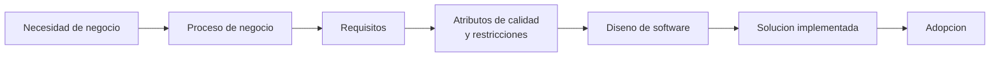

## Idea central

La unidad explica cómo se pasa del **problema de negocio** a una **solución de software**. Antes de diseñar clases o componentes hay que entender procesos, actores, reglas, restricciones, atributos de calidad y adopción.

Desde Larman, comprender el dominio es condición previa para asignar bien responsabilidades. Desde GoF, los patrones aparecen después, cuando ya se detectan variaciones o problemas recurrentes de diseño.

## Mapa mental

## Conceptos clave

| Concepto | Para recordar |
|---|---|
| **Dominio del problema** | Mundo del negocio: actores, procesos, reglas, objetivos. |
| **Dominio de la solución** | Mundo del software: módulos, componentes, datos, interfaces, tecnología. |
| **Proceso de negocio** | Actividades coordinadas que generan valor para la organización o el cliente. |
| **Proceso de software** | Actividades para construir y evolucionar software. |
| **Gobierno de procesos** | Roles, políticas, métricas y control para alinear procesos con objetivos. |
| **Requisito funcional** | Qué debe hacer el sistema. |
| **Requisito no funcional** | Cómo debe comportarse o qué cualidad debe cumplir. |
| **Atributo de calidad** | Propiedad a optimizar: rendimiento, seguridad, disponibilidad, mantenibilidad, usabilidad. |
| **Restricción** | Condición impuesta: tecnología obligatoria, norma, presupuesto, plazo. |
| **Adopción** | Incorporación real del software por usuarios y organización. |

## Procesos de software

Actividades fundamentales:

1. Especificación.
2. Diseño e implementación.
3. Validación.
4. Evolución.

Modelos importantes:

| Modelo | Idea |
|---|---|
| **Cascada** | Fases secuenciales. Sirve si requisitos son estables. |
| **Incremental** | Entrega por partes. Permite feedback temprano. |
| **Integración y configuración** | Construcción a partir de componentes existentes. |
| **RUP** | Iterativo, dirigido por casos de uso y centrado en arquitectura. |
| **Scrum** | Marco ágil basado en backlog, sprints, inspección y adaptación. |

## RUP en pocas palabras

RUP tiene cuatro fases y una idea central: **desarrollar en iteraciones, priorizar los casos de uso más valiosos y reducir temprano los riesgos arquitectónicos**.

1. **Inicio**: alcance, visión, riesgos, caso de negocio.
2. **Elaboración**: arquitectura base, dominio, requisitos principales, validación técnica.
3. **Construcción**: desarrollo incremental del producto con iteraciones ejecutables.
4. **Transición**: entrega, aceptación, capacitación y ajustes finales.

Características:

- dirigido por casos de uso;
- iterativo e incremental;
- centrado en arquitectura;
- configurable;
- orientado a riesgos y calidad.

## Scrum en pocas palabras

Scrum organiza el trabajo en ciclos cortos.

| Elemento | Función |
|---|---|
| **Product backlog** | Lista priorizada de trabajo. |
| **Historia de usuario** | Necesidad valiosa para un usuario. |
| **Sprint backlog** | Trabajo elegido para el sprint. |
| **Sprint** | Iteración de entrega. |
| **Review** | Validación del incremento. |
| **Retrospective** | Mejora del proceso. |

Una buena historia de usuario debe ser independiente, negociable, valiosa, estimable, pequeña y verificable.

## Atributos vs restricciones

| Aspecto | Atributo de calidad | Restricción |
|---|---|---|
| Naturaleza | Cualidad a optimizar. | Condición impuesta. |
| Evaluación | Puede haber grados. | Se cumple o no. |
| Ejemplo | "Responder en menos de 2 s". | "Usar PostgreSQL". |
| Impacto | Orienta decisiones. | Limita alternativas. |

## Para repasar rápido

- ¿Qué diferencia hay entre proceso de negocio y proceso de software?
- ¿Por qué los atributos de calidad impactan en la arquitectura?
- ¿Qué es una restricción y por qué no se negocia igual que un atributo?
- ¿Qué significa que RUP sea dirigido por casos de uso?
- ¿Qué aporta Scrum al diseño y validación temprana?
- ¿Por qué un sistema técnicamente correcto puede fallar por mala adopción?
