## Introducción

El diseño de software no surge de la nada: nace de un **problema de negocio** que una organización necesita resolver. Esta unidad recorre el camino que va desde ese problema —expresado en términos de **procesos de negocio**, objetivos y reglas— hasta la **solución de software** que lo automatiza o lo soporta. En el medio aparecen los **procesos de software** (cómo construimos el sistema), los **roles** que intervienen, los **requisitos** (funcionales y no funcionales), los **atributos de calidad** y **restricciones** que condicionan las decisiones de diseño, y finalmente la **adopción** del software por parte de sus usuarios.

La idea central es que el diseño es una actividad de **traducción y compromiso**: traducimos necesidades del dominio del problema al dominio de la solución, y lo hacemos balanceando objetivos en conflicto (trade-offs) dentro de un marco de restricciones.

{: .note }
> Una solución de software es "buena" no cuando es perfecta, sino cuando satisface los requisitos respetando las restricciones y equilibrando los atributos de calidad que el negocio prioriza.

Desde la bibliografía principal de la cátedra, esta unidad se conecta especialmente con **Larman**: antes de asignar responsabilidades a objetos hay que comprender el negocio, sus actores, sus casos de uso, sus reglas y sus conceptos de dominio. **GoF** aparece más adelante, cuando algunas decisiones de diseño pueden resolverse reutilizando patrones conocidos.

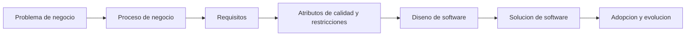

El recorrido no es lineal una sola vez: cada validación con usuarios o restricción descubierta puede obligar a volver hacia requisitos, proceso o diseño.

## Del problema de negocio a la solución de software

### Dominio del problema y dominio de la solución

- **Dominio del problema**: el espacio donde vive la necesidad. Está hecho de procesos de negocio, reglas, actores, objetivos organizacionales y restricciones del contexto. Se describe en el **lenguaje del negocio**.
- **Dominio de la solución**: el espacio del sistema de software que construimos. Está hecho de componentes, módulos, datos, interfaces y tecnología. Se describe en el **lenguaje técnico**.

El trabajo de ingeniería consiste en **transitar** del primero al segundo sin perder la trazabilidad: cada decisión técnica debería poder justificarse en función de una necesidad del negocio.

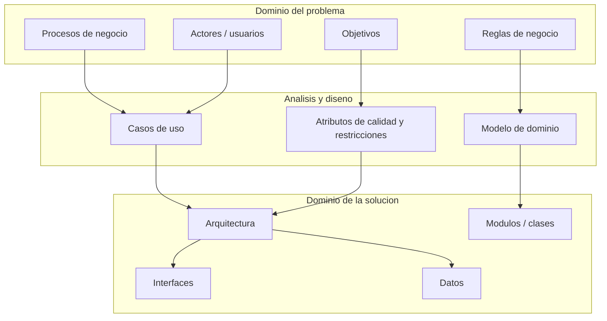

En términos de Larman, el **modelo de dominio** ayuda a nombrar y entender los conceptos del problema; luego el **modelo de diseño** decide qué clases de software, responsabilidades y colaboraciones implementan los casos de uso.

### El recorrido típico

1. **Comprensión del negocio**: entender procesos, objetivos, actores y problemas.
2. **Ingeniería de requisitos**: extraer y especificar qué debe hacer el sistema (funcionales) y con qué cualidades (no funcionales).
3. **Diseño**: decidir cómo se estructura la solución para cumplir los requisitos respetando restricciones y atributos de calidad.
4. **Implementación, validación y despliegue**.
5. **Adopción y evolución**: la solución entra en operación, los usuarios la incorporan y el sistema cambia con el tiempo.

{: .note }
> El diseño es el "puente" entre el qué (requisitos) y el cómo (código). Un buen diseño hace que el problema de negocio quede correctamente representado en la solución.

## Procesos de negocio (business process)

### Definición

Un **proceso de negocio** es un conjunto de **actividades coordinadas** que, a partir de unas entradas, producen un **resultado de valor** para un cliente o para la organización. Ejemplos: "alta de un cliente", "procesamiento de un pedido", "liquidación de sueldos".

### Elementos de un proceso de negocio

| Elemento | Descripción |
|---|---|
| **Actividades / tareas** | Las acciones que se ejecutan (manuales o automatizadas). |
| **Eventos** | Disparadores y resultados (inicio, intermedios, fin). |
| **Roles / actores** | Quién ejecuta cada actividad (personas, áreas, sistemas). |
| **Flujo (secuencia)** | El orden, las decisiones (gateways) y las bifurcaciones. |
| **Reglas de negocio** | Condiciones y políticas que rigen las decisiones. |
| **Entradas y salidas** | Datos y artefactos consumidos y producidos. |
| **Recursos** | Personas, sistemas e información necesarios. |

### Modelado de procesos: BPMN

El estándar más difundido para modelar procesos es **BPMN (Business Process Model and Notation)**. Permite representar gráficamente el flujo mediante:

- **Eventos** (círculos): inicio, intermedios, fin.
- **Actividades / tareas** (rectángulos redondeados).
- **Gateways** (rombos): decisiones y bifurcaciones (exclusivas, paralelas, inclusivas).
- **Flujos de secuencia y de mensaje** (flechas).
- **Pools y lanes**: para separar participantes y responsabilidades.

### Relación con el sistema de software

El proceso de negocio define **qué debe soportar** el sistema. Muchas actividades del proceso se automatizan con software; otras quedan como tareas manuales. El modelado del proceso es una entrada clave para descubrir requisitos: cada tarea automatizable y cada regla de negocio se traducen en funcionalidad y en lógica del sistema.

{: .note }
> Primero se entiende y (a veces) se rediseña el proceso de negocio; después se diseña el software que lo soporta. Automatizar un mal proceso solo produce un mal proceso más rápido.

**Ejemplo simple: pedido de compra**

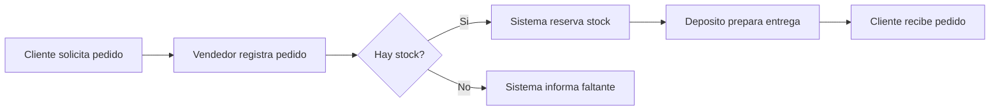

De este proceso salen requisitos funcionales ("registrar pedido", "consultar stock", "reservar stock") y restricciones o reglas ("no reservar si no hay stock", "avisar faltantes"). El diseño posterior debe asignar esas responsabilidades a objetos, servicios o componentes.

## Procesos de software

### Definición

Un **proceso de software** (software process) es el **conjunto de actividades y resultados asociados** que conducen a la producción de un producto de software (Sommerville). No existe un proceso universal: cada organización lo adapta a su contexto.

### Actividades fundamentales (Sommerville)

Todo proceso de software incluye, de una u otra forma, estas cuatro actividades:

| Actividad | Qué incluye |
|---|---|
| **Especificación del software** | Definir qué debe hacer el sistema y sus restricciones (ingeniería de requisitos). |
| **Diseño e implementación** | Producir el software a partir de la especificación (arquitectura, diseño detallado, codificación). |
| **Validación del software** | Verificar que el sistema hace lo que el cliente quiere (V&V, pruebas). |
| **Evolución del software** | Modificar el software para responder a cambios en las necesidades. |

### Modelos de proceso de software (Sommerville)

Sommerville agrupa los modelos genéricos así:

| Modelo | Idea central | Fortalezas | Limitaciones |
|---|---|---|---|
| **Cascada (waterfall)** | Fases secuenciales (requisitos → diseño → implementación → pruebas → operación), cada una termina antes de empezar la siguiente. | Simple, documentado, predecible. Apto cuando los requisitos son estables. | Rígido frente al cambio; el cliente ve el producto tarde. |
| **Desarrollo incremental** | Se desarrolla en incrementos; cada uno agrega funcionalidad y se evalúa. | Acomoda el cambio, feedback temprano, menor riesgo. | Estructura puede degradarse; documentación a veces escasa. |
| **Integración y configuración (reuse-oriented)** | Se construye reutilizando y configurando componentes / sistemas existentes (COTS, frameworks). | Menos software a desarrollar, entrega más rápida. | Compromisos en requisitos; dependencia de terceros. |

A estos se suman los **métodos ágiles** (agile), que aplican desarrollo incremental e iterativo con foco en la entrega frecuente de valor, la colaboración con el cliente y la respuesta al cambio (Manifiesto Ágil; Scrum, XP, Kanban). Pressman & Maxim también describen, entre los modelos evolutivos, el **modelo espiral** (orientado a la gestión de riesgos) y el **prototipado**.

{: .note }
> En la práctica los modelos se combinan. Un proyecto puede usar un marco incremental/ágil global con prácticas de configuración y reutilización dentro de cada iteración.

### Rational Unified Process (RUP)

El **Rational Unified Process (RUP)** es un marco de proceso de desarrollo de software impulsado por UML, asociado a Jacobson, Booch y Rumbaugh. No es una receta única: es un proceso **configurable**, adaptable al tamaño del equipo, tipo de proyecto, dominio, riesgos y restricciones.

RUP se caracteriza por ser:

- **Dirigido por casos de uso**: los casos de uso capturan objetivos de los actores y guían requisitos, análisis, diseño, implementación y pruebas.
- **Iterativo e incremental**: el producto se construye en iteraciones; cada iteración produce un incremento evaluable.
- **Centrado en la arquitectura**: la arquitectura se estabiliza tempranamente y guía el desarrollo.
- **Orientado a riesgos y calidad**: los riesgos relevantes se atacan temprano y la calidad se controla durante todo el proceso.
- **Compatible con técnicas OO y UML**: usa modelos y diagramas como lenguaje común entre roles.

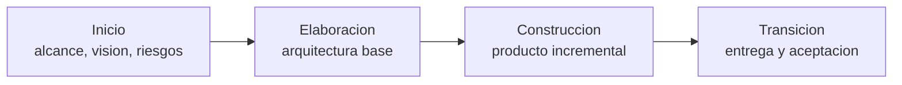

RUP también se entiende en dos dimensiones:

| Dimensión | Qué representa | Elementos |
|---|---|---|
| **Tiempo** | Evolución dinámica del proyecto. | Ciclos, fases, iteraciones e hitos. |
| **Contenido / esfuerzo** | Trabajo técnico y de gestión que se ejecuta. | Disciplinas, actividades, roles y artefactos. |

Disciplinas principales: **modelado del negocio**, **requisitos**, **análisis y diseño**, **implementación**, **pruebas** y **despliegue**. Disciplinas de soporte: **gestión de configuración y cambios**, **gestión del proyecto** y **entorno**.

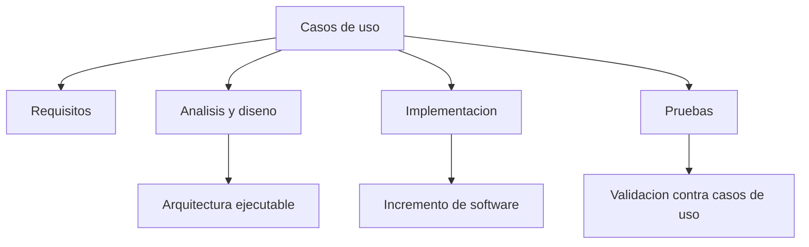

{: .note }
> En RUP, los casos de uso no son solo documentación de requisitos: integran el trabajo. Se especifican, se realizan en análisis/diseño, se implementan y luego se verifican con pruebas.

### Scrum, historias de usuario y backlog

**Scrum** no es una metodología de diseño OO ni reemplaza a UML, GRASP o GoF. Es un marco ágil de gestión y entrega iterativa. En la práctica de la cátedra aparece asociado a **historias de usuario**, **backlog**, **sprint backlog**, prototipos y validación temprana.

| Elemento | Función |
|---|---|
| **Historia de usuario** | Describe una necesidad valiosa para un usuario o rol. |
| **Criterios de aceptación** | Definen cómo se verifica que la historia está cumplida. |
| **Product backlog** | Lista priorizada de funcionalidades, mejoras y trabajo pendiente. |
| **Sprint backlog** | Selección de trabajo comprometido para una iteración. |
| **Sprint review / retrospectiva** | Inspección del incremento y mejora del proceso. |

Una historia de usuario bien formulada debe ser **independiente, negociable, valiosa, estimable, pequeña y verificable**. Para diseño, su valor está en conectar una necesidad de usuario con prototipos, casos de uso, pruebas y decisiones de interfaz.

## Procesos de negocio vs. procesos de software

Aunque ambos son "procesos", apuntan a cosas distintas y se relacionan de forma jerárquica.

| Aspecto | Proceso de **negocio** | Proceso de **software** |
|---|---|---|
| **Objetivo** | Generar valor para el negocio/cliente. | Producir y evolucionar un producto de software. |
| **Dominio** | Dominio del problema (la organización). | Dominio de la solución (la construcción del sistema). |
| **Ejecutores** | Áreas y personas del negocio (+ sistemas). | Equipo de desarrollo. |
| **Resultado** | Un servicio o resultado operativo (pedido entregado, cliente dado de alta). | Un sistema o incremento de software. |
| **Notación típica** | BPMN. | Modelos de ciclo de vida, UML, tableros ágiles. |

**Relación**: el proceso de software es el medio para construir el sistema que **soporta** el proceso de negocio. Los requisitos del software provienen, en gran medida, del análisis de los procesos de negocio.

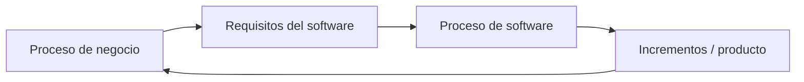

La flecha de retorno indica aprendizaje: cuando el software se usa, el negocio detecta ajustes, mejoras y nuevas necesidades.

## Gobierno de procesos (process governance)

### Qué es

El **gobierno de procesos** es el conjunto de **estructuras, políticas, roles y mecanismos** que aseguran que los procesos (de negocio y de software) estén **alineados con los objetivos estratégicos**, se ejecuten de forma controlada y mejoren en el tiempo.

### Por qué importa

- Garantiza **alineación** entre lo que hace la organización y lo que necesita.
- Establece **responsabilidades claras** (quién es dueño de cada proceso).
- Permite **medir** desempeño (métricas, indicadores/KPIs) y **controlar** desviaciones.
- Habilita la **mejora continua** de procesos.

### Control y mejora de procesos

- **Definición y estandarización**: documentar el proceso para que sea repetible.
- **Medición**: recolectar métricas (tiempos, calidad, defectos).
- **Control**: detectar desviaciones y corregir.
- **Mejora**: rediseñar el proceso con base en evidencia.

En el ámbito del software, la mejora de procesos se apoya en marcos como **CMMI** (niveles de madurez) e **ISO/IEC**, mencionados tanto por Sommerville como por Pressman & Maxim. La idea de fondo: procesos más maduros y mejor gobernados tienden a producir software de mayor calidad de forma más predecible.

{: .note }
> Gobierno (governance) ≠ gestión (management). El gobierno define el marco, las políticas y la rendición de cuentas; la gestión ejecuta dentro de ese marco.

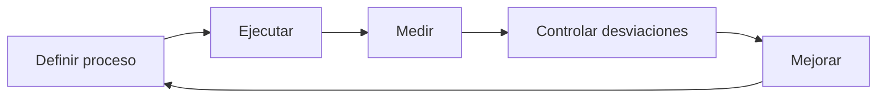

El gobierno evita que el proceso dependa solamente de esfuerzos individuales: define responsables, criterios de medición, estándares y mecanismos de mejora.

## Roles en el diseño y desarrollo

El éxito de una solución depende de la colaboración de múltiples roles, cada uno con responsabilidades específicas.

| Rol | Responsabilidad principal |
|---|---|
| **Stakeholders** | Interesados (cliente, usuarios, sponsors, áreas afectadas). Aportan necesidades, prioridades y validan el valor. |
| **Product Owner** | (En contexto ágil) Representa al negocio, gestiona y prioriza el backlog, define el "qué" y su valor. |
| **Analista (de requisitos / de negocio)** | Elicita, analiza y especifica requisitos; tiende el puente entre negocio y técnica. |
| **Arquitecto de software** | Define la **estructura general** del sistema, decide trade-offs de atributos de calidad y restricciones, fija lineamientos técnicos. |
| **Diseñador** | Detalla el diseño de componentes, módulos, interfaces y datos a partir de la arquitectura. |
| **Desarrollador** | Implementa (codifica) la solución según el diseño; realiza pruebas unitarias. |
| **QA / Tester** | Verifica y valida la calidad; diseña y ejecuta pruebas; reporta defectos. |
| **DevOps / Operaciones** | Despliegue, infraestructura, automatización (CI/CD) y operación. |
| **Líder / Gestor de proyecto (PM)** | Planifica, coordina, gestiona riesgos, alcance, tiempo y recursos. |

{: .note }
> Una misma persona puede asumir varios roles (especialmente en equipos chicos), y los nombres varían según el marco (ágil vs. tradicional). Lo importante es que las responsabilidades estén cubiertas.

### Roles vistos como responsabilidades

La idea de **responsabilidad** no aplica solo a objetos de software; también sirve para entender roles de trabajo. Si un rol no tiene una responsabilidad clara, aparecen huecos, duplicación de tareas o decisiones contradictorias.

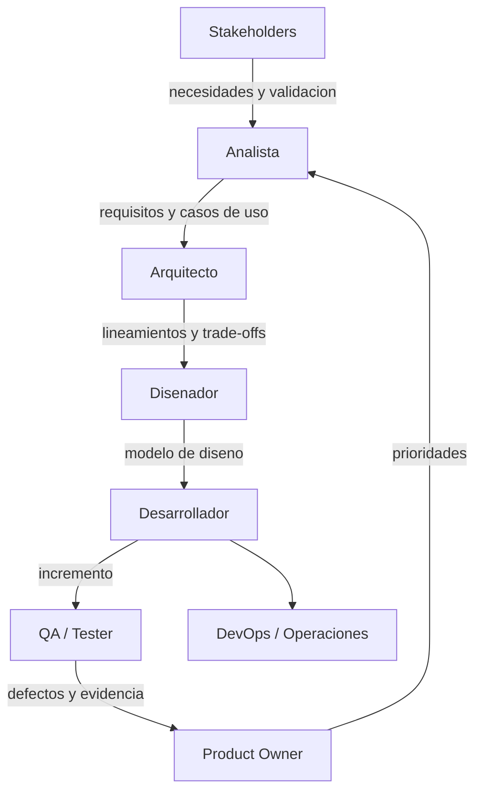

Este flujo no reemplaza una metodología, pero ayuda a ver cómo circulan decisiones y artefactos desde el negocio hasta la operación.

## Solución de software

### Qué la compone

Una solución de software no es solo "código". Incluye:

- **Software (aplicaciones, servicios, componentes)**.
- **Datos** y su modelo.
- **Arquitectura** (cómo se organizan e integran las partes).
- **Interfaces** (con usuarios y con otros sistemas).
- **Infraestructura** sobre la que opera.
- **Documentación** y procedimientos de operación.

### Cómo se especifica

La solución se especifica a través de los **requisitos** y del **diseño**. La especificación responde:

- **Qué** debe hacer (funcionalidad).
- **Con qué cualidades** (atributos de calidad / no funcionales).
- **Dentro de qué límites** (restricciones).

Estos tres ejes guían y restringen las decisiones de diseño.

### De requisitos a responsabilidades

En un diseño orientado a objetos, los requisitos no se convierten directamente en código. Primero se interpretan como **eventos del sistema**, operaciones, conceptos del dominio y responsabilidades.

| Entrada | Pregunta | Salida de diseño |
|---|---|---|
| Caso de uso | ¿Qué interacción debe soportar el sistema? | Operaciones del sistema y colaboraciones. |
| Regla de negocio | ¿Qué condición debe respetarse siempre? | Responsabilidad asignada a una clase/servicio. |
| Concepto de dominio | ¿Qué información y comportamiento tiene sentido agrupar? | Clase candidata o entidad del modelo. |
| Atributo de calidad | ¿Qué cualidad condiciona la estructura? | Decisión arquitectónica. |
| Restricción | ¿Qué alternativa queda prohibida u obligada? | Límite de diseño. |

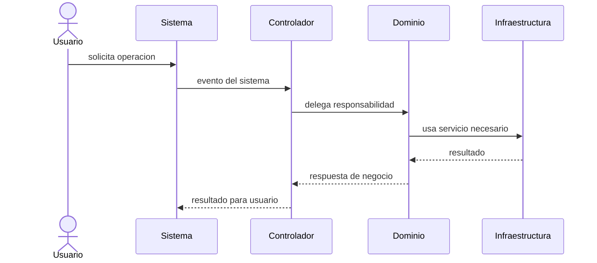

La secuencia muestra una idea clave de Larman: el controlador coordina el caso de uso, pero la lógica de negocio debería quedar en objetos o servicios del dominio, no concentrada en la interfaz.

## Requisitos: funcionales y no funcionales

### Definiciones

- **Requisitos funcionales (functional requirements)**: describen **qué** debe hacer el sistema —servicios, comportamientos y reacciones ante entradas. Ej.: "el sistema debe permitir registrar un pedido".
- **Requisitos no funcionales (non-functional requirements)**: describen **cómo** debe comportarse —restricciones y cualidades sobre los servicios. Ej.: "el sistema debe responder en menos de 2 segundos". Suelen expresarse como **atributos de calidad**.

| Tipo | Pregunta que responde | Ejemplo |
|---|---|---|
| Funcional | ¿Qué hace? | Calcular el total de una factura. |
| No funcional | ¿Cómo lo hace / con qué cualidad? | Hacerlo de forma segura, rápida y disponible 24x7. |

### Relación con el diseño

Los requisitos **funcionales** definen el alcance de la funcionalidad a diseñar. Los **no funcionales** suelen tener **mayor impacto en la arquitectura**: condicionan decisiones estructurales globales (por eso a menudo se denominan *requisitos arquitectónicamente significativos*). Sommerville advierte que un único requisito no funcional crítico puede afectar a todo el sistema.

## Atributos de calidad del software

Los **atributos de calidad** son las propiedades no funcionales que determinan qué tan bueno es el sistema para sus objetivos. Se evalúan, idealmente, de forma **medible**.

| Atributo | Qué expresa | Ejemplo de criterio |
|---|---|---|
| **Rendimiento (performance)** | Velocidad de respuesta y capacidad de procesamiento. | Tiempo de respuesta < 2 s; X transacciones/seg. |
| **Seguridad (security)** | Protección frente a accesos y usos no autorizados. | Cifrado, autenticación, autorización, auditoría. |
| **Disponibilidad (availability)** | Que el sistema esté operativo cuando se lo necesita. | 99,9% de uptime. |
| **Fiabilidad (reliability)** | Que funcione correctamente bajo condiciones dadas. | MTBF; tasa de fallos aceptable. |
| **Mantenibilidad (maintainability)** | Facilidad para corregir, adaptar y evolucionar. | Bajo acoplamiento, alta cohesión, modularidad. |
| **Usabilidad (usability)** | Facilidad de uso y aprendizaje para el usuario. | Tareas completadas sin asistencia. |
| **Escalabilidad (scalability)** | Capacidad de crecer ante mayor carga. | Soportar 10x usuarios agregando recursos. |
| **Portabilidad (portability)** | Facilidad de mover el sistema a otro entorno. | Ejecutar en distintos SO/plataformas. |
| **Interoperabilidad** | Capacidad de integrarse con otros sistemas. | APIs y formatos estándar. |

### Cómo condicionan el diseño: trade-offs

Los atributos **compiten entre sí**: mejorar uno suele perjudicar a otro. El diseño es, en buena medida, **gestionar estos compromisos** según las prioridades del negocio.

- **Seguridad ↔ Usabilidad / Rendimiento**: más controles de seguridad pueden complicar el uso y agregar latencia.
- **Rendimiento ↔ Mantenibilidad**: código altamente optimizado suele ser más difícil de mantener.
- **Disponibilidad / Escalabilidad ↔ Costo**: la redundancia y la elasticidad cuestan dinero.

{: .note }
> No se puede maximizar todo. El arquitecto prioriza los atributos críticos para el negocio y diseña aceptando concesiones (trade-offs) en los demás.

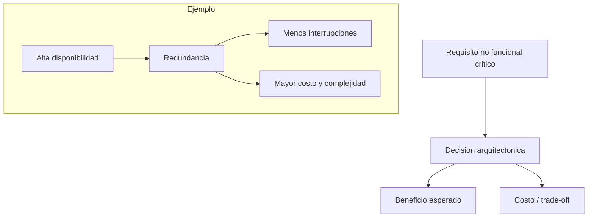

Los atributos de calidad son una de las razones por las que el diseño no puede derivarse mecánicamente de los requisitos funcionales.

## Restricciones del diseño (design constraints)

Las **restricciones** son condiciones **impuestas** que limitan el espacio de soluciones. A diferencia de los atributos de calidad (que se optimizan), las restricciones **se cumplen o no**.

| Tipo de restricción | Ejemplos |
|---|---|
| **Técnicas / de plataforma** | Lenguaje, framework o base de datos obligatorios; sistema operativo; integración con sistemas legados. |
| **De negocio** | Modelo de negocio, políticas internas, acuerdos comerciales. |
| **Regulatorias / legales** | Protección de datos personales, normativa del sector, requisitos de auditoría. |
| **De presupuesto y tiempo** | Costo máximo; fecha de entrega; recursos disponibles. |
| **Organizacionales** | Estándares corporativos, capacidades del equipo, infraestructura existente. |

Las restricciones **reducen las alternativas** de diseño y deben identificarse temprano, porque condicionan la arquitectura tanto como los requisitos.

### Diferencia entre atributo y restricción

| Aspecto | Atributo de calidad | Restricción |
|---|---|---|
| Naturaleza | Cualidad a optimizar o equilibrar. | Condición impuesta. |
| Evaluación | Puede tener grados: mejor/peor, más/menos. | Se cumple o no se cumple. |
| Ejemplo | "Responder en menos de 2 segundos". | "Usar PostgreSQL por estándar corporativo". |
| Impacto | Orienta decisiones y trade-offs. | Descarta alternativas. |

{: .note }
> Una restricción puede empeorar un atributo de calidad. Por ejemplo, una plataforma obligatoria puede limitar rendimiento o escalabilidad; el diseño debe reconocer ese compromiso.

## Adopción del software

Construir un buen sistema no garantiza su éxito: el software solo genera valor cuando **se usa efectivamente**. La **adopción** es el proceso por el cual los usuarios y la organización incorporan la solución a su operación.

### Gestión del cambio

La adopción implica un **cambio organizacional**: nuevas formas de trabajar, nuevos procesos, nueva herramienta. Gestionar ese cambio es clave para evitar el rechazo.

### Factores de éxito en la adopción

- **Patrocinio (sponsorship)** y compromiso de la dirección.
- **Involucramiento temprano de los usuarios** (que se sientan parte).
- **Capacitación** adecuada y soporte post-implementación.
- **Comunicación** clara de los beneficios y del impacto.
- **Usabilidad** del sistema (un sistema difícil de usar se adopta peor).
- **Despliegue gradual** (pilotos, fases) que reduce el riesgo.

### Resistencia al cambio

Es la oposición —activa o pasiva— de los usuarios al nuevo sistema. Causas típicas: miedo a lo desconocido, pérdida de control o de poder, hábitos arraigados, falta de capacitación o de percepción de beneficio. Se mitiga con participación, comunicación, formación y acompañamiento.

{: .note }
> La calidad técnica es necesaria pero no suficiente. Muchos proyectos técnicamente correctos fracasan por una mala adopción.

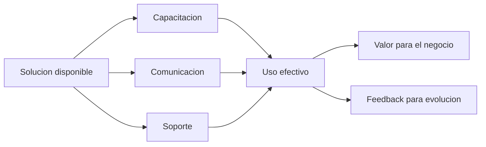

La adopción cierra el ciclo iniciado en el proceso de negocio: el software solo valida su diseño cuando genera valor real en operación.

## En síntesis (para el parcial)

- El diseño transita del **dominio del problema** (procesos de negocio) al **dominio de la solución** (software), manteniendo trazabilidad.
- Desde **Larman**, ese tránsito pasa por casos de uso, modelo de dominio y asignación de responsabilidades; desde **GoF**, algunas decisiones pueden reutilizar patrones probados cuando corresponda.
- Un **proceso de negocio** genera valor y se modela con **BPMN**; define qué debe soportar el sistema. Un **proceso de software** es cómo construimos ese sistema; sus actividades (Sommerville) son **especificación, diseño/implementación, validación y evolución**.
- Modelos de proceso: **cascada**, **incremental**, **integración y configuración**, **RUP** y **ágil/Scrum**; espiral y prototipado como modelos evolutivos.
- El **gobierno de procesos** alinea, controla y mejora los procesos (CMMI, ISO); gobierno ≠ gestión.
- **Roles**: stakeholders, PO, analista, arquitecto, diseñador, desarrollador, QA, DevOps, PM, cada uno con responsabilidades propias.
- Los **requisitos funcionales** dicen qué hace; los **no funcionales** (atributos de calidad) dicen cómo y suelen impactar la arquitectura.
- Los **atributos de calidad** (rendimiento, seguridad, disponibilidad, mantenibilidad, etc.) compiten: el diseño gestiona **trade-offs**.
- Las **restricciones** (técnicas, de negocio, regulatorias, de tiempo/costo) limitan las soluciones y se cumplen sí o sí.
- La **adopción** define el éxito real: requiere gestión del cambio, capacitación y manejo de la resistencia.

### Cobertura del programa de la unidad 2

| Tema indicado en el programa.pdf | Dónde aparece en estos apuntes |
|---|---|
| Del diseño de sistemas al diseño de software | Introducción; dominio del problema y solución; solución de software |
| Procesos de negocio | Sección "Procesos de negocio" |
| Procesos de software | Sección "Procesos de software" |
| RUP, iteraciones, casos de uso y arquitectura | Sección "Rational Unified Process (RUP)" |
| Scrum, historias de usuario y backlog | Sección "Scrum, historias de usuario y backlog" |
| Gobierno de procesos | Sección "Gobierno de procesos" |
| Roles | Sección "Roles en el diseño y desarrollo" |
| Solución de software | Sección "Solución de software" |
| Atributos de calidad | Sección "Atributos de calidad del software" |
| Restricciones del diseño | Sección "Restricciones del diseño" |
| Adopción del software | Sección "Adopción del software" |
