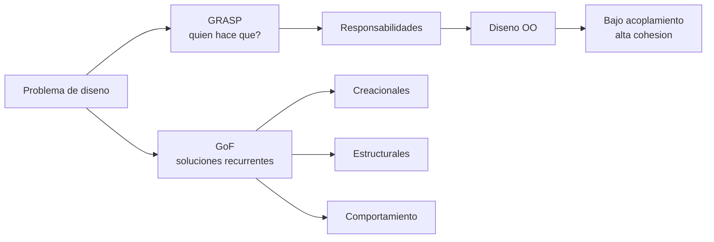

## Idea central

La unidad trata sobre **patrones de diseño** y **asignación de responsabilidades**.

Hay dos ejes principales:

- **GRASP (Larman)**: criterios para decidir qué objeto tiene qué responsabilidad.
- **GoF**: soluciones probadas para problemas recurrentes de diseño.

GRASP ayuda a pensar. GoF ayuda a reutilizar soluciones.

## Mapa mental

## Qué es un patrón

Un patrón describe:

| Elemento | Significado |
|---|---|
| **Nombre** | Vocabulario común para comunicar la solución. |
| **Problema** | Contexto donde aparece la necesidad. |
| **Solución** | Estructura general de clases/objetos/colaboraciones. |
| **Consecuencias** | Beneficios, costos y trade-offs. |

Un patrón no es código para copiar. Es una forma de organizar responsabilidades y colaboraciones.

## GRASP

GRASP significa **General Responsibility Assignment Software Patterns**.

Responsabilidades:

| Tipo | Qué incluye |
|---|---|
| **Conocer** | Datos propios, objetos relacionados, información derivable. |
| **Hacer** | Ejecutar acciones, crear objetos, coordinar actividades. |

Patrones GRASP:

| Patrón | Pregunta que responde |
|---|---|
| **Experto en Información** | ¿Quién tiene la información necesaria? |
| **Creador** | ¿Quién debe crear este objeto? |
| **Controlador** | ¿Quién recibe eventos del sistema? |
| **Bajo Acoplamiento** | ¿Cómo reduzco dependencias? |
| **Alta Cohesión** | ¿Cómo mantengo clases enfocadas? |
| **Polimorfismo** | ¿Cómo evito condicionales por tipo? |
| **Fabricación Pura** | ¿Dónde pongo lógica que no pertenece al dominio? |
| **Indirección** | ¿Cómo desacoplo dos elementos? |
| **Variaciones Protegidas** | ¿Cómo aíslo puntos de cambio? |

## Controlador

El controlador recibe operaciones del sistema desde la UI, pero no debe contener toda la lógica.

Variantes:

- **Fachada**: representa sistema/subsistema.
- **Por caso de uso**: coordina un flujo específico.
- **Por componente/módulo**: agrupa casos de uso relacionados.

Riesgo: **controlador saturado**. Se detecta cuando recibe demasiados eventos, acumula datos o hace trabajo que deberían hacer objetos expertos.

## GoF

Clasificación principal:

| Tipo | Qué resuelve | Ejemplos |
|---|---|---|
| **Creacionales** | Cómo crear objetos sin acoplarse a clases concretas. | Singleton, Factory Method, Abstract Factory, Builder, Prototype. |
| **Estructurales** | Cómo componer clases y objetos. | Adapter, Bridge, Composite, Decorator, Facade, Flyweight, Proxy. |
| **Comportamiento** | Cómo distribuir algoritmos, eventos y colaboraciones. | Strategy, Observer, Command, State, Template Method, Iterator, Mediator, Visitor. |

## Patrones que suelen confundirse

| Patrones | Diferencia |
|---|---|
| **Factory Method vs Abstract Factory** | Factory Method crea un producto; Abstract Factory crea familias de productos. |
| **Adapter vs Decorator vs Proxy** | Adapter cambia interfaz; Decorator agrega comportamiento; Proxy controla acceso. |
| **Strategy vs State** | Strategy intercambia algoritmo; State cambia comportamiento según estado interno. |
| **GRASP Controller vs MVC Controller** | GRASP asigna eventos del sistema; MVC separa interacción, vista y modelo. |

## MVC

MVC separa:

- **Modelo**: datos y reglas de negocio.
- **Vista**: presentación.
- **Controlador**: entrada del usuario y coordinación.

Suele combinar:

- GRASP Controller;
- Observer entre modelo y vistas;
- Strategy/Composite según variantes de presentación.

## Antipatrones

Recordar:

- **God Object**: una clase hace demasiado.
- **Spaghetti Code**: flujo desordenado.
- **Golden Hammer**: usar siempre la misma solución.
- **Copy-Paste Programming**: duplicación.
- **Big Ball of Mud**: sistema sin arquitectura clara.

## Para repasar rápido

- ¿Qué diferencia hay entre GRASP y GoF?
- ¿Qué responsabilidad tiene un objeto: conocer o hacer?
- ¿Por qué Experto favorece encapsulamiento?
- ¿Cuándo conviene una Fabricación Pura?
- ¿Qué problema resuelve Strategy?
- ¿Qué problema resuelve Observer?
- ¿Qué diferencia hay entre Adapter, Decorator y Proxy?
- ¿Qué señales indican un controlador saturado?
