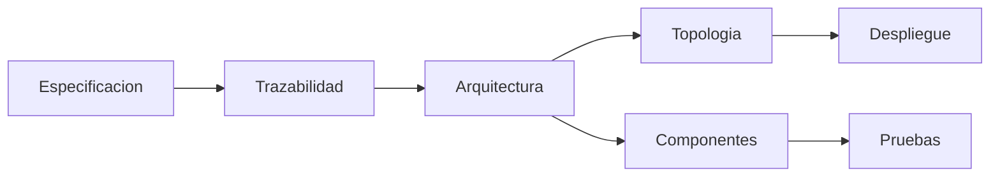

## Idea central

La unidad conecta **requisitos**, **diseño**, **arquitectura**, **topologías** y **pruebas**. El diseño realiza la especificación: convierte requisitos funcionales y no funcionales en componentes, interfaces, arquitectura y despliegue.

## Mapa mental



## Requisitos

| Tipo | Qué describe | Ejemplo |
|---|---|---|
| **Funcional** | Servicio o comportamiento del sistema. | Buscar productos. |
| **No funcional** | Cualidad o restricción sobre el servicio. | Responder en menos de 2 s. |

Un buen SRS debe ser:

- completo;
- consistente;
- no ambiguo;
- verificable.

## Trazabilidad

La trazabilidad conecta:

```text
requisito -> diseno -> codigo -> prueba
```

Sirve para:

- comprobar cobertura;
- evitar diseño sin justificación;
- analizar impacto de cambios;
- diseñar pruebas alineadas a requisitos.

## Refinamiento

El diseño se refina en niveles:

1. **Arquitectónico**: subsistemas, componentes, estilos, distribución.
2. **Detallado**: clases, interfaces, algoritmos, estructuras de datos.

La arquitectura responde especialmente a RNF: rendimiento, seguridad, disponibilidad, escalabilidad, mantenibilidad.

## UML útil

| Diagrama | Uso |
|---|---|
| **Casos de uso** | Requisitos desde actores externos. |
| **Actividad** | Flujos y procesos. |
| **Clase** | Estructura estática. |
| **Secuencia/comunicación** | Mensajes y responsabilidades. |
| **Estados** | Ciclo de vida de objetos. |
| **Componentes** | Subsistemas e interfaces. |
| **Despliegue** | Nodos físicos/virtuales. |

## Topologías

| Tipo de sistema | Claves de diseño |
|---|---|
| **Escritorio** | Ejecución local, offline, alto rendimiento, actualización más difícil. |
| **Web** | Cliente-servidor, HTTP, REST, n capas, escalabilidad, seguridad pública. |
| **Móvil** | Recursos limitados, conectividad variable, sensores, UX táctil, sincronización. |

## WebApps

Elementos de diseño:

- interfaz;
- estética;
- contenido;
- navegación;
- arquitectura;
- componentes.

La calidad de una WebApp depende de usabilidad, funcionalidad, confiabilidad, eficiencia y mantenibilidad.

## Estilos arquitectónicos

| Estilo | Idea |
|---|---|
| **Capas** | Separar responsabilidades por niveles. |
| **Cliente-servidor** | Clientes consumen servicios de servidores. |
| **MVC** | Separar modelo, vista y controlador. |
| **Repositorio** | Componentes comparten datos centrales. |
| **Pipe and filter** | Transformaciones encadenadas sobre datos. |

## SOA, microservicios y eventos

| Arquitectura | Recordar |
|---|---|
| **SOA** | Servicios empresariales, contratos, integración, ESB. |
| **Microservicios** | Servicios pequeños, autónomos, despliegue independiente, BD por servicio. |
| **Event-driven** | Productores publican eventos; consumidores reaccionan; broker desacopla. |

## Testing

| Tipo | Qué valida/verifica |
|---|---|
| **Unitaria** | Unidad pequeña. |
| **Integración** | Colaboración entre módulos. |
| **Regresión** | Que cambios no rompan lo anterior. |
| **Smoke** | Funciones críticas mínimas. |
| **Aceptación** | Stakeholders validan el sistema. |
| **Sistema** | Sistema completo. |
| **Performance / seguridad / recuperación / despliegue** | Atributos y entorno operativo. |

Dobles de prueba:

- **stub**: respuesta fija;
- **mock**: simula y verifica interacción;
- **driver**: invoca una unidad cuando falta su llamador;
- **mockup**: prototipo visual, útil para UX.

## Para repasar rápido

- ¿Qué diferencia hay entre RF y RNF?
- ¿Por qué un RNF puede cambiar la arquitectura?
- ¿Qué aporta la trazabilidad?
- ¿Qué diferencia hay entre componente y despliegue?
- ¿Cuándo conviene Web, móvil o escritorio?
- ¿Qué diferencia hay entre SOA y microservicios?
- ¿Qué problema resuelve una arquitectura basada en eventos?
- ¿Qué prueba usarías para validar seguridad, performance o aceptación?
