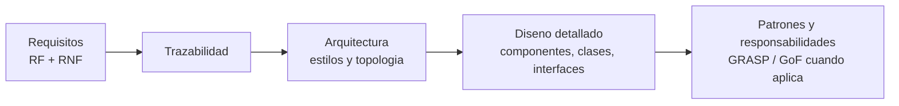
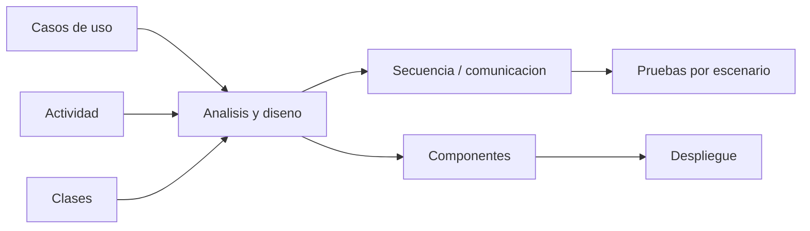
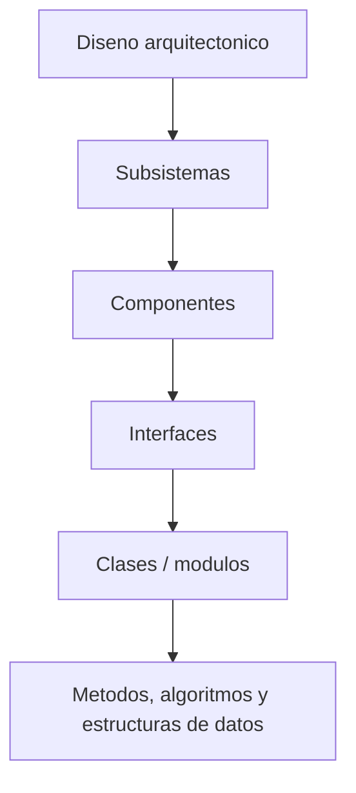
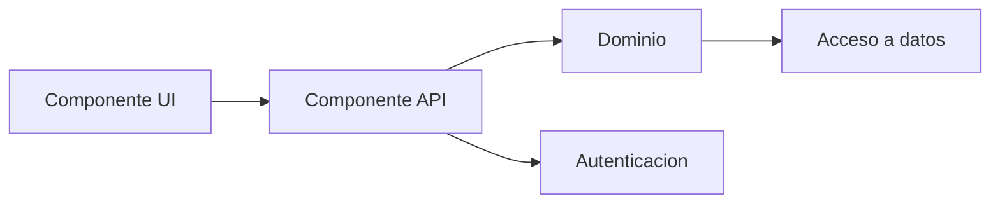
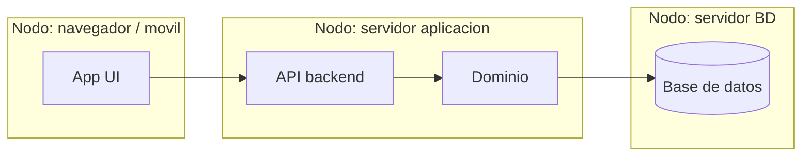
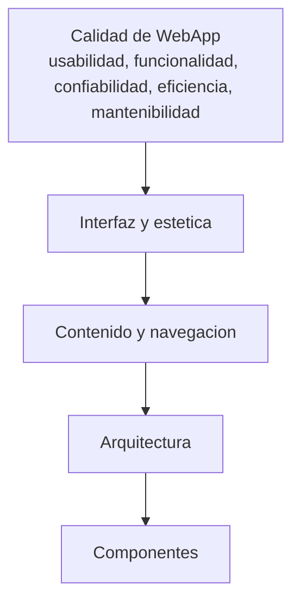
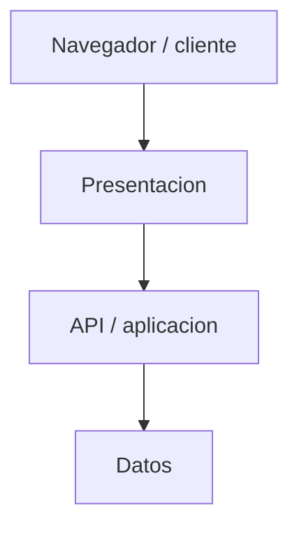
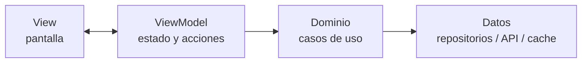
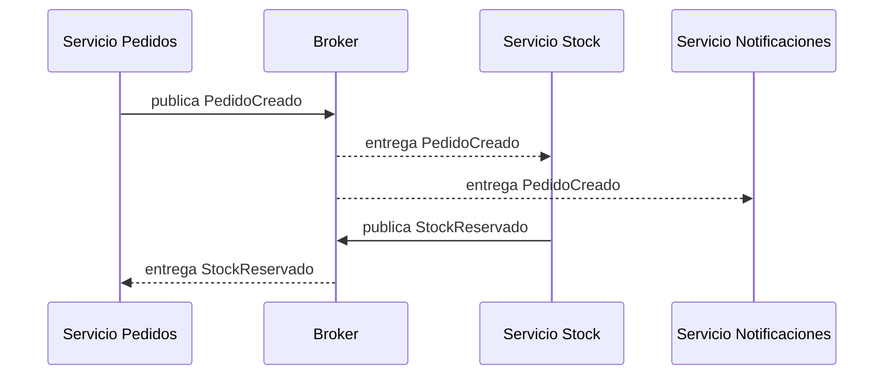

## Introducción

La Unidad 4 conecta dos actividades centrales de la ingeniería de software: **especificar qué debe hacer el sistema** (requisitos) y **decidir cómo se construirá** (diseño). El diseño no surge de la nada: refina progresivamente las decisiones, desde una visión arquitectónica de alto nivel hasta el diseño detallado de cada componente.

Esa estructura de alto nivel —cómo se reparten responsabilidades, dónde reside cada parte y cómo se comunican— constituye la **arquitectura** del software. Las formas recurrentes de organizar esa arquitectura se denominan **estilos** o **patrones arquitectónicos** (en capas, cliente-servidor, MVC, etc.), y la manera concreta en que las piezas se despliegan e interconectan es la **topología de diseño**.

En esta unidad estudiamos:

- Cómo se especifican requisitos y cómo se relacionan con el diseño (trazabilidad).
- El refinamiento del diseño (de lo arquitectónico a lo detallado).
- Las topologías según el tipo de sistema: **Escritorio, Web y Móvil**.
- Los **estilos arquitectónicos** clásicos (Sommerville / Pressman).
- Arquitecturas **orientadas a servicios (SOA)** y **microservicios**.
- Arquitecturas **basadas en eventos (event-driven)**.
- **Topologías emergentes**: serverless, cloud-native, edge, contenedores.

{: .note }
> **Bibliografía prioritaria de la materia.** **Larman** ayuda a razonar la transición de requisitos a responsabilidades de software, bajo acoplamiento y alta cohesión. **GoF** aporta el vocabulario de patrones cuando el diseño detallado necesita resolver variaciones concretas. Para esta unidad, **Sommerville** y **Pressman & Maxim** se usan como apoyo principal en requisitos, arquitectura, WebApps, SOA y topologías.

La idea central de la unidad es que el diseño no es una actividad aislada: traduce requisitos en decisiones arquitectónicas y luego en componentes concretos.

## Especificación de requisitos

### Requisitos funcionales y no funcionales

Un **requisito** es una declaración de un servicio que el sistema debe proveer o de una restricción sobre el sistema. Sommerville distingue dos grandes tipos:

- **Requisitos funcionales (RF):** describen *qué debe hacer* el sistema, sus servicios, cómo reacciona ante entradas particulares y cómo se comporta en situaciones específicas.
  *Ejemplo:* "El usuario podrá buscar productos por nombre y categoría".
- **Requisitos no funcionales (RNF):** son restricciones sobre los servicios o sobre el proceso. No describen funciones, sino **propiedades de calidad** (atributos de calidad). Suelen ser **críticos**: si fallan, el sistema completo puede resultar inutilizable.
  *Ejemplo:* "El sistema responderá a una búsqueda en menos de 2 segundos con 1000 usuarios concurrentes".

Sommerville clasifica los RNF en tres familias:

| Tipo de RNF | Origen | Ejemplos |
|---|---|---|
| **De producto** | Comportamiento del software | Rendimiento, disponibilidad, seguridad, usabilidad, fiabilidad |
| **Organizacionales** | Políticas de la empresa/cliente | Estándares de proceso, lenguajes, entornos operativos |
| **Externos** | Factores externos al proyecto | Legales, regulatorios, interoperabilidad, éticos |

{: .note }
> Los RNF son la principal fuente de **decisiones arquitectónicas**: requisitos como rendimiento, seguridad o disponibilidad determinan en gran medida el estilo arquitectónico elegido.

### El documento de especificación (SRS)

La **Especificación de Requisitos del Software** (*Software Requirements Specification*, SRS) es el documento oficial que registra lo que el equipo debe implementar. Reúne tanto los **requisitos de usuario** (descripciones en lenguaje natural, orientadas al cliente) como los **requisitos del sistema** (descripciones detalladas y precisas, orientadas a desarrolladores).

Según Sommerville, un buen SRS debe ser:

- **Completo:** define todos los servicios requeridos.
- **Consistente:** sin contradicciones entre requisitos.
- **No ambiguo y verificable:** cada requisito debe poder probarse.

Estructura típica (IEEE / Sommerville): introducción y objetivos, requisitos de usuario, arquitectura del sistema, requisitos del sistema (RF y RNF), modelos del sistema, evolución y apéndices.

### Relación entre especificación y diseño: trazabilidad

La especificación responde **qué** y el diseño responde **cómo**. La conexión entre ambos se gestiona mediante la **trazabilidad**: la capacidad de seguir un requisito a través de los artefactos que lo realizan.

- **Trazabilidad hacia adelante (forward):** de cada requisito hacia los elementos de diseño y código que lo implementan.
- **Trazabilidad hacia atrás (backward):** de cada componente de diseño hacia el/los requisito(s) que justifica(n) su existencia.

Una **matriz de trazabilidad** vincula requisitos con elementos de diseño, casos de prueba y componentes. Sirve para:

- Verificar que **todo requisito esté cubierto** por el diseño (sin huecos).
- Detectar **diseño sin justificación** (componentes que no responden a ningún requisito).
- Analizar el **impacto del cambio**: si un requisito cambia, saber qué partes del diseño se ven afectadas.

{: .note }
> Idea clave para el parcial: el diseño es la **realización** de la especificación. Los RNF (especialmente los de producto) condicionan la arquitectura; los RF se traducen en componentes, módulos y operaciones.

Ejemplo mínimo de trazabilidad:

| Requisito | Decisión de diseño | Componente afectado | Prueba asociada |
|---|---|---|---|
| RF-01: buscar productos por texto y categoría. | API de búsqueda + capa de acceso a datos indexada. | `CatalogoController`, `ServicioBusqueda`, repositorio. | Buscar por nombre, categoría y combinación. |
| RNF-01: respuesta menor a 2 s con 1000 usuarios. | Caché, paginación y escalado horizontal. | API, caché, base de datos. | Prueba de carga. |
| RNF-02: solo usuarios autenticados compran. | Autenticación y autorización centralizadas. | gateway/API, módulo de usuarios. | Pruebas de acceso permitido/denegado. |

Esta tabla muestra por qué los RNF suelen empujar decisiones de arquitectura, mientras que los RF suelen refinarse hacia operaciones y colaboraciones.

### Validación, verificación y pruebas asociadas al diseño

Los apuntes de testing definen la **prueba** como el conjunto de actividades para **verificar y validar** la calidad del software. En esta unidad se ubica como complemento de la especificación y el diseño: un requisito verificable debe poder convertirse en prueba, y una decisión de diseño debe poder evaluarse.

| Concepto | Pregunta |
|---|---|
| **Verificación** | ¿Construimos correctamente el producto según la especificación y el diseño? |
| **Validación** | ¿Construimos el producto correcto para las necesidades del usuario/stakeholder? |

Tipos de pruebas relevantes:

| Tipo | Qué verifica |
|---|---|
| **Unitarias** | Pequeñas unidades funcionales, clases o funciones. |
| **Integración** | Colaboración entre módulos/componentes. |
| **Regresión** | Que cambios recientes no rompan comportamiento ya validado. |
| **Smoke test** | Que las funciones críticas mínimas siguen funcionando. |
| **Validación funcional** | Que el sistema cumple los requisitos funcionales. |
| **Alfa / beta / aceptación** | Evaluación en entorno controlado, preliminar o con stakeholders. |
| **Sistema** | Comportamiento del sistema completo, incluyendo hardware, información y personas cuando aplica. |
| **Recuperación, performance, seguridad y despliegue** | Atributos de calidad y condiciones operativas. |

En pruebas unitarias e integración se usan dobles de prueba:

| Doble | Uso |
|---|---|
| **Stub** | Reemplazo simple que devuelve respuestas fijas cuando un colaborador real aún no existe o no conviene usarlo. |
| **Mock** | Simula un colaborador y además verifica que el sistema bajo prueba haya interactuado como se esperaba. |
| **Driver** | Controlador auxiliar que invoca una unidad a probar cuando su llamador real no está disponible. |
| **Mockup** | Prototipo visual de interfaz; sirve para validar UX/UI, no para probar lógica funcional. |

### UML como puente entre requisitos, diseño e implementación

UML es un **lenguaje de modelado**, no un proceso. Sirve para representar distintas vistas del sistema según lo que se necesite comunicar. Las referencias de clase insisten en que no hace falta usar todo UML: se eligen los diagramas que aportan claridad.

| Diagrama UML | Vista que ayuda a entender | Uso típico |
|---|---|---|
| **Casos de uso** | Funcionalidad desde el punto de vista de actores externos. | Captura y validación de requisitos. |
| **Actividad** | Flujo de trabajo, decisiones, paralelismo, responsabilidades por rol. | Procesos de negocio, casos de uso o algoritmos. |
| **Clase** | Estructura estática: clases, atributos, operaciones y relaciones. | Modelo de dominio y modelo de diseño. |
| **Secuencia** | Mensajes ordenados en el tiempo. | Realización de casos de uso y asignación de responsabilidades. |
| **Comunicación / colaboración** | Objetos conectados y mensajes numerados. | Evaluar enlaces, colaboración y acoplamiento. |
| **Estados** | Ciclo de vida de un objeto o entidad. | Objetos con estados relevantes y reglas de transición. |
| **Componentes** | Piezas de software e interfaces. | Diseño de subsistemas y dependencias. |
| **Despliegue** | Nodos físicos/virtuales y artefactos desplegados. | Topología e infraestructura. |

La trazabilidad aparece cuando un caso de uso se especifica, se realiza con interacciones, se diseña con clases/componentes, se implementa y finalmente se verifica con pruebas.

## Refinamiento del diseño

El **refinamiento** es un proceso de **descomposición sucesiva**: se parte de una descripción de alto nivel y se la elabora en niveles cada vez más detallados, decidiendo en cada paso *cómo* se realiza lo que el nivel anterior dejó *abstracto*. Es complementario de la **abstracción**: mientras la abstracción oculta detalle, el refinamiento lo revela.

El diseño avanza por niveles:

1. **Diseño arquitectónico (alto nivel):** identifica los subsistemas/componentes principales, sus responsabilidades y relaciones, y el estilo arquitectónico. Responde a los RNF globales.
2. **Diseño detallado (bajo nivel):** especifica el interior de cada componente: clases, interfaces, estructuras de datos, algoritmos y colaboraciones.

El proceso de diseño arquitectónico de Sommerville implica decisiones sobre: **estructura** (¿cómo se descompone?), **distribución** (¿centralizado o distribuido?), **estilos** (¿qué patrones aplican?), **control** (¿cómo se coordina la ejecución?) y **modularización**.

{: .note }
> Buenos atributos del diseño que guían el refinamiento: **modularidad**, **encapsulamiento**, **bajo acoplamiento** (componentes poco dependientes entre sí) y **alta cohesión** (cada componente con una responsabilidad bien definida).

Visto desde Larman, el refinamiento también es una sucesión de asignaciones de responsabilidad: primero entre subsistemas, luego entre componentes y finalmente entre objetos o módulos.

## Topologías de diseño

Una **topología de diseño** describe cómo se **organizan y despliegan** los componentes de un sistema y cómo se comunican entre sí (qué corre en el cliente, qué en el servidor, cuántos niveles físicos hay, cómo fluyen los datos).

La topología adecuada **depende de**:

- El **tipo de sistema** y su contexto de uso (Escritorio, Web, Móvil).
- Los **RNF**: rendimiento, escalabilidad, disponibilidad, seguridad.
- El **modelo de despliegue (deployment):** ¿una sola máquina, cliente-servidor, n capas distribuidas, nube?
- La **conectividad** esperada (siempre en línea, intermitente, sin conexión).

Conviene distinguir tres planos relacionados:

- **Estilo arquitectónico:** patrón lógico de organización (capas, cliente-servidor, MVC…).
- **Topología:** disposición física/de despliegue de esos componentes.
- **Tecnología:** las herramientas concretas que lo implementan.

### UML para componentes y despliegue

Las referencias de clase distinguen dos diagramas UML útiles cuando el diseño pasa de la estructura lógica a la implementación física:

| Diagrama | Qué muestra | Cuándo usarlo |
|---|---|---|
| **Diagrama de componentes** | Piezas de software, interfaces provistas/requeridas y dependencias. | Para entender subsistemas, módulos principales y relaciones de uso. |
| **Diagrama de despliegue** | Nodos físicos o virtuales, artefactos y dónde corre cada componente. | Para sistemas distribuidos, Web, cloud, móviles, IoT o cliente-servidor. |

Un **componente** puede representar una porción importante del sistema: un módulo, servicio, biblioteca, ejecutable, paquete o subsistema. Tiene mayor nivel de abstracción que una clase: normalmente se implementa con varias clases.

Un **diagrama de despliegue** agrega la pregunta física: qué artefacto corre en qué nodo.

{: .note }
> En términos de RUP/UML, el modelo de implementación describe componentes y módulos de software; el modelo de despliegue describe la arquitectura hardware o de infraestructura donde esos componentes se ejecutan.

### Diseño en el nivel de componentes

Un **componente** es una parte modular, reemplazable y desplegable del sistema. Puede verse de dos formas complementarias:

- Como **conjunto de clases que colaboran** para cumplir una responsabilidad del dominio o de infraestructura.
- Como **unidad funcional** con una interfaz clara que permite invocar servicios y pasar datos.

Tipos habituales:

| Tipo de componente | Responsabilidad |
|---|---|
| **Control** | Coordina la invocación de otros componentes y el flujo de una operación. |
| **Dominio** | Implementa una función o regla propia del problema. |
| **Infraestructura** | Provee servicios técnicos: persistencia, mensajería, logging, seguridad, integración. |

Los apuntes de componentes remarcan cuatro principios de diseño basados en clase:

| Principio | Idea de diseño |
|---|---|
| **Abierto/Cerrado** | Extender comportamiento sin modificar código estable. |
| **Sustitución de Liskov** | Una subclase debe poder usarse donde se espera su superclase. |
| **Inversión de dependencias** | Depender de abstracciones, no de clases concretas. |
| **Segregación de interfaces** | Preferir interfaces específicas para cada cliente antes que una interfaz grande y general. |

También hay principios de organización en paquetes:

| Principio | Criterio |
|---|---|
| **Equivalencia reutilización/lanzamiento** | Lo que se reutiliza junto debería versionarse y liberarse junto. |
| **Cierre común** | Las clases que cambian juntas pertenecen al mismo paquete. |
| **Reutilización común** | Las clases que no se reutilizan juntas no deberían agruparse juntas. |

{: .note }
> En diagramas de componentes, conviene representar dependencias mediante **interfaces** antes que con dependencias directas componente-a-componente. Esto preserva bajo acoplamiento y facilita reemplazar implementaciones.

A continuación, las topologías según el tipo de sistema.

## Diseño de sistemas de Escritorio (desktop)

Las aplicaciones de escritorio se **instalan y ejecutan localmente** en la máquina del usuario, normalmente con acceso completo a sus recursos (CPU, disco, periféricos) y sin depender de un navegador.

**Características:**

- Ejecución local, frecuentemente con capacidad **offline**.
- Interfaz rica y de baja latencia, integrada al sistema operativo.
- Distribución por instalador; actualizaciones que el usuario debe aplicar.
- Dependencia de la plataforma (Windows, macOS, Linux).

**Arquitecturas típicas:**

- **Monolítica:** toda la lógica (UI, negocio, datos) en un único ejecutable. Simple de desarrollar y desplegar, pero difícil de mantener y escalar al crecer.
- **En capas:** separa presentación, lógica de negocio y acceso a datos dentro de la aplicación, mejorando el mantenimiento.
- **Cliente-servidor (2 capas):** un cliente de escritorio "rico" que se conecta a un servidor de base de datos central (clásico modelo *fat client*).

| Ventajas | Limitaciones |
|---|---|
| Alto rendimiento y respuesta | Distribución/actualización compleja |
| Funcionamiento offline | Atada a la plataforma |
| Acceso completo al hardware local | Difícil escalar a muchos usuarios |
| Mayor control sobre seguridad local | Mantenimiento por equipo en cada máquina |

## Diseño de sistemas Web

Las aplicaciones Web se ejecutan sobre la arquitectura **cliente-servidor**: el **cliente** (navegador) solicita recursos y un **servidor** los provee, comunicándose por **HTTP/HTTPS**. Pressman las trata específicamente como **WebApps**, con énfasis en arquitecturas de contenido, interacción y funcionalidad.

### Pirámide de diseño de WebApps

Los apuntes de WebApps organizan el diseño en varios elementos que se apoyan entre sí:

| Elemento | Qué decide |
|---|---|
| **Interfaz** | Estructura de pantallas, controles, flujo de interacción y mecanismos de navegación. |
| **Estética** | Aspecto visual: color, tipografía, composición, espaciado y consistencia gráfica. |
| **Contenido** | Objetos de contenido, estructura, relaciones y forma de presentación. |
| **Navegación** | Cómo se desplaza el usuario entre contenido y funciones; semántica de vínculos y nodos. |
| **Arquitectura** | Estructura general de hipermedios y aplicación; separación entre presentación, lógica y datos. |
| **Componentes** | Lógica de procesamiento detallada que implementa funciones completas de la WebApp. |

La calidad de una WebApp se introduce durante el diseño: una arquitectura correcta no compensa una navegación confusa, y una estética atractiva no compensa una lógica lenta o insegura.

### Modelo de n capas

El estilo dominante es la organización **en capas (n-tier)**:

| Capa | Responsabilidad | Tecnologías típicas |
|---|---|---|
| **Presentación** | Interfaz de usuario (UI/UX) | HTML, CSS, JS, frameworks frontend |
| **Lógica de negocio** | Reglas, validaciones, procesamiento | Lenguajes/frameworks de backend |
| **Datos** | Persistencia y acceso | Bases de datos (SQL/NoSQL) |

La separación en capas permite escalar y mantener cada nivel de forma independiente.

### HTTP sin estado (stateless)

HTTP es **stateless**: cada petición es independiente y el servidor no recuerda peticiones previas. El estado entre solicitudes se gestiona con mecanismos como **cookies, tokens (JWT) y sesiones**. Esta naturaleza sin estado **favorece la escalabilidad horizontal** (cualquier servidor puede atender cualquier petición).

### REST y APIs

**REST** (*Representational State Transfer*) es un estilo arquitectónico para servicios Web basado en:

- **Recursos** identificados por URL.
- Verbos **HTTP** (GET, POST, PUT, DELETE) para operar sobre ellos.
- Comunicación **stateless** y uso de formatos como **JSON**.

Una **API** REST expone la lógica del servidor para que la consuman clientes Web, móviles u otros servicios.

### Renderizado: servidor vs cliente; SPA

- **Server-Side Rendering (SSR):** el servidor genera el HTML completo y lo envía listo. Bueno para SEO y primera carga; más carga en el servidor.
- **Client-Side Rendering (CSR):** el servidor envía HTML mínimo + JavaScript, y el navegador construye la UI consumiendo APIs.
- **SPA (Single Page Application):** un caso de CSR donde la aplicación carga una sola página y actualiza el contenido dinámicamente sin recargas completas, mejorando la fluidez (estilo aplicación de escritorio en el navegador).

### Herramientas

- **Postman:** cliente para **probar y documentar APIs** (enviar peticiones, inspeccionar respuestas).
- **Swagger / OpenAPI:** estándar y herramientas para **especificar y documentar APIs** REST de forma legible y autodescriptiva.

| Ventajas (Web) | Limitaciones (Web) |
|---|---|
| Sin instalación; acceso multiplataforma | Requiere conectividad |
| Actualización centralizada | Latencia de red |
| Escalabilidad (horizontal) | Dependencia del navegador |
| Mantenimiento en el servidor | Seguridad expuesta en red pública |

## Diseño de sistemas Móviles

Las aplicaciones móviles se ejecutan en dispositivos con **recursos limitados** y un contexto de uso muy particular, lo que impone restricciones de diseño propias.

**Características y restricciones:**

- **Recursos limitados:** batería, memoria, CPU y almacenamiento acotados.
- **Conectividad variable:** intermitente; conviene contemplar modo **offline** y sincronización.
- **UX específica:** pantallas pequeñas, interacción táctil, gestos, orientación.
- **Sensores y contexto:** GPS, cámara, acelerómetro, notificaciones push.
- **Distribución por tiendas:** App Store / Google Play, con sus políticas y revisiones.

### Tipos de aplicaciones móviles

| Tipo | Descripción | Ventajas | Desventajas |
|---|---|---|---|
| **Nativa** | Desarrollada para una plataforma (Kotlin/Java en Android, Swift en iOS) | Máximo rendimiento; acceso total al hardware | Un código por plataforma; mayor costo |
| **Híbrida / multiplataforma** | Un código para varias plataformas (React Native, Flutter) | Reutilización de código; menor costo | Rendimiento algo menor; acceso a hardware mediado |
| **PWA (Progressive Web App)** | App web instalable que corre en el navegador | Sin tienda; multiplataforma; actualización web | Acceso limitado a hardware; depende del navegador |

### Arquitecturas móviles

Predominan patrones que **separan la UI de la lógica** para facilitar pruebas y mantenimiento:

- **MVVM (Model-View-ViewModel):** la *View* (UI) se enlaza (*data binding*) a un *ViewModel* que expone el estado, y el *Model* contiene los datos/negocio. Muy usado en Android (Jetpack) e iOS.
- También se aplican **MVC** y **MVP**, y por debajo es habitual una **arquitectura en capas** (presentación, dominio, datos) con consumo de **APIs REST**.

## Patrones y estilos arquitectónicos (Sommerville / Pressman)

Un **estilo (o patrón) arquitectónico** es una organización estructural recurrente, con sus ventajas, desventajas y contextos de aplicación. Sommerville describe varios estilos fundamentales:

Antes de elegir un estilo, conviene distinguir **arquitectura** de **diseño concreto**. La arquitectura define la estructura o estructuras principales del sistema: componentes, propiedades visibles e interrelaciones. Un diseño concreto instancia esa arquitectura en una solución particular.

Según los apuntes basados en Pressman/Shaw-Garlan, una descripción arquitectónica debe considerar:

| Aspecto | Qué define |
|---|---|
| **Propiedades estructurales** | Componentes del sistema y forma en que se agrupan e interactúan. |
| **Propiedades extrafuncionales** | Cómo la arquitectura satisface rendimiento, seguridad, disponibilidad, mantenibilidad, etc. |
| **Familias o patrones reutilizables** | Bloques arquitectónicos recurrentes que sirven para sistemas similares. |

También pueden verse distintos modelos de arquitectura:

| Modelo | Enfoque |
|---|---|
| **Estructural** | Componentes organizados y sus relaciones. |
| **De marco** | Patrones o marcos arquitectónicos repetibles. |
| **Dinámico** | Cambios de configuración o comportamiento en ejecución. |
| **De proceso** | Organización del proceso técnico usado para construir el sistema. |
| **Funcional** | Funciones principales y transformación de datos. |

### En capas (layered)

Organiza el sistema en **capas** donde cada una ofrece servicios a la superior y se apoya en la inferior. Favorece la separación de responsabilidades y el reemplazo de capas completas. Ejemplo: arquitectura Web de presentación/negocio/datos.

### Cliente-servidor

El sistema se divide en **servidores** que proveen servicios y **clientes** que los consumen a través de la red. Base de las aplicaciones Web y distribuidas.

### MVC (Model-View-Controller)

Separa el sistema en tres componentes: **Model** (datos y lógica), **View** (presentación) y **Controller** (gestiona la interacción y coordina los otros dos). Permite múltiples vistas de los mismos datos y desacopla presentación de lógica.

### Repositorio (repository)

Los componentes comparten datos a través de un **repositorio o almacén central** común. Cada componente lee/escribe en él en lugar de comunicarse directamente entre sí. Útil cuando hay grandes volúmenes de datos compartidos (ej.: IDEs, sistemas de información).

### Tubería y filtros (pipe and filter)

Los datos fluyen a través de una secuencia de **filtros** (transformaciones) conectados por **tuberías (pipes)**. Cada filtro procesa y pasa el resultado al siguiente. Ideal para **procesamiento por lotes** y flujos de datos (ej.: pipelines de datos, comandos Unix).

| Estilo | Ventajas | Desventajas | Cuándo usar |
|---|---|---|---|
| **En capas** | Separación clara; capas reemplazables | Rendimiento (atravesar capas); acoplamiento entre capas adyacentes | Sistemas con niveles de servicio bien diferenciados |
| **Cliente-servidor** | Distribución; escalabilidad; servicios reutilizables | Punto único de falla en el servidor; dependencia de red | Sistemas distribuidos, Web |
| **MVC** | Múltiples vistas; desacople UI/lógica | Complejidad adicional para casos simples | UIs con datos que cambian y varias representaciones |
| **Repositorio** | Datos compartidos consistentes y centralizados | El repositorio es cuello de botella y punto de falla | Grandes volúmenes de datos compartidos |
| **Tubería-filtros** | Reutilización de filtros; fácil de extender | Mal ajuste para interacción; sobrecarga de transformación de datos | Procesamiento secuencial de datos / por lotes |

### Cómo elegir una topología

| Si predomina... | Topología o estilo candidato | Razón de diseño |
|---|---|---|
| Uso local, baja latencia y trabajo offline. | Escritorio en capas. | Aprovecha recursos locales y separa UI, negocio y datos. |
| Acceso multiplataforma y actualización centralizada. | Web cliente-servidor / n capas. | Centraliza despliegue y permite escalar servidores. |
| Conectividad variable y sensores del dispositivo. | Móvil con capas + sincronización offline. | Aísla UI, dominio y datos remotos/locales. |
| Integración empresarial entre sistemas heterogéneos. | SOA. | Contratos de servicio e integración mediante infraestructura común. |
| Despliegue independiente por capacidad de negocio. | Microservicios. | Bajo acoplamiento operativo y escalado por servicio. |
| Procesos asincrónicos y picos de carga. | Event-driven. | Productores y consumidores desacoplados por eventos. |
| Carga intermitente o disparada por eventos. | Serverless/FaaS. | Escalado bajo demanda y menor administración de servidores. |
| Baja latencia cerca del origen de datos. | Edge computing. | Procesamiento próximo al dispositivo o usuario. |

## Arquitectura Orientada a Servicios (SOA)

La **ingeniería de software orientada a servicios** (Sommerville) organiza el sistema como un conjunto de **servicios** débilmente acoplados, independientes y reutilizables, que se comunican a través de la red.

**Conceptos clave:**

- **Servicio:** unidad lógica autónoma que expone una funcionalidad a través de una **interfaz/contrato** bien definido, independiente de su implementación.
- **Contrato:** define qué ofrece el servicio y cómo invocarlo (clásicamente con **WSDL** y mensajes **SOAP/XML** en SOA "tradicional").
- **ESB (Enterprise Service Bus):** infraestructura de comunicación central que **orquesta, enruta y transforma** los mensajes entre servicios. Actúa como columna vertebral de integración.
- **Bajo acoplamiento y reutilización:** los servicios se combinan (*composición*) para construir procesos de negocio.

### Microservicios

Los **microservicios** son una evolución de las ideas de SOA hacia servicios **muy pequeños, autónomos y desplegables de forma independiente**, cada uno responsable de una capacidad de negocio y con su propia base de datos. Se comunican típicamente con **APIs REST ligeras** o mensajería, **sin un ESB central**.

| Aspecto | SOA (tradicional) | Microservicios |
|---|---|---|
| **Granularidad** | Servicios grandes, de empresa | Servicios pequeños y específicos |
| **Comunicación** | ESB centralizado; SOAP/XML | APIs ligeras (REST), mensajería; sin ESB |
| **Datos** | Tienden a compartir bases de datos | Una base de datos por servicio |
| **Despliegue** | Más acoplado | Independiente por servicio |
| **Gobierno** | Centralizado | Descentralizado |

**Ventajas de los microservicios:** despliegue y escalado independientes, equipos autónomos, tolerancia a fallos por aislamiento, libertad tecnológica por servicio.

**Desafíos:** mayor complejidad operativa (red, monitoreo, despliegue), **consistencia de datos distribuida**, latencia de comunicación, necesidad de DevOps y observabilidad.

{: .note }
> Regla mnemotécnica: SOA busca **integrar la empresa** con servicios reutilizables y un bus central; microservicios buscan **descomponer una aplicación** en piezas pequeñas e independientes, sin bus central.

## Arquitecturas basadas en eventos (event-driven)

En una **arquitectura dirigida por eventos** (*event-driven architecture*, EDA), los componentes se comunican **produciendo y consumiendo eventos** en lugar de invocarse directamente. Un **evento** es una notificación de que "algo ocurrió" (ej.: "pedido creado").

**Elementos:**

- **Productores (publishers):** generan eventos cuando ocurre un cambio de estado.
- **Consumidores (subscribers):** reaccionan a los eventos que les interesan.
- **Broker / canal de eventos:** intermediario que recibe y distribuye eventos (ej.: Kafka, RabbitMQ).
- **Pub/Sub (publish-subscribe):** los productores publican en un *tópico* y todos los consumidores suscriptos reciben el evento, **sin conocerse entre sí**.

**Event sourcing:** patrón en el que el estado del sistema se reconstruye a partir de la **secuencia de eventos** almacenados (en lugar de guardar solo el estado actual), conservando el historial completo de cambios.

**Ventajas:**

- **Desacople** fuerte entre productores y consumidores.
- **Escalabilidad** y procesamiento **asíncrono**.
- **Extensibilidad:** agregar nuevos consumidores sin tocar a los productores.
- Buena tolerancia a picos de carga (los eventos se encolan).

**Desafíos:** flujo difícil de seguir/depurar, consistencia eventual, garantías de entrega y orden de eventos. Suele combinarse con microservicios.

La diferencia con una llamada directa es que `Servicio Pedidos` no conoce a todos los consumidores. Publica un hecho ocurrido y otros componentes reaccionan.

## Topologías emergentes

Tendencias actuales que extienden o reemplazan las topologías clásicas, fuertemente ligadas a la **nube (cloud)**:

- **Serverless / FaaS (Function as a Service):** el desarrollador escribe **funciones** que el proveedor ejecuta bajo demanda, escalando automáticamente y cobrando por uso. No hay servidores que administrar (ej.: AWS Lambda). Ideal para cargas event-driven e intermitentes.
- **Cloud-native:** aplicaciones diseñadas **desde el origen para la nube**, típicamente con microservicios, contenedores, escalado elástico y despliegue automatizado (DevOps/CI-CD).
- **Edge computing:** el procesamiento se acerca al **borde de la red**, cerca de donde se generan los datos (dispositivos, IoT), reduciendo latencia y tráfico hacia el centro.
- **Contenedores:** empaquetan una aplicación con sus dependencias en una unidad portable y aislada (ej.: **Docker**), orquestada a escala (ej.: **Kubernetes**). Son la base técnica de las arquitecturas cloud-native y de microservicios.

{: .note }
> Hilo conductor: todas estas topologías persiguen **escalabilidad elástica, despliegue independiente y desacople**, los mismos objetivos que motivan microservicios y EDA.

## En síntesis (para el parcial)

- La **especificación de requisitos** (RF + RNF) define *qué* hace el sistema; el **diseño** define *cómo*. La **trazabilidad** (matriz de trazabilidad) los vincula y asegura cobertura completa. Los **RNF** son los principales motores de las decisiones arquitectónicas.
- El **SRS** debe ser completo, consistente, no ambiguo y verificable.
- Las **pruebas** verifican y validan requisitos y decisiones de diseño: unitarias, integración, regresión, smoke, aceptación, sistema, performance, seguridad, recuperación y despliegue.
- El **refinamiento** descompone el diseño sucesivamente: del **diseño arquitectónico** (alto nivel) al **diseño detallado** (bajo nivel), buscando **bajo acoplamiento** y **alta cohesión**.
- Una **topología de diseño** organiza y despliega los componentes; depende del **tipo de sistema**, los **RNF** y el **modelo de despliegue**.
- **Escritorio:** local, offline, alto rendimiento, atado a la plataforma; arquitectura monolítica o en capas.
- **Web:** cliente-servidor, n capas, **HTTP stateless**, **REST/APIs**, **SPA**, SSR vs CSR; herramientas Postman y Swagger.
- **Móvil:** recursos y conectividad limitados, UX táctil; **nativo vs híbrido vs PWA**; patrón **MVVM**.
- **Estilos arquitectónicos (Sommerville):** en capas, cliente-servidor, MVC, repositorio, tubería-filtros, cada uno con sus ventajas/desventajas y contexto.
- **SOA:** servicios con contrato + **ESB** central; **microservicios:** servicios pequeños, independientes, sin ESB, una BD por servicio.
- **Event-driven:** productores/consumidores, **brokers**, **pub/sub**, **event sourcing**; aporta desacople y escalabilidad.
- **Topologías emergentes:** **serverless/FaaS**, **cloud-native**, **edge** y **contenedores**, orientadas a escalabilidad elástica y despliegue independiente.

### Cobertura del programa de la unidad 4

| Tema indicado en el programa.pdf | Dónde aparece en estos apuntes |
|---|---|
| Diseño, refinamiento y especificación | Introducción; especificación; refinamiento del diseño |
| Especificaciones de requisitos y relación con diseño | SRS; trazabilidad; matriz de trazabilidad |
| Validación, verificación y pruebas | Sección "Validación, verificación y pruebas asociadas al diseño" |
| UML como apoyo al diseño | Sección "UML como puente entre requisitos, diseño e implementación" |
| Topologías de diseño | Sección "Topologías de diseño" y guía de elección |
| UML de componentes y despliegue | Sección "UML para componentes y despliegue" |
| Diseño de componentes | Sección "Diseño en el nivel de componentes" |
| Diseño de sistemas Web | Modelo n capas; HTTP; REST; SSR/CSR/SPA; herramientas |
| WebApps, contenido, navegación y componentes | Sección "Pirámide de diseño de WebApps" |
| Diseño de sistemas Móvil | Características, tipos de app y arquitectura móvil |
| Diseño de sistemas de Escritorio | Arquitecturas y tabla de ventajas/limitaciones |
| Topologías emergentes | Serverless, cloud-native, edge y contenedores |
| Arquitectura Web, SOA y basadas en eventos | Secciones Web, SOA/microservicios y event-driven |
