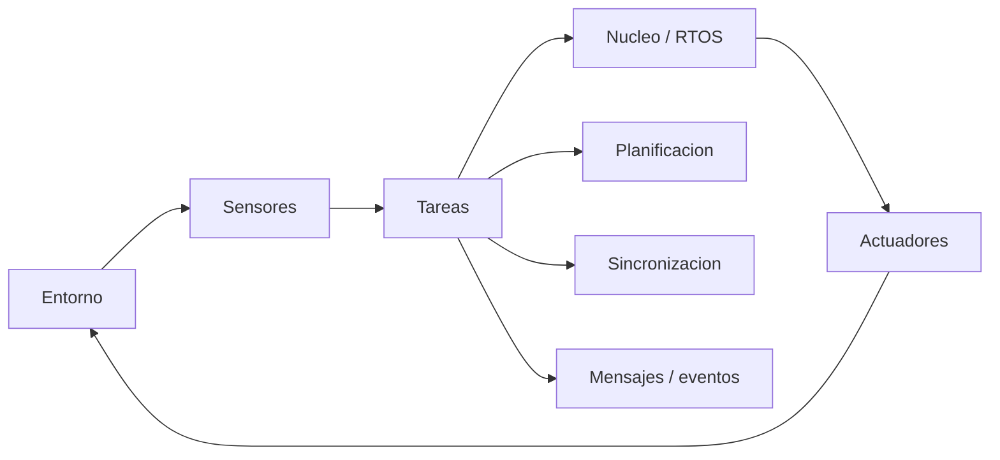

## Idea central

Un **sistema de tiempo real** es correcto solo si produce el resultado correcto **a tiempo**. El tiempo forma parte de la especificación.

Tiempo real no significa "rápido"; significa **predecible y acotado**.

## Mapa mental



## Clasificación

| Tipo | Si se pierde el deadline | Ejemplo |
|---|---|---|
| **Hard real-time** | Fallo grave o catastrófico. | Airbag, ABS, marcapasos. |
| **Firm real-time** | El resultado tardío ya no sirve. | Cuadros de video descartados. |
| **Soft real-time** | Baja la calidad, pero sigue siendo útil. | Streaming, UI, telefonía. |

## Restricciones temporales

| Concepto | Significado |
|---|---|
| **Deadline** | Límite temporal para completar una respuesta. |
| **Tiempo de respuesta** | Desde estímulo hasta respuesta completada. |
| **Período** | Intervalo entre activaciones periódicas. |
| **Jitter** | Variación de tiempos que deberían ser regulares. |
| **WCET** | Peor tiempo de ejecución. Base del análisis. |
| **Latencia** | Retardo hasta empezar a atender un evento. |
| **Utilización** | Fracción de CPU consumida: Σ(C/T). |

## Arquitectura

Componentes:

- **Sensores**: detectan cambios físicos y los convierten en datos.
- **Sistema de control**: procesa estímulos y decide respuestas.
- **Actuadores**: ejecutan acciones físicas.
- **RTOS/núcleo**: planifica, despacha, maneja interrupciones y recursos.

## Tareas

| Tipo | Activación |
|---|---|
| **Periódica** | Cada intervalo fijo. |
| **Aperiódica** | Evento impredecible. |
| **Esporádica** | Evento impredecible con separación mínima garantizada. |

Estados:

- ready/lista;
- running/en ejecución;
- blocked/bloqueada;
- suspended/dormida.

## Sincronización

| Mecanismo | Uso |
|---|---|
| **Sección crítica** | Código que accede a recurso compartido. |
| **Mutex** | Exclusión mutua con dueño. |
| **Semáforo** | Exclusión o conteo/sincronización. |
| **Monitor** | Encapsula datos + operaciones con exclusión automática. |

Problema clásico: **inversión de prioridades**. Se corrige con:

- herencia de prioridad;
- techo de prioridad.

## Planificación

| Algoritmo | Tipo | Criterio |
|---|---|---|
| **RM** | Prioridad fija | Menor período = mayor prioridad. |
| **EDF** | Prioridad dinámica | Deadline absoluto más cercano. |

RM:

```text
U <= n * (2^(1/n) - 1)
```

EDF:

```text
U <= 1
```

## Eventos y mensajes

Comunicación:

- memoria compartida;
- paso de mensajes;
- colas;
- buffers;
- mailbox.

Eventos:

- interrupciones;
- ISR cortos;
- colas de eventos;
- buffering;
- polling cuando se acepta mayor latencia.

Regla: el ISR debe hacer lo mínimo y delegar el trabajo pesado a tareas planificables.

## Redes de Petri

Elementos:

- **lugares**: estados/condiciones/recursos;
- **transiciones**: eventos/acciones;
- **arcos**: conexiones;
- **tokens**: marcado/estado actual.

Sirven para modelar:

- concurrencia;
- sincronización;
- exclusión mutua;
- deadlocks;
- vivacidad;
- alcanzabilidad.

## Para repasar rápido

- ¿Por qué tiempo real no significa simplemente rápido?
- ¿Qué diferencia hay entre hard, firm y soft real-time?
- ¿Por qué el WCET es más importante que el promedio?
- ¿Qué hace un RTOS?
- ¿Qué diferencia hay entre tarea periódica, aperiódica y esporádica?
- ¿Qué es inversión de prioridades?
- ¿Cuándo usar RM o EDF?
- ¿Cómo modela una red de Petri la exclusión mutua?
