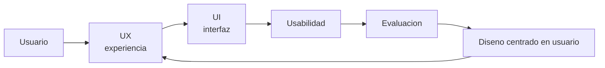

## Idea central

La interfaz es el punto donde el usuario experimenta el sistema. Una solución técnicamente correcta puede fracasar si la interacción es confusa, lenta, inaccesible o poco confiable.

HCI/IHC estudia cómo diseñar, evaluar y mejorar esa interacción.

## Mapa mental

## UX vs UI

| Concepto | Qué significa |
|---|---|
| **UI** | Elementos visuales e interactivos: botones, textos, menús, tablas, formularios. |
| **UX** | Experiencia completa: objetivo, esfuerzo, confianza, satisfacción, contexto. |

La UI es parte de la UX. Una UI linda no salva una mala experiencia.

## Usabilidad

Usabilidad = eficacia + eficiencia + satisfacción.

Atributos de Nielsen:

| Atributo | Pregunta |
|---|---|
| **Aprendizaje** | ¿Se aprende rápido? |
| **Eficiencia** | ¿Se usa con velocidad una vez aprendido? |
| **Memorabilidad** | ¿Se recuerda luego de un tiempo sin uso? |
| **Errores** | ¿Previene y permite recuperarse? |
| **Satisfacción** | ¿Resulta agradable? |

## Reglas de oro de Pressman

1. **Dejar el control al usuario**.
2. **Reducir la carga de memoria**.
3. **Mantener consistencia**.

En otras palabras: el usuario debe entender qué pasa, qué puede hacer y cómo volver atrás.

## Heurísticas de Nielsen

Recordar estas especialmente:

- visibilidad del estado;
- correspondencia con el mundo real;
- control y libertad;
- consistencia;
- prevención de errores;
- reconocer antes que recordar;
- flexibilidad;
- diseño minimalista;
- ayuda ante errores;
- documentación útil.

## Accesibilidad

WCAG se resume en cuatro principios:

| Principio | Idea |
|---|---|
| **Perceptible** | La información debe poder percibirse. |
| **Operable** | La interfaz debe poder usarse. |
| **Comprensible** | Texto y comportamiento claros. |
| **Robusto** | Compatible con tecnologías de asistencia. |

## Diseño de contenidos y componentes

Claves:

- arquitectura de información;
- jerarquía visual;
- legibilidad;
- escaneabilidad;
- espacio en blanco;
- consistencia.

Componentes:

| Componente | Criterio |
|---|---|
| **Menús** | Agrupar por tareas, poca profundidad. |
| **Íconos** | Usar metáforas reconocibles; agregar texto si hay duda. |
| **Tablas** | Encabezados claros, filtros, orden, columnas relevantes. |
| **Formularios** | Pedir solo lo necesario, validar bien, mensajes claros. |

## Diseño centrado en usuario

Proceso:

1. Comprender contexto de uso.
2. Especificar requisitos de usuario.
3. Producir soluciones.
4. Evaluar con usuarios.
5. Iterar.

Herramientas:

- user personas;
- pruebas de usabilidad;
- heat maps;
- prototipos;
- historias de usuario.

## Interacción

Conceptos:

| Concepto | Significado |
|---|---|
| **Affordance** | El objeto sugiere cómo usarlo. |
| **Feedback** | El sistema responde a la acción. |
| **Mapping** | Relación natural entre control y efecto. |
| **Constraints** | Limitar acciones inválidas. |
| **Consistencia** | Mismos elementos, mismo comportamiento. |

## Interfaces entre procesos

No toda interfaz es humana. También hay APIs, colas, archivos, servicios y mensajes.

Diseño correcto:

- contrato claro;
- versionado;
- manejo de errores;
- autenticación/autorización;
- cifrado;
- validación de entradas;
- rate limiting;
- colas y backpressure.

## E-commerce

Factores clave:

- catálogo claro;
- búsqueda y filtros;
- carrito editable;
- checkout corto;
- confianza;
- seguridad;
- rendimiento;
- accesibilidad móvil.

La conversión depende de reducir fricción e incertidumbre.

## Para repasar rápido

- ¿Qué diferencia hay entre UX y UI?
- ¿Cuáles son las tres reglas de oro de Pressman?
- ¿Qué significa reconocer antes que recordar?
- ¿Por qué accesibilidad mejora la experiencia de todos?
- ¿Qué debe tener un buen formulario?
- ¿Qué se valida en una prueba de usabilidad?
- ¿Cómo se relacionan Observer, Command o Strategy con interfaces?
- ¿Por qué el checkout es crítico en e-commerce?
