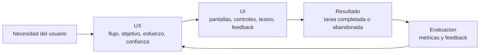
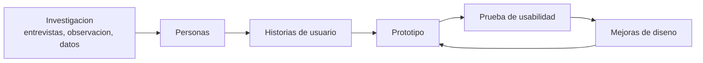
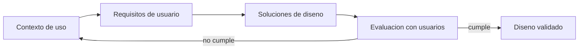
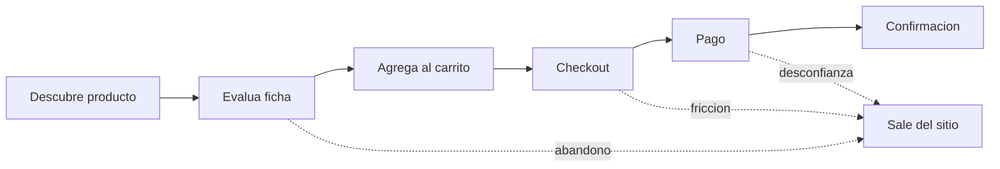

## Introducción

La **interfaz** es el punto de contacto entre el ser humano y el sistema de software. Por muy correcta que sea la lógica interna, un usuario juzga al sistema por lo que ve y por cómo logra (o no) cumplir sus objetivos a través de la interfaz. Pressman lo resume con una frase del usuario típico: "puede que el sistema funcione, pero ¿es fácil de usar?". Una interfaz mal diseñada provoca errores, frustración, rechazo y, en última instancia, el fracaso del producto, aunque la ingeniería subyacente sea impecable.

Esta unidad estudia el **diseño de la interfaz hombre-computadora** (HCI, *Human-Computer Interaction*; en español IHC, Interacción Hombre-Computadora) desde la ingeniería de software. Cubre la distinción entre **UX** y **UI**, la **usabilidad** y sus atributos, los **principios y reglas de oro** de Pressman, las **heurísticas de Nielsen**, la **accesibilidad**, el **diseño de contenidos y de componentes** (menús, íconos, tablas, formularios), el **proceso de diseño** iterativo, el **diseño centrado en el usuario (DCU)**, el **diseño de la interacción**, las **interfaces entre procesos** (no humanas) con su seguridad y control de tráfico, y el diseño de **sistemas de comercio electrónico**.

{: .note }
> La interfaz no es "la última capa que se pinta al final". Es una decisión de diseño que debe planificarse, prototiparse y evaluarse de forma iterativa, con participación del usuario real.

{: .note }
> **Bibliografía prioritaria de la materia.** En esta unidad **Pressman & Maxim** y material de HCI/usabilidad se usan como apoyo específico. **Larman** aporta el criterio de responsabilidades y separación entre UI, controladores y dominio; **GoF** aparece cuando los patrones ayudan a desacoplar interfaz, estado y comportamiento, por ejemplo MVC, Observer, Strategy o Command.

## Interfaz Hombre-Computadora (HCI / IHC)

La **Interacción Hombre-Computadora (HCI)** es la disciplina que estudia el diseño, la evaluación y la implementación de sistemas informáticos interactivos para uso humano, y los fenómenos que rodean a ese uso. Es un campo **multidisciplinario** que combina:

- **Informática / Ingeniería de software:** construcción del sistema interactivo.
- **Psicología cognitiva:** cómo las personas perciben, recuerdan, razonan y cometen errores.
- **Ergonomía y factores humanos:** capacidades y límites físicos y perceptuales.
- **Diseño gráfico y comunicación visual.**
- **Sociología / antropología:** uso en contexto, trabajo colaborativo.

La **interfaz de usuario** es el medio concreto por el que ocurre esa interacción: pantallas, controles, comandos, gestos, voz, etc. Su diseño determina la **curva de aprendizaje**, la **productividad**, la **tasa de errores** y la **satisfacción**.

{: .important }
> Importancia: la interfaz puede representar una proporción muy alta del código y del esfuerzo de un sistema interactivo. Es la cara visible del producto y el factor que más pesa en la percepción de calidad del usuario.

### El modelo de comunicación

En la interacción intervienen tres "modelos" cuya **alineación** es el gran desafío del diseño:

- **Modelo del usuario (modelo mental):** la imagen que el usuario tiene de cómo funciona el sistema.
- **Modelo del diseñador:** cómo el diseñador concibe el sistema.
- **Imagen del sistema (modelo de implementación):** cómo el sistema se comporta y comunica realmente.

Cuando el modelo mental del usuario coincide con la imagen que el sistema proyecta, la interacción es natural; cuando divergen, aparecen confusión y errores. El diseñador debe **comunicar su modelo a través de la interfaz**, no obligar al usuario a aprender el modelo de implementación.

## UX vs UI

Dos términos que suelen confundirse pero designan cosas distintas y complementarias.

- **UI (User Interface, Interfaz de Usuario):** los **elementos visuales e interactivos** concretos con los que el usuario opera: botones, tipografía, color, íconos, espaciado, controles, microinteracciones. Responde a *cómo se ve y cómo se manipula*.
- **UX (User Experience, Experiencia de Usuario):** la **experiencia global** de la persona al usar el producto para alcanzar un objetivo: si lo logra, con qué esfuerzo, qué siente. Abarca investigación, arquitectura de información, flujos, usabilidad y emoción. Responde a *cómo se siente y qué tan bien funciona el conjunto*.

| Aspecto | UI (Interfaz de Usuario) | UX (Experiencia de Usuario) |
|---|---|---|
| Foco | Apariencia y elementos interactivos | Experiencia y satisfacción global |
| Pregunta clave | ¿Cómo se ve? ¿Cómo se opera? | ¿Cumple el objetivo del usuario y cómo se siente? |
| Disciplina | Diseño visual / de interacción | Investigación, arquitectura de información, usabilidad |
| Entregables | Mockups, guías de estilo, componentes | Personas, flujos, wireframes, mapas de experiencia |
| Alcance | Una pantalla / un componente | Todo el recorrido (journey) del usuario |
| Analogía | Los detalles de terminación de una casa | Que la casa sea cómoda y habitable |

{: .note }
> La UI es una **parte** de la UX. Una UI bonita con una UX mala (flujos confusos, lentitud, no resuelve la necesidad) fracasa; una UX bien pensada con UI pobre tampoco convence. Se necesitan ambas.

La evaluación cierra el ciclo: no alcanza con diseñar una pantalla, hay que verificar si el usuario logra su objetivo con eficacia, eficiencia y satisfacción.

### Componentes de la UX (panal de Morville)

Para que una experiencia sea valiosa, debe ser:

- **Útil (useful):** satisface una necesidad real.
- **Usable (usable):** fácil y eficiente de usar.
- **Deseable (desirable):** atractiva, genera emoción positiva, identidad de marca.
- **Encontrable (findable):** el contenido y las funciones se localizan con facilidad (navegación, búsqueda).
- **Accesible (accessible):** utilizable por personas con discapacidades.
- **Creíble (credible):** transmite confianza; el usuario cree en lo que ofrece.
- **Valiosa (valuable):** aporta valor al usuario y al negocio.

Ejemplo aplicado: en un sistema de turnos médicos, la experiencia es **útil** si permite obtener un turno real, **usable** si se reserva en pocos pasos, **encontrable** si el profesional se localiza rápido, **accesible** si puede usarla una persona con baja visión, **creíble** si muestra datos claros de clínica y cobertura, y **valiosa** si reduce llamadas y esperas.

## Usabilidad

La **usabilidad** es el grado en que un producto puede ser usado por usuarios específicos para lograr objetivos específicos con **eficacia, eficiencia y satisfacción** en un contexto de uso determinado (ISO 9241). Es el atributo central de la calidad en uso.

### Atributos de usabilidad (Nielsen)

| Atributo | Definición | Pregunta que responde |
|---|---|---|
| **Facilidad de aprendizaje** (learnability) | Qué tan fácil es para un novato realizar tareas básicas la primera vez | ¿Se aprende rápido? |
| **Eficiencia** (efficiency) | Una vez aprendido, qué tan rápido se realizan las tareas | ¿Se trabaja con velocidad? |
| **Memorabilidad** (memorability) | Tras un tiempo sin usarlo, qué tan fácil es recuperar la destreza | ¿Se recuerda cómo usarlo? |
| **Errores** (errors) | Cuántos errores comete el usuario, qué tan graves y qué tan fácil es recuperarse | ¿Previene y permite corregir errores? |
| **Satisfacción** (satisfaction) | Qué tan agradable resulta el uso | ¿Es placentero usarlo? |

{: .note }
> Eficacia (lograr el objetivo), eficiencia (lograrlo con el mínimo esfuerzo/recursos) y satisfacción son las tres métricas con las que se mide la usabilidad de forma operativa.

## Principios y reglas de oro de Pressman

Pressman organiza el diseño de interfaces en torno a **tres reglas de oro** (de Mandel), que luego se traducen en principios prácticos.

| Regla de oro | Idea central |
|---|---|
| **1. Dejar el control en manos del usuario** | El usuario, no el sistema, dirige la interacción. |
| **2. Reducir la carga de memoria del usuario** | La interfaz debe recordar por el usuario; minimizar lo que hay que memorizar. |
| **3. Lograr una interfaz consistente** | Comportamiento, apariencia y reglas uniformes en todo el sistema. |

### 1. Dejar el control en manos del usuario

- Definir la interacción de modo que el usuario **no se vea forzado** a realizar acciones innecesarias o no deseadas.
- Permitir **interacción flexible** (mouse, teclado, atajos, voz según convenga).
- Permitir **interrumpir y deshacer** acciones (undo/redo).
- Facilitar la interacción a medida que el usuario gana **destreza** (atajos, personalización).
- Ocultar al usuario los **detalles técnicos** internos.
- Diseñar para la **interacción directa** con los objetos que aparecen en pantalla.

### 2. Reducir la carga de memoria del usuario

- **Reducir la demanda de memoria de corto plazo** (no exigir recordar datos entre pantallas).
- Establecer **valores por defecto** con sentido.
- Definir **atajos** intuitivos y nemotécnicos.
- El formato visual debe basarse en una **metáfora del mundo real**.
- Revelar la información de forma **progresiva** (de lo general a lo específico).
- **Reconocer en lugar de recordar:** mostrar opciones visibles en vez de exigir memorizar comandos.

### 3. Lograr una interfaz consistente

- Permitir que el usuario ubique la tarea actual en un **contexto** comprensible (dónde estoy, de dónde vengo, a dónde puedo ir).
- Mantener consistencia en una **familia** de aplicaciones.
- No cambiar modelos de interacción ya asimilados por el usuario, salvo razón de peso.
- Seguir **convenciones y estándares** de plataforma (lo que el usuario ya conoce de otros sistemas).

## Heurísticas de usabilidad de Nielsen

Las **10 heurísticas de Nielsen** son reglas generales para evaluar (evaluación heurística) y diseñar interfaces usables. Son el estándar de la disciplina.

| # | Heurística | Significado breve |
|---|---|---|
| 1 | **Visibilidad del estado del sistema** | Mantener informado al usuario de lo que ocurre mediante retroalimentación oportuna (carga, progreso, confirmaciones). |
| 2 | **Correspondencia entre el sistema y el mundo real** | Usar el lenguaje y conceptos del usuario, no jerga técnica; orden lógico y natural. |
| 3 | **Control y libertad del usuario** | Ofrecer "salidas de emergencia": deshacer, rehacer, cancelar. |
| 4 | **Consistencia y estándares** | Mismas palabras/acciones significan lo mismo; seguir convenciones de plataforma. |
| 5 | **Prevención de errores** | Mejor evitar que el error ocurra (restricciones, confirmaciones) que solo mostrar mensajes. |
| 6 | **Reconocer antes que recordar** | Hacer visibles objetos, acciones y opciones; no exigir memorizar. |
| 7 | **Flexibilidad y eficiencia de uso** | Atajos y personalización para expertos, sin entorpecer a novatos. |
| 8 | **Diseño estético y minimalista** | Mostrar solo lo relevante; el ruido compite con lo importante. |
| 9 | **Ayudar a reconocer, diagnosticar y recuperarse de errores** | Mensajes en lenguaje claro, indican el problema y sugieren solución. |
| 10 | **Ayuda y documentación** | Disponible, buscable, enfocada en la tarea, concisa, cuando se necesita. |

{: .note }
> Nielsen (reconocer antes que recordar) y Pressman (reducir la carga de memoria) coinciden: el sistema debe recordar por el usuario.

## Simplicidad de acceso y accesibilidad

### Simplicidad de acceso

Significa que el usuario alcance lo que necesita con el **mínimo de pasos, esfuerzo y conocimiento previo**. Se logra con navegación clara, jerarquía de opciones poco profunda, búsqueda eficaz, valores por defecto sensatos y eliminación de fricción (registros innecesarios, formularios largos, etc.).

### Accesibilidad (a11y)

La **accesibilidad** es el diseño de productos usables por **personas con discapacidades** (visuales, auditivas, motrices, cognitivas) y, en general, en cualquier contexto. Las pautas de referencia son las **WCAG** (Web Content Accessibility Guidelines), con cuatro principios — el sistema debe ser:

- **Perceptible:** la información debe poder percibirse (texto alternativo en imágenes, subtítulos, contraste suficiente).
- **Operable:** navegable por teclado, sin límites de tiempo rígidos, sin elementos que provoquen convulsiones.
- **Comprensible:** texto legible, comportamiento predecible, ayuda ante errores.
- **Robusto:** compatible con tecnologías de asistencia (lectores de pantalla) y agentes de usuario.

{: .important }
> La accesibilidad beneficia a todos (diseño universal): los subtítulos sirven en ambientes ruidosos, el buen contraste ayuda bajo el sol, la navegación por teclado acelera a usuarios expertos.

### Principios básicos de interfaz Web

Las referencias de clase incorporan principios clásicos para WebApps, alineados con Pressman y Tognozzi. Los más relevantes para diseño son:

| Principio | Aplicación práctica |
|---|---|
| **Previsión** | Anticipar qué necesita el usuario en cada paso. |
| **Comunicación** | Informar estado, errores, progreso y consecuencias. |
| **Consistencia** | Mantener patrones de navegación, componentes y lenguaje. |
| **Autonomía controlada** | Dar control sin dejar que el usuario rompa el flujo o los datos. |
| **Eficiencia y flexibilidad** | Permitir caminos rápidos para usuarios frecuentes sin confundir a novatos. |
| **Ley de Fitts** | Hacer que acciones importantes sean fáciles de alcanzar y seleccionar. |
| **Reducción de latencia** | Optimizar tiempos o mostrar feedback mientras el sistema responde. |
| **Navegación visible** | Que el usuario sepa dónde está, qué puede hacer y cómo volver. |

## Diseño de contenidos (content design)

El **diseño de contenidos** organiza la información para que sea fácil de leer, encontrar y comprender. Claves:

- **Arquitectura de información:** estructurar y agrupar el contenido según la lógica del usuario (tarjetas, categorías, etiquetas).
- **Jerarquía visual:** guiar la mirada con tamaño, peso, color, espaciado y posición; lo más importante, más prominente.
- **Legibilidad y lecturabilidad:** tipografía adecuada, longitud de línea moderada, interlineado, contraste; lenguaje claro y conciso.
- **Escaneabilidad:** los usuarios "escanean" más que leen; usar títulos, listas, negritas y bloques cortos.
- **Espacio en blanco:** separa, agrupa y da respiro; reduce la sobrecarga.
- **Consistencia de estilo y tono.**

### Diseño estético y composición visual

En WebApps, Pressman separa el diseño de la interfaz del **diseño estético**: la interfaz define estructura e interacción; la estética define la percepción visual y la claridad de la pantalla.

Pautas prácticas:

- No sobrecargar la página: el espacio en blanco ayuda a agrupar y priorizar.
- Hacer énfasis en el contenido principal, no en adornos.
- Mantener consistencia de color, tipografía, tamaños y espaciados.
- Agrupar navegación, contenido y funciones de forma geográfica y predecible.
- Evitar que el usuario tenga que desplazarse o buscar de más para acciones frecuentes.
- Usar contraste y jerarquía visual para guiar la mirada.

## Diseño de componentes de la interfaz

### Menús

- Agrupar opciones por **afinidad** y orden lógico (frecuencia o secuencia de uso).
- **Jerarquía poco profunda:** preferir ancho a profundidad excesiva; evitar muchos niveles de submenús.
- Etiquetas **claras y consistentes**; deshabilitar (en gris) opciones no disponibles en lugar de ocultarlas si el usuario las espera.
- Indicar el **estado/contexto actual** (resaltar la sección activa) y ofrecer atajos.

### Íconos

- Deben ser **reconocibles** y representar metáforas conocidas; ante la duda, acompañar con texto (label).
- **Consistentes** en estilo, tamaño y significado en todo el sistema.
- Distinguibles entre sí; no abusar de la cantidad.
- Considerar **convenciones establecidas** (lupa = buscar, engranaje = configuración, carrito = compra).

### Tablas

- Encabezados claros; **alineación** coherente (texto a la izquierda, números a la derecha).
- Permitir **ordenar, filtrar y buscar** en tablas grandes; **paginación** o carga incremental.
- Evitar sobrecarga: mostrar columnas relevantes, usar separación visual sutil (zebra striping).
- Resaltar totales/valores clave; formato de datos consistente (fechas, moneda).

### Formularios

- Pedir **solo lo necesario**; agrupar campos relacionados.
- **Etiquetas visibles** (no depender solo de placeholders), marcar campos obligatorios.
- **Validación** clara, en el momento adecuado, con mensajes que expliquen cómo corregir (prevención y recuperación de errores).
- Valores por defecto sensatos, formatos de entrada flexibles, y confirmación de éxito.

| Componente | Riesgo común | Buen criterio de diseño |
|---|---|---|
| Menú | Demasiados niveles o etiquetas ambiguas. | Agrupar por tareas del usuario y mantener poca profundidad. |
| Ícono | Metáfora poco reconocible. | Usar convenciones y agregar texto si hay duda. |
| Tabla | Exceso de columnas sin jerarquía. | Priorizar columnas clave, permitir ordenar/filtrar. |
| Formulario | Pedir datos innecesarios o validar tarde. | Reducir campos, validar cerca del campo y explicar la corrección. |

## Proceso de diseño de interfaces

El diseño de la interfaz es un **proceso iterativo** (espiral): se diseña, se prototipa, se evalúa con usuarios y se refina. Pressman/Sommerville lo describen en cuatro actividades principales:

1. **Análisis y modelado de usuarios, tareas y entorno.**
   - **Análisis del usuario:** quiénes son, su nivel de experiencia, sus modelos mentales, sus objetivos. Construcción de **personas**.
   - **Análisis de tareas:** qué tareas realizan, en qué pasos, con qué frecuencia; análisis del **flujo de trabajo**.
   - **Análisis del entorno:** condiciones físicas y organizacionales de uso.
2. **Diseño de la interfaz.**
   - Definir objetos y acciones de la interfaz, organización de pantallas, navegación y mecanismos de interacción, aplicando los principios y reglas de oro.
3. **Construcción / prototipado.**
   - Desde **prototipos de baja fidelidad** (bocetos, wireframes en papel) hasta **alta fidelidad** (mockups interactivos), para validar temprano y barato.
4. **Validación / evaluación.**
   - **Evaluación heurística** (expertos con las heurísticas de Nielsen), **tests de usabilidad** con usuarios reales, recolección de métricas y retroalimentación. Los hallazgos realimentan el ciclo.

{: .note }
> **Modelo mental:** el usuario construye una idea de cómo funciona el sistema. El diseñador debe analizar y respetar ese modelo para que la interfaz resulte predecible e intuitiva.

### Técnicas de investigación y evaluación

El diseño centrado en el usuario necesita evidencia, no solo opinión. Tres herramientas vistas en las referencias:

| Técnica | Para qué sirve | Resultado esperado |
|---|---|---|
| **User persona** | Representar un perfil de usuario basado en investigación. | Objetivos, contexto, frustraciones, necesidades y comportamiento. |
| **Prueba de usabilidad** | Observar usuarios realizando tareas reales o representativas. | Problemas detectados, tasa de éxito, tiempo, errores y comentarios. |
| **Heat map** | Visualizar clics, atención o desplazamiento en una interfaz. | Zonas calientes/frías, elementos confundidos como clicables, oportunidades de mejora. |

Una **persona** no es un estereotipo inventado sin datos. Debe sintetizar patrones observados en entrevistas, roleplay, encuestas, analítica o pruebas. Sirve para tomar decisiones: priorizar historias de usuario, definir lenguaje, elegir flujos y validar prototipos.

En una prueba de usabilidad conviene definir: tarea, usuario objetivo, criterio de éxito, métricas, observaciones y cambios derivados. El objetivo no es "defender" el diseño, sino descubrir dónde falla.

## Diseño Centrado en el Usuario (DCU / UCD)

El **Diseño Centrado en el Usuario** es una filosofía y un proceso que pone al **usuario y sus necesidades en el centro** de todas las decisiones, involucrándolo a lo largo de todo el desarrollo (no solo al final). Su marco está definido en la norma **ISO 9241-210**.

Principios:

- Diseño basado en la **comprensión explícita** de usuarios, tareas y entornos.
- **Participación del usuario** durante todo el diseño y desarrollo.
- Diseño **guiado y refinado por evaluación** centrada en el usuario.
- Proceso **iterativo**.
- Diseño que aborda la **experiencia completa** del usuario.
- Equipo de diseño con **habilidades y perspectivas multidisciplinarias**.

Etapas iterativas típicas:

1. **Comprender y especificar el contexto de uso.**
2. **Especificar los requisitos** de usuario y de la organización.
3. **Producir soluciones de diseño** (prototipos).
4. **Evaluar** los diseños contra los requisitos (con usuarios) y repetir hasta cumplir objetivos.

{: .important }
> Diferencia clave del DCU: el usuario no es un sujeto pasivo al que se le "entrega" un producto, sino un **participante activo** que valida y orienta el diseño desde el inicio.

En términos de ingeniería de software, DCU agrega trazabilidad desde necesidades reales del usuario hacia decisiones de interfaz y pruebas de usabilidad.

## Diseño de la interacción (interaction design)

El **diseño de la interacción (IxD)** se ocupa de **cómo dialogan** el usuario y el sistema: las acciones, las respuestas y el flujo entre ambos. Conceptos centrales:

- **Affordances (significantes):** propiedades percibidas de un objeto que sugieren cómo usarlo (un botón "invita" a pulsarlo, una manija a tirar). Buen diseño = affordances claras.
- **Feedback (retroalimentación):** toda acción debe producir una respuesta perceptible e inmediata (estado del sistema visible). Sin feedback, el usuario duda si la acción ocurrió.
- **Mapeo (mapping):** correspondencia natural entre controles y sus efectos (deslizar hacia arriba sube el valor).
- **Restricciones (constraints):** limitar las acciones posibles para prevenir errores (deshabilitar opciones inválidas).
- **Consistencia:** mismos elementos se comportan igual en todo el sistema.
- **Patrones de interacción:** soluciones reutilizables y reconocibles (búsqueda con autocompletado, paginación, scroll infinito, master-detail, wizard paso a paso, arrastrar y soltar).

{: .note }
> Norman: un buen diseño hace **visibles** las acciones posibles y provee **feedback** claro. Cuando algo "se usa solo", es porque sus affordances y su mapeo son correctos.

### Relación con patrones de diseño

Varios patrones estudiados en la unidad 3 aparecen naturalmente en interfaces:

| Problema de interacción | Patrón útil | Idea |
|---|---|---|
| La vista debe actualizarse cuando cambia el estado. | **Observer** | El modelo notifica a las vistas suscriptas. |
| Un botón, menú o atajo ejecuta una acción reusable. | **Command** | La acción se encapsula como objeto/comando. |
| Hay distintas formas de ordenar, filtrar o validar. | **Strategy** | El algoritmo cambia sin modificar la pantalla. |
| Una pantalla contiene componentes anidados. | **Composite** | Tratar elementos simples y compuestos de forma uniforme. |
| Separar datos, presentación e interacción. | **MVC/MVVM** | Reducir acoplamiento entre UI y lógica de negocio. |

Estos patrones no se aplican por estética: se usan cuando reducen acoplamiento, protegen variaciones y hacen más mantenible la interfaz.

## Interfaces entre procesos, seguridad y control de tráfico

No todas las interfaces son con humanos. Las **interfaces entre procesos** (o interfaces máquina-máquina / de software) permiten que **sistemas y componentes se comuniquen entre sí**: integración entre aplicaciones, servicios web, **APIs**, colas de mensajes, intercambio de archivos, etc.

Características de un buen diseño de interfaz entre procesos:

- **Contrato bien definido:** formato de datos, protocolo, operaciones, códigos de error (por ejemplo, una **API REST** con su especificación).
- **Bajo acoplamiento y alta cohesión:** los sistemas dependen del contrato, no de la implementación interna del otro.
- **Versionado:** poder evolucionar la interfaz sin romper a los consumidores.
- **Manejo de errores y reintentos** ante fallas de comunicación.

### Seguridad

- **Autenticación y autorización:** verificar identidad (tokens, claves de API, OAuth) y permisos de cada sistema.
- **Cifrado en tránsito** (TLS/HTTPS) y en reposo cuando corresponde.
- **Validación de entradas:** nunca confiar en datos externos; prevenir inyecciones.
- **Confidencialidad, integridad y disponibilidad (CIA):** los tres pilares de la seguridad de la información.
- **Auditoría y trazabilidad** de las comunicaciones.

### Control de tráfico de información

Para que la integración sea estable y no se sature:

- **Control de flujo y throttling / rate limiting:** limitar la cantidad de solicitudes por unidad de tiempo.
- **Colas y buffers:** desacoplar productores y consumidores, absorber picos de carga (procesamiento asíncrono).
- **Backpressure:** mecanismos para frenar al emisor cuando el receptor no da abasto.
- **Balanceo de carga** y monitoreo del tráfico para detectar anomalías.

## Sistemas de comercio electrónico (e-commerce)

Los sistemas de **comercio electrónico** son un caso paradigmático donde la calidad de la UX/UI **impacta directamente en el negocio**: una fricción mínima puede significar pérdida de ventas (caída de conversión). Áreas de diseño:

- **Catálogo y búsqueda:** navegación por categorías, filtros, búsqueda eficaz, fichas de producto claras (fotos, descripción, precio, disponibilidad, reseñas).
- **Carrito de compras:** visible y editable, con totales claros (incluidos costos de envío e impuestos), sin sorpresas.
- **Checkout (proceso de pago):** el paso crítico. Debe ser **corto, claro y con la menor fricción posible**; permitir compra como invitado, mostrar progreso, validar bien los formularios y confirmar la operación. Reducir el **abandono de carrito**.
- **Confianza (trust):** sellos de seguridad, políticas de devolución, reseñas, datos de contacto, HTTPS visible. La **credibilidad** es decisiva para que el usuario ingrese datos de pago.
- **Conversión:** optimizar el embudo (descubrimiento → producto → carrito → pago → confirmación); llamadas a la acción claras; pruebas A/B.
- **Rendimiento:** la velocidad de carga influye fuerte en ventas y en SEO.
- **Accesibilidad y responsive:** funcionar bien en móviles y para todos los usuarios.

Cada transición del embudo debe diseñarse para reducir incertidumbre: precio claro, disponibilidad, costos de envío, medios de pago, seguridad y confirmación.

### Seguridad en e-commerce

- **Cifrado** de la comunicación (HTTPS/TLS) y de datos sensibles.
- **Pasarelas de pago** que cumplan estándares (PCI-DSS); idealmente **no almacenar datos de tarjetas**.
- **Autenticación** robusta de cuentas y **prevención de fraude**.
- **Protección de datos personales** del cliente (privacidad) y resguardo ante ataques (inyección, XSS, CSRF).

{: .important }
> En e-commerce, **confianza + simplicidad de acceso + checkout sin fricción + seguridad** son los factores que determinan la conversión. La mejor UI es inútil si el usuario no se siente seguro al pagar.

## En síntesis (para el parcial)

- La **HCI/IHC** estudia la interacción persona-sistema; la **interfaz** es la cara del producto y define la percepción de calidad. Alinear el **modelo mental del usuario** con la **imagen del sistema** es el objetivo central.
- **UI** = elementos visuales/interactivos; **UX** = experiencia global. La UI es parte de la UX. La UX valiosa es útil, usable, deseable, encontrable, accesible, creíble y valiosa.
- **Usabilidad** = eficacia + eficiencia + satisfacción. Atributos de Nielsen: aprendizaje, eficiencia, memorabilidad, errores, satisfacción.
- **Reglas de oro de Pressman:** (1) control al usuario, (2) reducir la carga de memoria, (3) consistencia.
- **10 heurísticas de Nielsen:** estándar para diseñar y evaluar interfaces.
- **Accesibilidad (WCAG):** perceptible, operable, comprensible, robusto. Beneficia a todos.
- **Proceso iterativo:** analizar usuarios/tareas → diseñar → prototipar → evaluar → refinar.
- **DCU (ISO 9241-210):** usuario en el centro y participando durante todo el desarrollo.
- **Diseño de interacción:** affordances, feedback, mapeo, restricciones, patrones.
- **Diseño visual:** jerarquía, contraste, espacio en blanco, agrupación geográfica y consistencia estética.
- **Interfaces entre procesos:** contratos/APIs bien definidos, seguridad (CIA, autenticación, cifrado) y control de tráfico (rate limiting, colas, backpressure).
- **E-commerce:** catálogo, carrito, checkout sin fricción, confianza, conversión y seguridad (PCI-DSS, HTTPS) son lo determinante.

### Cobertura del programa de la unidad 6

| Tema indicado en el programa.pdf | Dónde aparece en estos apuntes |
|---|---|
| Interfaz Hombre-Computadora | Introducción; HCI/IHC |
| UX vs UI | Sección "UX vs UI" y mapa conceptual |
| Interfaces del usuario | Modelo de comunicación; diseño de componentes |
| Principios de las interfaces | Reglas de oro de Pressman; heurísticas de Nielsen |
| Principios básicos de interfaz Web | Sección "Principios básicos de interfaz Web" |
| Simplicidad de acceso | Sección "Simplicidad de acceso y accesibilidad" |
| Diseño de contenidos | Arquitectura de información, jerarquía, legibilidad |
| Diseño estético y composición visual | Sección "Diseño estético y composición visual" |
| Diseño de interfaces del usuario | Componentes, proceso de diseño, interacción |
| Simplicidad, características, menús, íconos, tablas | Sección de componentes y tabla de riesgos |
| Proceso de diseño de interfaces | Proceso iterativo; prototipado y evaluación |
| User personas, pruebas de usabilidad y heat maps | Sección "Técnicas de investigación y evaluación" |
| Interfaces entre procesos, seguridad y control de tráfico | Sección específica de APIs, seguridad y tráfico |
| Sistemas de comercio electrónico | E-commerce, checkout, confianza y seguridad |
| Diseño centrado en el usuario | DCU / ISO 9241-210 |
| Diseño de la interacción hombre-máquina | Affordances, feedback, mapeo, restricciones y patrones |
